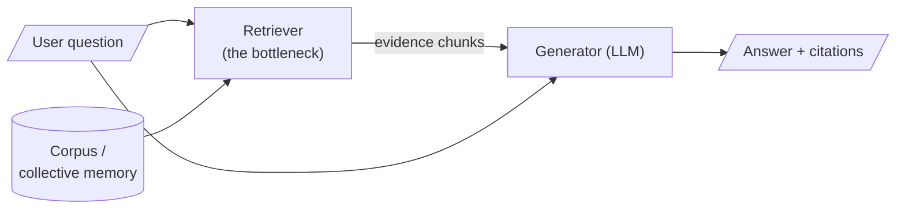

Search is usually introduced as a solved problem: type words, get documents, move on. Yet whole organisations stumble **not because they lack information but because they cannot retrieve what they already possess**. The contract that was signed, the experiment that already failed, the customer who already complained — all of it sits in some store, indexed by words that no longer match the question being asked.

The usual illusion is that information is the scarce resource. In practice, the scarce resource is often access: the facts exist, but they are not in reach when the question is asked.

> Knowledge an organisation cannot find is, for every practical purpose, knowledge it does not have.

Will Durant observed that civilisation is a stream with banks: the stream carries the deeds we record, but the banks — the quiet, unremembered work of keeping and retrieving knowledge — are what let each generation begin where the last left off. Retrieval is bank-work: unglamorous, necessary, and often the difference between a functioning institution and a confident disaster.

## Core intuition

The central idea is simple: a system can only answer what it can fetch. In most real organisations, the problem is not raw intelligence but retrieval failure.

When the question is about a product, a contract, a legal clause, a past decision, or a support ticket, the relevant facts usually exist somewhere in storage. They fail to help because the system cannot reliably match the *question* to the *right source*. The model is then asked to answer from partial evidence, which is where hallucination and confident nonsense begin.

## Why it matters

This is why the course treats retrieval as the **epistemic bottleneck** of RAG:

> A generator can only be as truthful as the evidence placed before it. Bad retrieval caps the quality of everything downstream — no prompt, however clever, and no larger model, however capable, repairs evidence that was never fetched.

A language model's *parametric memory* is frozen at training time, finite in capacity, expensive to update, and unable to cite its sources. RAG is the architectural response: hand the model an open book at the moment of answering. The art of the whole course is making sure the book is open to the *right page*.



If the retriever passes the wrong chunks, everything to its right operates on false premises — confidently.

## Instructor framing

The course is not trying to celebrate a magical chatbot. It is teaching a practical discipline: treat retrieval as an engineering boundary condition. The retriever is the gatekeeper between user intent and facts.

In other words, every later system component — query rewriting, rankers, filters, chunking policy, answer grounding, and safety checks — exists to keep that boundary honest.

## Worked example

Imagine a support team asks: "Why did the customer cancel in the last quarter?"

The relevant facts may be scattered across:

- CRM notes
- contract amendments
- email threads
- issue tickets
- product logs

A naive keyword search may find the word "cancel" but miss the real reason, or it may return dozens of irrelevant mentions. The system fails because the retrieval step is using a vocabulary signal rather than a semantic understanding of the task. This is the exact problem the course spends the next weeks trying to fix.

## Math explained step by step

The whole course oscillates between two quantities. For a set of returned results:

$$\text{Precision} = \frac{\#\,\text{relevant returned}}{\#\,\text{returned}}, \qquad \text{Recall} = \frac{\#\,\text{relevant returned}}{\#\,\text{relevant that exist}}$$

- **Precision** asks: of the things I returned, how many were relevant?
- **Recall** asks: of the relevant things that existed, how many did I return?

A search that returns nothing has perfect precision and useless recall; a search that returns everything has perfect recall and useless precision. **Every retrieval system is a negotiated truce between the two**, and much of the engineering ahead — hybrid search, re-ranking, thresholds — is about moving the truce to where your application needs it.

```python
# precision & recall, the long way — no libraries, just counting
returned  = ["doc3", "doc7", "doc1", "doc9"]
relevant  = ["doc1", "doc3", "doc5"]

hits = 0
for d in returned:
    if d in relevant:
        hits = hits + 1

precision = hits / len(returned)   # 2/4 = 0.50
recall    = hits / len(relevant)   # 2/3 = 0.67
print("precision:", precision, "recall:", recall)
```

## Practical pattern

The practical rule is simple: retrieval must be treated as a first-class retrieval problem, not as a side effect of prompting.

For any real system, the pattern is:

1. store the knowledge in a retrievable corpus;
2. match user intent to that corpus with the right embeddings or lexical signals;
3. rank and filter the candidates;
4. pass only the most relevant evidence to the generator;
5. keep the answer grounded in the evidence, not in free-form model memory.

This is the conceptual foundation for the rest of the system design in the course.

## Common traps

- Treating search as a solved problem and skipping the quality checks.
- Optimising for recall alone and flooding the model with noise.
- Assuming a longer prompt can compensate for bad retrieval.
- Forgetting that retrieval quality is measured in downstream answer quality.

## Takeaways

- Retrieval is the bottleneck between user intent and organisational memory.
- Good RAG is built on good evidence selection, not just clever prompting.
- Precision and recall are the basic engineering trade-off behind every retriever.
- The job of the rest of the system is to protect the truthfulness of the evidence pipeline.

## The premise of the course

Search is not a technical convenience bolted onto a chatbot. It is **the interface between human intent and collective memory**. Every instrument built in this course — chunkers, re-rankers, query rewriters, guardrails, grounding judges — exists to keep that interface honest.
