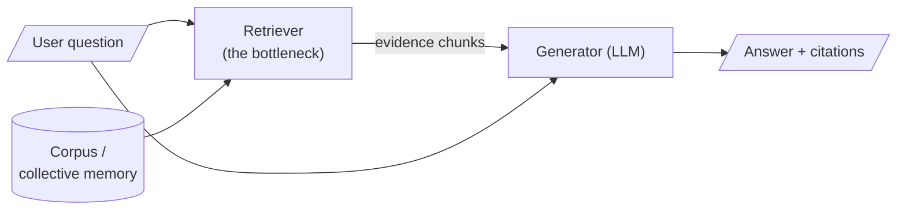

Search is usually introduced as a solved problem: type words, get documents, move on. Yet whole organisations stumble **not because they lack information but because they cannot retrieve what they already possess**. The contract that was signed, the experiment that already failed, the customer who already complained — all of it sits in some store, indexed by words that no longer match the question being asked.

> Knowledge an organisation cannot find is, for every practical purpose, knowledge it does not have.

Will Durant observed that civilisation is a stream with banks: the stream carries the deeds we record, but the banks — the quiet, unremembered work of keeping and retrieving knowledge — are what let each generation begin where the last left off. Retrieval is bank-work: unglamorous and load-bearing.

## Why retrieval caps everything downstream

This is why the course treats retrieval as the **epistemic bottleneck** of RAG:

> A generator can only be as truthful as the evidence placed before it. Bad retrieval caps the quality of everything downstream — no prompt, however clever, and no larger model, however capable, repairs evidence that was never fetched.

A language model's *parametric memory* is frozen at training time, finite in capacity, expensive to update, and unable to cite its sources. RAG is the architectural response: hand the model an open book at the moment of answering. The art of the whole course is making sure the book is open to the *right page*.



If the retriever passes the wrong chunks, everything to its right operates on false premises — confidently.

## The two ancient failure modes: precision and recall

The whole course oscillates between two quantities. For a set of returned results:

$$\text{Precision} = \frac{\#\,\text{relevant returned}}{\#\,\text{returned}}, \qquad \text{Recall} = \frac{\#\,\text{relevant returned}}{\#\,\text{relevant that exist}}$$

- **Precision** asks: of the things I returned, how many were relevant?
- **Recall** asks: of the relevant things that existed, how many did I return?

A search that returns nothing has perfect precision and useless recall; a search that returns everything has perfect recall and useless precision. **Every retrieval system is a negotiated truce between the two**, and much of the engineering ahead — hybrid search, re-ranking, thresholds — is about moving the truce to where your application needs it.

```python
# precision & recall, the long way — no libraries, just counting
returned  = ["doc3", "doc7", "doc1", "doc9"]
relevant  = ["doc1", "doc3", "doc5"]

hits = 0
for d in returned:
    if d in relevant:
        hits = hits + 1

precision = hits / len(returned)   # 2/4 = 0.50
recall    = hits / len(relevant)   # 2/3 = 0.67
print("precision:", precision, "recall:", recall)
```

## The premise of the course

Search is not a technical convenience bolted onto a chatbot. It is **the interface between human intent and collective memory**. Every instrument built in this course — chunkers, re-rankers, query rewriters, guardrails, grounding judges — exists to keep that interface honest.
