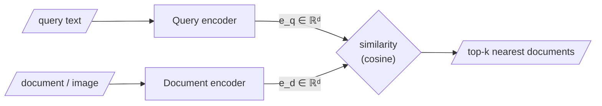

Ask a collection of images, *in words*, about "learning to love an animal", and back comes a photograph of a child with a dog — though the word "dog" never appears in the query and no caption was matched. This should be unsettling if you picture search as string-matching: no substring of the query occurs in the pixels of a photograph. **Something has been matched, but it is not text. What has been compared is meaning, rendered as position in a space.**

This is the first major shift in the course: the system is no longer asking whether two strings look alike. It is asking whether two points sit near one another in a geometry of meaning.

## Core intuition

Lexical search answers: "Which strings look similar?" Semantic search answers: "Which points are near in meaning?"

That sounds simple, but it changes the entire architecture of search. A lexical engine sees words; a **bi-encoder** — a model that encodes the query and the documents *separately*, each into its own vector, so the two never see each other during encoding — sees geometry. The same query may retrieve an item containing none of the same tokens because the meaning sits near it in vector space. The system is not matching strings; it is ranking by representation.

## Why it matters

This is the first big conceptual split in the course: keyword systems work when the exact language matches, while semantic systems work when the intent or concept matches.

The problem is not merely that semantic search is clever. It is that real questions are often abstract, emotional, or indirect. A user may ask for something that does not literally contain their words. If the retriever is lexical-only, the system misses the relevant evidence and answers from the wrong evidence.

## Instructor framing

This chapter is the bridge between the idea of retrieval and the practice of representation learning. The course is teaching that information is not stored in strings alone but in coordinates. The vector space is not decoration; it is the actual substrate on which retrieval happens.

The important point is not that semantic matching is “more clever” than lexical matching. It is that the two systems solve different problems. Lexical search is excellent at exact, literal overlap; semantic search is useful when the user is asking for a concept whose words may be different from the evidence that satisfies it.

## Worked example

A query like "regulatory pressure on a company" may match passages mentioning FDA letters, compliance reviews, or authority notices. Those passages share meaning, not string overlap.

Likewise, a question like "something melancholy" may retrieve a poem or an article about grief, even though the literal tokens do not overlap. Here semantic matching is doing the useful work: it is aligning by effect and mood, not by exact words.

## Math explained step by step

Here is the mechanism in one breath. An encoder turns the query into a vector $e_q$; the same kind of encoder has already turned every document into a vector $e_d$; all of these live in **one shared space**; and we retrieve the documents whose vectors are closest to the query's:

$$\text{retrieve} = \arg\max_{d}\; \text{sim}(e_q, e_d)$$

The key idea is that we are not matching on text tokens; we are matching on the geometry of representation. A common similarity function is cosine similarity:

$$\text{sim}(e_q, e_d) = \frac{e_q \cdot e_d}{\|e_q\|\,\|e_d\|}$$

This puts both query and document into the same coordinate system and ranks them by angular closeness.



**Dense Passage Retrieval (DPR)** is the canonical *trained* version of exactly this idea. When the query is text and the documents are images, we use a model trained to place both modalities in one shared space — the trick behind **CLIP-style** image–text retrieval, which is why words can find pictures.

## Practical pattern

In production, the standard pattern is:

1. encode the query with the same embedding model used for documents;
2. place each document in the same vector space;
3. retrieve the nearest neighbors by similarity;
4. use lexical search for identifiers or formulaic text where exact matching matters.

That is why modern systems usually do not choose “semantic vs lexical” as a religion. They build a hybrid system: lexical handles exact, high-precision matches; semantic handles meaning and paraphrase.

## Common traps

- assuming semantic search replaces lexical search entirely;
- forgetting that rare identifiers like part numbers are often lexical-first cases;
- over-trusting embeddings when the query is extremely specific and literal;
- ignoring that semantic search can also fail on polysemy and ambiguous terms.

## Takeaways

- Semantic search compares meaning in a shared embedding space, not literal strings.
- The bi-encoder pattern is the core retrieval primitive behind many modern RAG systems.
- Lexical search is still valuable for exact matches and identifiers.
- The real win comes from hybrid retrieval, not from choosing just one side.

## Three families where lexical and semantic diverge

Return to these again and again; they are the reason the rest of the course exists:

| Family | Example query | Why lexical fails |
|---|---|---|
| **Abstraction** | "regulatory pressure on the company" | Matches passages about FDA letters and EMA guidelines that never use those words |
| **Emotion** | "something melancholy" | Retrieved items share a *mood*, not a keyword |
| **Intent** | "how do I stop my code crashing at night" | Matches what the user is trying to *accomplish*, not what they typed |

These divergences are not curiosities — they are also, as Act III shows, the seed of how semantic search goes *wrong* (semantic near-misses, polysemy collisions).

## A toy contrast in code

```python
# lexical vs semantic, side by side — tiny corpus, no cleverness
corpus = [
    "The FDA sent a warning letter about manufacturing violations.",
    "Our dog learned to trust us after months of patience.",
    "Interest rates were raised by the central bank.",
]

query = "regulatory pressure on a company"

# --- lexical: count shared words -------------------------------
for doc in corpus:
    shared = 0
    for w in query.lower().split():
        if w in doc.lower().split():
            shared = shared + 1
    print(shared, doc[:50])   # every doc scores ~0: no shared words!

# --- semantic: embed and compare -------------------------------
import requests
r = requests.post("http://10.0.10.51:8000/embed-text/v1/embeddings",
    json={"model": "sentence-transformers/all-MiniLM-L6-v2",
          "input": [query] + corpus})
vecs = [d["embedding"] for d in r.json()["data"]]

def cos(u, v):
    dot = sum(a*b for a, b in zip(u, v))
    nu  = sum(a*a for a in u) ** 0.5
    nv  = sum(b*b for b in v) ** 0.5
    return dot / (nu * nv)

for doc, v in zip(corpus, vecs[1:]):
    print(round(cos(vecs[0], v), 3), doc[:50])
# the FDA sentence wins by a wide margin — meaning matched, not words
```

## Don't forget what lexical is good at

A rare identifier — a part number, a statute, a gene name — may carry little semantic signal and be **missed entirely by dense search**, even though a keyword index would have nailed it. This "lexical blindness" is why Week 3 builds *hybrid* retrieval rather than throwing keywords away.
