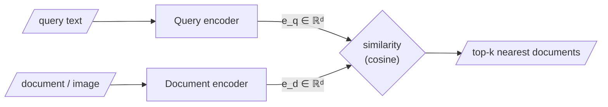

Ask a collection of images, *in words*, about "learning to love an animal", and back comes a photograph of a child with a dog — though the word "dog" never appears in the query and no caption was matched. This should be unsettling if you picture search as string-matching: no substring of the query occurs in the pixels of a photograph. **Something has been matched, but it is not text. What has been compared is meaning, rendered as position in a space.**

## The bi-encoder picture

Here is the mechanism in one breath. An encoder turns the query into a vector $e_q$; the same kind of encoder has already turned every document into a vector $e_d$; all of these live in **one shared space**; and we retrieve the documents whose vectors are closest to the query's:

$$\text{retrieve} = \arg\max_{d}\; \text{sim}(e_q, e_d)$$



**Dense Passage Retrieval (DPR)** is the canonical *trained* version of exactly this idea. When the query is text and the documents are images, we use a model trained to place both modalities in one shared space — the trick behind **CLIP-style** image–text retrieval, which is why words can find pictures.

## Three families where lexical and semantic diverge

Return to these again and again; they are the reason the rest of the course exists:

| Family | Example query | Why lexical fails |
|---|---|---|
| **Abstraction** | "regulatory pressure on the company" | Matches passages about FDA letters and EMA guidelines that never use those words |
| **Emotion** | "something melancholy" | Retrieved items share a *mood*, not a keyword |
| **Intent** | "how do I stop my code crashing at night" | Matches what the user is trying to *accomplish*, not what they typed |

These divergences are not curiosities — they are also, as Act III shows, the seed of how semantic search goes *wrong* (semantic near-misses, polysemy collisions).

## A toy contrast in code

```python
# lexical vs semantic, side by side — tiny corpus, no cleverness
corpus = [
    "The FDA sent a warning letter about manufacturing violations.",
    "Our dog learned to trust us after months of patience.",
    "Interest rates were raised by the central bank.",
]

query = "regulatory pressure on a company"

# --- lexical: count shared words -------------------------------
for doc in corpus:
    shared = 0
    for w in query.lower().split():
        if w in doc.lower().split():
            shared = shared + 1
    print(shared, doc[:50])   # every doc scores ~0: no shared words!

# --- semantic: embed and compare -------------------------------
import requests
r = requests.post("http://10.0.10.51:8000/embed-text/v1/embeddings",
    json={"model": "sentence-transformers/all-MiniLM-L6-v2",
          "input": [query] + corpus})
vecs = [d["embedding"] for d in r.json()["data"]]

def cos(u, v):
    dot = sum(a*b for a, b in zip(u, v))
    nu  = sum(a*a for a in u) ** 0.5
    nv  = sum(b*b for b in v) ** 0.5
    return dot / (nu * nv)

for doc, v in zip(corpus, vecs[1:]):
    print(round(cos(vecs[0], v), 3), doc[:50])
# the FDA sentence wins by a wide margin — meaning matched, not words
```

## Don't forget what lexical is good at

A rare identifier — a part number, a statute, a gene name — may carry little semantic signal and be **missed entirely by dense search**, even though a keyword index would have nailed it. This "lexical blindness" is why Week 3 builds *hybrid* retrieval rather than throwing keywords away.
