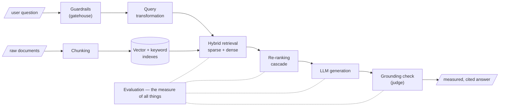

Before descending into mechanism, see the whole route. The course is a **single pipeline** — from a raw document to a measured, trustworthy answer — and each week adds one instrument to it. The syllabus is not a list; it is an argument, and Week 1 is its first premise. If you can hold the map in view, the later chapters stop feeling like a catalogue of tricks and start feeling like a disciplined engineering story.

## Core intuition

The whole course is one pipeline, not a pile of disconnected topics. Every chapter is a tool for answering the same question: how do we turn raw knowledge into a robust, grounded answer when the system is uncertain, noisy, and under pressure? A good retrieval system is not a feature set; it is a chain of decisions that preserves truth under stress.

This is the reason the syllabus feels like a map rather than a table of contents. The tools are designed to solve a chain of failure modes, not to exist in isolation.

## Why it matters

A naive RAG system fails in predictable ways: it cannot find the right evidence, it chunks badly, it loses nuance, it retrieves the wrong candidate, and it produces answers without the discipline of checking.

The map matters because it tells you what problem each instrument is solving. Chunking is not just a preprocessing detail; it is a projection of meaning. Hybrid retrieval is not a fancy option; it is the response to lexical blindness. Guardrails are not afterthoughts; they are the gate that keeps bad prompts and poisoned retrieval from contaminating the answer.

## Instructor framing

The course is not a list of features. It is a sequence of surgical responses to recurring failure modes. The student is meant to see the pipeline as a system with failure points and remedies stacked over time.

That makes the course useful as a whole. The architecture evolves from basic retrieval into trust, verification, and evaluation. You are not learning “AI tricks”; you are learning how a production answer system remains honest under bad conditions.

## Worked example

Think about a compliance question in an enterprise setting: “Which vendor contracts mention this risk clause and what was the previous legal decision?”

A naive system might:

- chunk the contract corpus badly;
- retrieve a few semantically similar but irrelevant passages;
- answer from a single weak hit;
- produce a confident but unsupported result.

The map tells you exactly where the pipeline breaks. The subsequent weeks add small but crucial instruments to repair those stages.

## Math explained step by step

The pipeline is easiest to reason about as a chain of transformations:

$$
\text{documents} \rightarrow \text{chunks} \rightarrow \text{index} \rightarrow \text{retrieve} \rightarrow \text{rank} \rightarrow \text{generate} \rightarrow \text{ground}
$$

Each stage is a filter. A chunker removes the wrong context. A retriever selects candidate evidence. A re-ranker decides which subset is strongest. A grader decides whether the final answer is supported. The course is teaching not one algorithm, but this discipline of staged evidence flow.

## Practical pattern

The practical pattern is a production data pipeline:

1. ingest the raw corpus;
2. clean and chunk it intentionally;
3. index both lexical and semantic views;
4. rewrite or augment the query;
5. retrieve, rerank, and filter;
6. generate with citations;
7. evaluate and ground the final answer.

That sequence is the real architecture of trustworthy AI application design.

## Common traps

- thinking the syllabus is random instead of causal;
- treating each tool as a standalone feature instead of a repair to a failure mode;
- focusing only on the LLM while ignoring ingestion and retrieval;
- treating evaluation as a final step rather than as a continuous discipline.

## Takeaways

- The course is one system, not a collection of isolated ideas.
- Each week addresses a failure mode in the retrieval-to-answer pipeline.
- The deeper value is in how the pieces fit together.
- The capstone is where these instruments become operational judgment.

## The pipeline, module by module

| Module | Instruments |
|---|---|
| **Foundations** | How meaning becomes geometry; how the machine learns to place it there |
| **Ingestion** | Chunking — cutting documents into retrievable units, *the first and most irreversible projection* |
| **Retrieval** | The sparse/dense/hybrid pipeline and its cascade of re-rankers; query transformation — the translator that rewrites the question before it is ever asked |
| **Enrichment** | Derivative artifacts (*the prism*), RAPTOR (*the zoom lens*), GraphRAG (*the telescope*) — three ways of seeing one corpus at different resolutions |
| **Architecture & Speed** | How scale decides architecture; semantic caching — the system's memory for questions it has already answered |
| **Safety & Trust** | Request guardrails (*the gatehouse before the castle*); response grounding (*the judge after the jury*) |
| **Proof & Frontier** | Evaluation — *the measure of all things*; the bridge to structured data via Text-to-SQL |

## Why the course begins with a worldview

We do not begin with frameworks and APIs. We begin with geometry, because **the instruments only make sense once you can see the space they operate on**. Every clever-looking trick later — hybrid search, re-ranking, RAPTOR trees, graph communities, semantic caches, grounding judges — is a disciplined response to a geometric fact met in Week 1.

The pathologies of naive RAG (last page of this week) map one-to-one onto these instruments: *lost-in-the-cut* becomes the chunking chapter, *lexical blindness* becomes hybrid retrieval, *thin margins over the noise floor* become the re-ranking cascade, *garbled questions* become query transformation, *ungrounded answers* become guardrails and grounding, and *unmeasured everything* becomes evaluation.

## The capstone

Theory earns its keep when it ships. The course culminates in an enterprise-grade capstone chosen from realistic briefs — a **clinical-trial matchmaker**, a **compliance sentinel**, an **earnings analyst**, a **procurement analyst**, a **pharmacovigilance monitor**, a **newsroom verifier**, a **legislative cartographer** — each from a domain where retrieval quality has real consequences. Read every concept in this textbook with your eventual project in mind.
