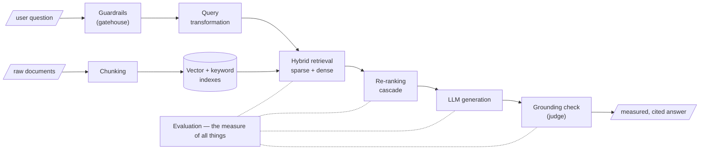

Before descending into mechanism, see the whole route. The course is a **single pipeline** — from a raw document to a measured, trustworthy answer — and each week adds one instrument to it. The syllabus is not a list; it is an argument, and Week 1 is its first premise.

## The pipeline, module by module

| Module | Instruments |
|---|---|
| **Foundations** | How meaning becomes geometry; how the machine learns to place it there |
| **Ingestion** | Chunking — cutting documents into retrievable units, *the first and most irreversible projection* |
| **Retrieval** | The sparse/dense/hybrid pipeline and its cascade of re-rankers; query transformation — the translator that rewrites the question before it is ever asked |
| **Enrichment** | Derivative artifacts (*the prism*), RAPTOR (*the zoom lens*), GraphRAG (*the telescope*) — three ways of seeing one corpus at different resolutions |
| **Architecture & Speed** | How scale decides architecture; semantic caching — the system's memory for questions it has already answered |
| **Safety & Trust** | Request guardrails (*the gatehouse before the castle*); response grounding (*the judge after the jury*) |
| **Proof & Frontier** | Evaluation — *the measure of all things*; the bridge to structured data via Text-to-SQL |

## Why the course begins with a worldview

We do not begin with frameworks and APIs. We begin with geometry, because **the instruments only make sense once you can see the space they operate on**. Every clever-looking trick later — hybrid search, re-ranking, RAPTOR trees, graph communities, semantic caches, grounding judges — is a disciplined response to a geometric fact met in Week 1.

The pathologies of naive RAG (last page of this week) map one-to-one onto these instruments: *lost-in-the-cut* becomes the chunking chapter, *lexical blindness* becomes hybrid retrieval, *thin margins over the noise floor* become the re-ranking cascade, *garbled questions* become query transformation, *ungrounded answers* become guardrails and grounding, and *unmeasured everything* becomes evaluation.

## The capstone

Theory earns its keep when it ships. The course culminates in an enterprise-grade capstone chosen from realistic briefs — a **clinical-trial matchmaker**, a **compliance sentinel**, an **earnings analyst**, a **procurement analyst**, a **pharmacovigilance monitor**, a **newsroom verifier**, a **legislative cartographer** — each from a domain where retrieval quality has real consequences. Read every concept in this textbook with your eventual project in mind.
