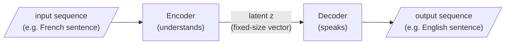

Strip away the marketing and a language model is a **sequence model**: a function that, given a sequence of tokens, assigns probabilities to what comes next. Formally, it factorises the probability of a whole sequence into a product of next-token probabilities:

$$p(y_1, y_2, \ldots, y_T) = \prod_{t=1}^{T} p\left(y_t \mid y_1, \ldots, y_{t-1}\right)$$

Read the $\prod$ (product) as "multiply the per-step probabilities together." Concretely: suppose that after reading "The capital of France is", the model assigns $p(\text{Paris}) = 0.62$ to the next token; then, having appended "Paris", it assigns $p(\text{"."} \mid \ldots \text{Paris}) = 0.90$ to the token after that. The probability of producing the two-token continuation "Paris." is just the product of those two steps: $0.62 \times 0.90 \approx 0.56$. Nothing more exotic is happening in the formula above — it is that same multiplication, carried out for every token in the sequence.

Generation is **autoregressive**: predict $y_t$, append it, condition on it, predict $y_{t+1}$. Each factor is a distribution over the entire vocabulary, and "writing" is repeatedly sampling from it.

> This factorisation is why a language model can be *steered by context*: everything to the left — including the documents RAG inserts — conditions every probability that follows. Retrieval works precisely because the model attends to the evidence we place in $y_1, \ldots, y_{t-1}$.

```python
# autoregressive generation, spelled out — the loop IS the idea
def next_token_probs(tokens):
    """Stand-in for a trained model: returns {token: probability}."""
    ...

tokens = ["The", "capital", "of", "France", "is"]
for step in range(3):
    probs = next_token_probs(tokens)
    best = max(probs, key=probs.get)   # greedy: take the most likely
    tokens.append(best)                # append, condition, repeat
print(" ".join(tokens))
```

## The seq2seq scaffold

The pedagogically useful scaffold for relating an input to an output is **sequence-to-sequence** (Sutskever et al.): an *encoder* reads the input and compresses it into an internal representation — a latent $z$ — and a *decoder* expands that latent into an output sequence:

$$\text{input} \xrightarrow{\;\text{encoder}\;} z \xrightarrow{\;\text{decoder}\;} \text{output}$$

Read it as a pipeline of meaning: the encoder's job is to **understand** (map text into a latent that captures its content); the decoder's job is to **speak** (turn a latent back into fluent text). Early machine translation used exactly this shape — read the French, form a thought, write the English.



> **The bottleneck:** all the meaning of a long input must squeeze through a single fixed-size latent $z$. For a short sentence, fine; for a paragraph, the latent forgets its own beginning by the time it reaches the end. This bottleneck is exactly what *attention* was invented to relieve — next page.

## Encoder vs decoder: the Week-1 misconception that costs weeks

A distinction worth fixing now. In almost every production RAG system:

| | The **embedder** (encoder) | The **generator** (decoder LLM) |
|---|---|---|
| Job | Place texts as points in a space | Write the answer |
| Character | Silent, cheap | Eloquent, expensive |
| When it runs | Already ran over **every chunk** in the corpus | Once per answer |
| Examples | Sentence-BERT descendants, MiniLM | GPT-style models |

The model that generates your answer is **not** the same model that embeds your documents for retrieval. Conflating them is the single most common Week-1 misconception, and it quietly corrupts one's reasoning about cost, latency, and failure modes for weeks. When the course says "the embedding model", it means the encoder; "the LLM" or "the generator" means the decoder.
