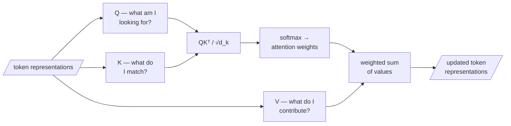

The key discovery that made modern representations possible has a two-part history, and both parts are worth telling.

## Part 1 — Bahdanau's alignment: a cure for the bottleneck

Instead of forcing the whole input through one latent, Bahdanau, Cho & Bengio let the decoder, at each output step $i$, form a **weighted average of all the encoder's hidden states** $h_j$:

$$c_i = \sum_j \alpha_{ij} h_j, \qquad \alpha_{ij} = \frac{\exp(e_{ij})}{\sum_k \exp(e_{ik})}$$

The weights $\alpha_{ij}$ are a softmax over learned *alignment scores* $e_{ij}$ measuring how relevant input position $j$ is to output position $i$. Attention began life as a cure for the seq2seq bottleneck: **let the decoder look back**, and attend more to the input words that matter for the word it is about to produce.

Concretely, with just two input positions: say $h_1 = 2$ and $h_2 = 10$ (one number per hidden state, to keep the arithmetic visible), and the model has learned alignment scores $e_{i1} = 1$, $e_{i2} = 2$ for the output word it is about to generate. Softmax turns those scores into weights: $\alpha_{i1} = e^1 / (e^1 + e^2) \approx 0.27$ and $\alpha_{i2} = e^2 / (e^1 + e^2) \approx 0.73$. The context vector is then $c_i = 0.27 \times 2 + 0.73 \times 10 \approx 7.8$ — mostly $h_2$, because the model scored position 2 as more relevant to this output word than position 1.

## Part 2 — The transformer: alignment becomes the whole machine

Vaswani and colleagues asked a radical question: if attention is so powerful, what if we throw away the recurrence entirely and build the whole model out of attention? The resulting architecture — the **transformer** — is organised around *scaled dot-product attention*:

$$\text{Attention}(Q, K, V) = \text{softmax}\!\left(\frac{QK^\top}{\sqrt{d_k}}\right)V$$

Read this as a **soft, differentiable lookup**:

| Symbol | Question it asks |
|---|---|
| Query $Q$ | "What am I looking for?" |
| Key $K$ | "What do I match?" |
| Value $V$ | "What do I contribute if matched?" |

The dot product $QK^\top$ scores every query against every key; the $\sqrt{d_k}$ keeps those scores from exploding as dimension grows; the softmax turns them into attention weights; and the weighted sum of values is what each token carries forward.

> **The $\sqrt{d_k}$ rescaling is our first quiet encounter with high-dimensional geometry**: dot products of long vectors grow with dimension, and without rescaling the softmax would saturate. The same "things get big and concentrated in high dimensions" theme returns, far more dramatically, in Act III.



```python
# scaled dot-product attention in plain python — one query, tiny d_k
import math

q      = [1.0, 0.0]                              # what am I looking for?
keys   = [[1.0, 0.0], [0.0, 1.0], [0.7, 0.7]]    # what does each token match?
values = [[10.0], [20.0], [30.0]]                # what does each contribute?

d_k = len(q)
scores = []
for k in keys:
    s = sum(a*b for a, b in zip(q, k)) / math.sqrt(d_k)
    scores.append(s)

exps    = [math.exp(s) for s in scores]
weights = [e / sum(exps) for e in exps]           # softmax
output  = sum(w * v[0] for w, v in zip(weights, values))
print("weights:", [round(w, 3) for w in weights], "→ output:", round(output, 2))
# the key most aligned with q gets the most weight — a soft lookup
```

Doing this with several independent **heads** in parallel (multi-head attention) lets the model match on several kinds of relationship at once; and because every position is processed in parallel rather than in sequence, the architecture scales to enormous data and parameter counts. The paper's title, *Attention Is All You Need*, was not hyperbole — it was a thesis, and the years since have largely vindicated it.

**Demo:** Poloclub's [Transformer Explainer](https://poloclub.github.io/transformer-explainer) — watch a real transformer turn a prompt into a distribution over next tokens, attention weights lighting up between words, the residual stream carrying information forward layer by layer. Treat it as a window, not a lecture: the point is to see with your own eyes that *the thing operates on vectors*.
