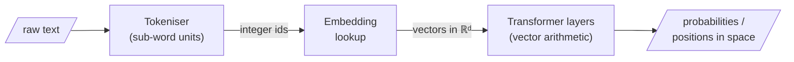

Here is the central claim of Week 1, stated plainly. **Modern models do not manipulate words, letters, or grammar rules.** The first thing that happens to your text is *tokenisation* — it is chopped into sub-word units, each mapped to an integer, each integer mapped to a learned vector. From that point on, every token, every passage, every image patch is a **vector**: an ordered list of real numbers, a point in a high-dimensional space. Tensors — stacks of such vectors — are the only objects the machine ever truly handles.

This is the deepest conceptual commitment of the course: language has been translated into geometry, and retrieval becomes a question of proximity rather than string overlap.

> The native currency of machine cognition is not symbol and syntax; it is **proximity, similarity, and probability**.

## Core intuition

In machine learning, the model does not reason over words directly. It reasons over coordinates. A token becomes a point in a space, and the model manipulates that point through arithmetic.

This is the foundation of retrieval: the query and the document are not being matched by exact strings, but by the relationship of their positions in a vector space.

## Why it matters

If you do not understand that a model is operating on vectors, you will misread every later concept: embeddings, similarity search, semantic retrieval, attention, and high-dimensional geometry.

The practical implication is huge. Search is no longer a string operation; it becomes a geometric one. We retrieve the items that lie nearest to the query in the same coordinate system.

## Instructor framing

This chapter is where the abstract language of embeddings becomes concrete. The course is telling you that language has been translated into geometry — and that once meaning has become position, similarity becomes a computable geometric quantity.

## Worked example

Imagine a query vector for “customer complaint about latency” and candidate document vectors for “network slowdown”, “billing issue”, and “calendar invite”. The nearest vector is not the one with the same words but the one whose direction best matches the query’s intent.

This is exactly why semantic retrieval works when lexical search fails: the system is finding a nearby point in meaning space, not a matching string fragment.

## Math explained step by step

Because of a principle that predates deep learning by decades — the **distributional hypothesis**: *"you shall know a word by the company it keeps"* (Firth 1957, Harris 1954). Words that occur in similar contexts come to occupy similar positions.

Mikolov and colleagues showed this concretely with **word2vec**, and Pennington and colleagues with **GloVe**: not only do related words cluster, but *relationships appear as consistent directions* in the space — the famous

$$\vec{\text{king}} - \vec{\text{man}} + \vec{\text{woman}} \approx \vec{\text{queen}}$$

Let the strangeness land: an analogy is not stored as a rule; it is **recovered as vector arithmetic**. "Royalty" is a direction; "gender" is another direction. Meaning has become geometry, and reasoning has become moving along directions.

If meaning is geometry, similarity must be geometric too. The two measures used constantly are the **dot product** and **cosine similarity**:

$$\text{sim}_{\cos}(u, v) = \frac{u \cdot v}{\lVert u \rVert\, \lVert v \rVert} = \cos\theta$$

- **Cosine** measures the *angle* between two vectors and ignores their lengths; it asks "do these point the same way?"
- The **dot product** keeps the lengths and so also rewards *magnitude*.

For most semantic retrieval we care about **direction — the topic — more than magnitude**, which is why cosine is the workhorse. And note: if we first normalise every vector to unit length, the dot product *becomes* cosine, so the two views coincide.



```python
# cosine similarity from scratch — and the normalisation trick
def dot(u, v):
    total = 0.0
    for a, b in zip(u, v):
        total = total + a * b
    return total

def norm(u):
    return dot(u, u) ** 0.5

def cosine(u, v):
    return dot(u, v) / (norm(u) * norm(v))

u = [3.0, 4.0]          # length 5, pointing "north-east-ish"
v = [30.0, 40.0]        # same direction, 10x the length

print(cosine(u, v))      # 1.0  — same direction, length ignored
print(dot(u, v))         # 300  — dot product rewards magnitude

# normalise first, and dot == cosine:
u_hat = [x / norm(u) for x in u]
v_hat = [x / norm(v) for x in v]
print(dot(u_hat, v_hat))  # 1.0
```

## Practical pattern

In retrieval systems, the practical rule is: encode the query and document into the same space, then rank by directional similarity.

This is why the search stack usually uses cosine or a near-cosine variant. The geometry is not decorative; it is the retrieval score.

## Common traps

- thinking embeddings are just “token IDs with a better name”;
- forgetting that lengths can be irrelevant for semantic comparison;
- assuming all vector spaces behave like 3D Euclidean space;
- conflating semantic similarity with literal lexical overlap.

## Takeaways

- Models operate on vectors, not symbolic text alone.
- Meaning can be represented as position in a shared geometric space.
- Similarity is a geometric relation, often cosine distance or angle.
- Retrieval is nearest-neighbour search in that space.

## Why not raw word2vec for enterprise search?

Static word vectors give one muddled point per word (next page: polysemy). **Sentence-BERT and its descendants** produce contextual, *sentence-level* embeddings whose cosine similarity is actually meaningful — the move from a single muddled point to a context-resolved one. That is the kind of model doing the embedding in every retrieval system this course builds.
