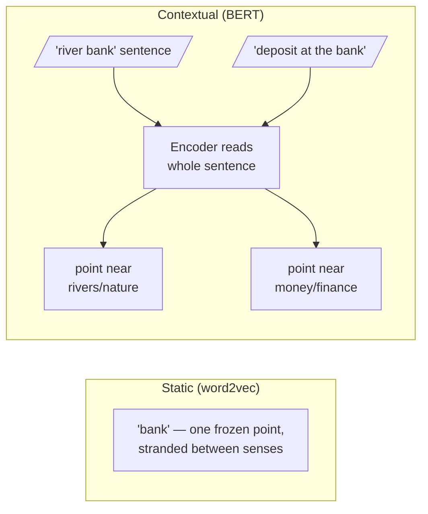

Words have more than one meaning. A *bank* is a place for money and also the edge of a river; a *monarch* is a sovereign and also a butterfly; *spring* is a season, a coil, and a source of water. This is **polysemy**, and it is not a rare edge case — **the most common words are the most polysemous**.

## Why static embeddings fail

The first generation of embeddings (word2vec, GloVe) was **static**: one vector per word *type*, computed once and frozen. Such a vector is forced to be a compromise — the single point for "bank" is dragged toward both "money" and "river" and ends up stranded between them, near neither.

> For retrieval this is poison: a query about river ecology and a query about interest rates would both match the same muddled "bank" vector.

## The fix: contextual embeddings

A transformer encoder (BERT and its descendants) reads the **whole sentence before placing any token**, so the vector for "bank" in *"she sat on the river bank"* lands far from the vector for "bank" in *"she deposited it at the bank"*. Attention is what makes this possible: each token's representation is a weighted blend of its neighbours, so **context literally moves the point**.

$$\text{static: } w \mapsto e_w \qquad \text{vs.} \qquad \text{contextual: } (w, \text{sentence}) \mapsto e_{w \mid \text{sentence}}$$

Meaning is no longer a property of a word; it is a property of **a word in a place**.



```python
# watch context move the point (uses the cluster embedder)
import requests

sentences = [
    "She sat on the river bank watching the water flow.",
    "He deposited the cheque at the bank before noon.",
    "The bank raised interest rates again this quarter.",
]
r = requests.post("http://10.0.10.51:8000/embed-text/v1/embeddings",
    json={"model": "sentence-transformers/all-MiniLM-L6-v2", "input": sentences})
v = [d["embedding"] for d in r.json()["data"]]

def cos(u, w):
    dot = sum(a*b for a, b in zip(u, w))
    return dot / (sum(a*a for a in u)**0.5 * sum(b*b for b in w)**0.5)

print("river-bank  vs deposit-bank :", round(cos(v[0], v[1]), 3))  # low
print("deposit-bank vs rates-bank  :", round(cos(v[1], v[2]), 3))  # high
# the two financial sentences huddle together; the river drifts away
```

## The Monarch exercise

Abstraction sticks better when the body joins in. Each student holds a card bearing a word or phrase — some about a monarch butterfly's migration, some about a king and his court, some about chess, a music label, a moth — and the room arranges itself physically *by meaning*. Butterfly cards drift to one corner, royalty to another, and the genuinely ambiguous cards find themselves **pulled between clusters, unsure where to stand**. What the room has built is a low-dimensional embedding space, and it plants three intuitions:

1. **Meaning is position.**
2. **Similarity is distance (or angle).**
3. **Ambiguity is being near several clusters at once.**

A static embedding leaves the ambiguous card-holder stranded forever between clusters; a contextual embedding reads the rest of their card — the sentence — and walks them firmly into one neighbourhood.

## One level deeper: superposition

Inside a model, individual *neurons* are themselves **polysemantic**: a single neuron fires for several unrelated concepts. The leading explanation is **superposition** — models pack far more features than they have dimensions by assigning features overlapping, non-orthogonal directions, tolerating a little interference in exchange for enormous capacity.

Linguistic polysemy (one word, many senses) and mechanistic polysemanticity (one neuron, many features) are **two faces of the same pressure**: meaning is dense, dimensions are finite, and the geometry must economise. Recent work on *dictionary learning* (Anthropic's "Towards Monosemanticity") tries to disentangle these superposed features back into interpretable, monosemantic directions.
