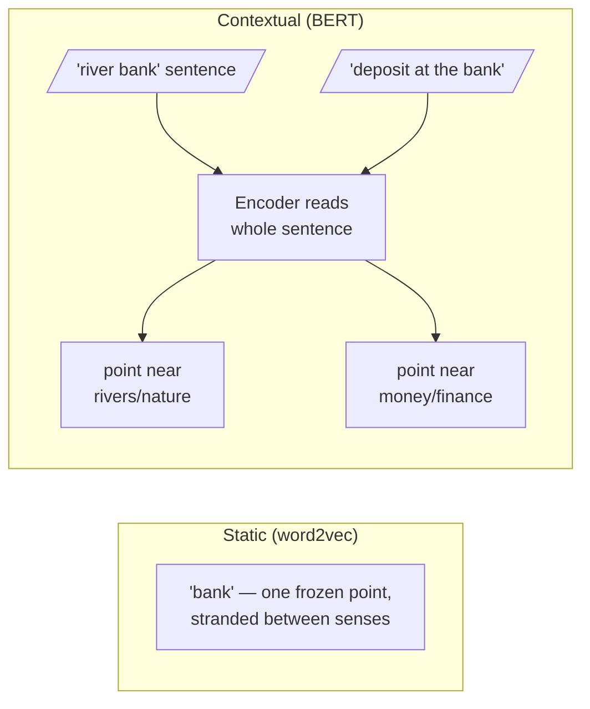

Words have more than one meaning. A *bank* is a place for money and also the edge of a river; a *monarch* is a sovereign and also a butterfly; *spring* is a season, a coil, and a source of water. This is **polysemy**, and it is not a rare edge case — **the most common words are the most polysemous**. Ambiguity is not a defect of language; it is a fact of how human meaning works.

## Core intuition

The same word can point to different neighborhoods depending on context. A static embedding treats each word as one fixed point; a contextual embedding moves that point as the sentence changes. The model’s representation must therefore be sensitive to the sentence in which the word appears, not merely to the word as a type.

This is why ambiguity is such a serious challenge in retrieval: if the representation is too rigid, the system cannot distinguish meaningfully different uses of the same word.

## Why it matters

A query about river ecology and a query about interest rates might both contain the word “bank,” but they refer to completely different concepts. If the retriever maps both to the same static point, it will confuse the evidence and produce weak or wrong retrieval results.

This is one of the main reasons high-quality enterprise search cannot rely on naive word vectors alone.

## Instructor framing

This chapter is the first clear demonstration that context changes the geometry of meaning. The course is teaching a broad fact: the representation of meaning must depend on the surroundings, not only the token spelling.

## Worked example

Compare these sentences:

- “She sat on the river bank watching the water flow.”
- “He deposited the cheque at the bank before noon.”

The word “bank” has two very different meanings. A contextual model reads the whole sentence and places the token in different regions of the representation space depending on the surrounding words and structure.

## Math explained step by step

The difference between static and contextual embeddings is the function they represent:

$$\text{static: } w \mapsto e_w \qquad \text{vs.} \qquad \text{contextual: } (w, \text{sentence}) \mapsto e_{w \mid \text{sentence}}$$

In static embeddings, one vector is assigned to a word type. In contextual embeddings, the vector is a function of both the word and the sentence in which it appears.

That means each occurrence of a word can be placed in a different location in the same representation space, depending on its surrounding context.



```python
# watch context move the point (uses the cluster embedder)
import requests

sentences = [
    "She sat on the river bank watching the water flow.",
    "He deposited the cheque at the bank before noon.",
    "The bank raised interest rates again this quarter.",
]
r = requests.post("http://10.0.10.51:8000/embed-text/v1/embeddings",
    json={"model": "sentence-transformers/all-MiniLM-L6-v2", "input": sentences})
v = [d["embedding"] for d in r.json()["data"]]

def cos(u, w):
    dot = sum(a*b for a, b in zip(u, w))
    return dot / (sum(a*a for a in u)**0.5 * sum(b*b for b in w)**0.5)

print("river-bank  vs deposit-bank :", round(cos(v[0], v[1]), 3))  # low
print("deposit-bank vs rates-bank  :", round(cos(v[1], v[2]), 3))  # high
# the two financial sentences huddle together; the river drifts away
```

## Practical pattern

In modern retrieval, the practical pattern is to use contextual embeddings whenever the system must handle ambiguity, syntactic structure, or nuanced meaning.

That is the reason sentence-level encoders and transformer-based document representations dominate modern enterprise search.

## Common traps

- assuming one vector per word is sufficient for modern retrieval;
- thinking ambiguous words will self-resolve without context;
- ignoring that the same token may belong to different semantic neighborhoods in different contexts;
- forgetting that context changes the geometry of meaning.

## Takeaways

- Polysemy is a major reason static word embeddings are limited.
- Contextual embeddings resolve ambiguity by moving the point according to sentence structure.
- Retrieval quality depends on representing meaning in context, not just by token type.
- Polysemy and superposition are two sides of the same geometry problem.

## The Monarch exercise

Abstraction sticks better when the body joins in. Each student holds a card bearing a word or phrase — some about a monarch butterfly's migration, some about a king and his court, some about chess, a music label, a moth — and the room arranges itself physically *by meaning*. Butterfly cards drift to one corner, royalty to another, and the genuinely ambiguous cards find themselves **pulled between clusters, unsure where to stand**. What the room has built is a low-dimensional embedding space, and it plants three intuitions:

1. **Meaning is position.**
2. **Similarity is distance (or angle).**
3. **Ambiguity is being near several clusters at once.**

A static embedding leaves the ambiguous card-holder stranded forever between clusters; a contextual embedding reads the rest of their card — the sentence — and walks them firmly into one neighbourhood.

## One level deeper: superposition

Inside a model, individual *neurons* are themselves **polysemantic**: a single neuron fires for several unrelated concepts. The leading explanation is **superposition** — models pack far more features than they have dimensions by assigning features overlapping, non-orthogonal directions, tolerating a little interference in exchange for enormous capacity.

Linguistic polysemy (one word, many senses) and mechanistic polysemanticity (one neuron, many features) are **two faces of the same pressure**: meaning is dense, dimensions are finite, and the geometry must economise. Recent work on *dictionary learning* (Anthropic's "Towards Monosemanticity") tries to disentangle these superposed features back into interpretable, monosemantic directions.
