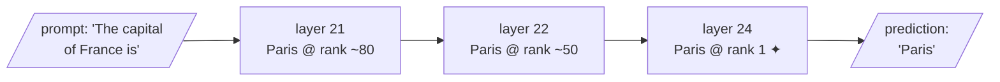

Meaning is geometry in the embedding space — and here is the provocation that closes Act II: **meaning is geometry inside the model's own weights, too**, and we can now query it almost as we would a database. This is the doorway to *mechanistic interpretability*, the study of what the computations inside a model actually represent.

## LARQL: "the model is the database"

LARQL "decompiles" a transformer's weights into a queryable structure — a **vindex** (vector index) — in which:

- the model's feed-forward **gate vectors** become a nearest-neighbour index,
- its **embeddings** become a token lookup,
- its **output projections** become labelled edges between concepts.

You then pose questions in a small query language, **LQL**:

```text
larql> DESCRIBE "France";
France
  capital   -> Paris    L27
  language  -> French   L24
  continent -> Europe   L25
  borders   -> Spain    L18
```

Notice the layer tags (L27, L24): **the knowledge is not in one place but spread across depth** — a fact mechanistic interpretability takes very seriously. LARQL runs without a GPU because it treats stored weights as *data to be browsed* rather than a network to be run.

## Watching an answer crystallise: the residual stream

More striking still, one can trace how an answer forms as computation flows through the layers — the **residual stream**. Asking the model to complete *"The capital of France is"*, LARQL shows the token "Paris" sitting at rank ~50 around layer 22, then **leaping to rank 1 at layer 24** — a visible phase transition where the model "decides". The knowledge was always present as geometry in the weights; the trace lets us watch it crystallise into a prediction.



## A caution, and why this matters for RAG

Do not over-interpret a single demo. These tools are young, and a tidy France → Paris edge is a *best case*, not a guarantee; **superposition means most features are entangled, not clean**. The lesson is directional: the black box is becoming less black.

Why raise this on day one of a *retrieval* course?

> It is tempting to treat a language model as an oracle — an opaque box that emits text. But a RAG engineer who believes the box is opaque will treat its failures as magic and its fixes as superstition.

The truer picture, and the one this course adopts: a model's apparent knowledge is **structured, located, and increasingly inspectable**. When we later build grounding pipelines that check whether an answer is supported by evidence, and guardrails that decide what the model should never answer, it will matter enormously that you think of the model not as a wizard but as a **queryable, fallible store of geometric facts**.
