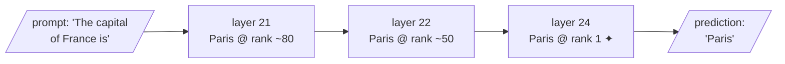

Meaning is geometry in the embedding space — and here is the provocation that closes Act II: **meaning is geometry inside the model's own weights, too**, and we can now query it almost as we would a database. This is the doorway to *mechanistic interpretability*, the study of what the computations inside a model actually represent. The intellectual move is simple but profound: if knowledge lives in geometry, then it is also possible to inspect the geometry directly.

## Core intuition

The model is not a black box in the strongest sense. Its knowledge is distributed across weights, layers, and directions in activation space. It can be probed, examined, and partially queried as a structured object. The internal state of a model is not mystical; it is a rich mathematical object that can be examined more closely.

This does not mean the model is perfectly interpretable. It means that the notion of “knowledge as geometry” extends beyond embeddings and into the internals of the model itself.

## Why it matters

For RAG engineers, this matters because it changes how you think about the model. It is not an oracle that emits truth by magic. It is a computation graph with internal structure, and that structure can be inspected.

The practical lesson is humility: good retrieval and good guardrails are required because the model is a genuinely fallible, high-capacity approximation machine.

## Instructor framing

This chapter opens a door to mechanistic interpretability without pretending the door is fully opened. The point is not to become a neuroscientist of transformers; it is to become aware that a model's “memory” is distributed geometry, not mystical competence.

## Worked example

Ask the model to complete the phrase “The capital of France is.” The model does not retrieve a factual record from a database. Instead, it follows a path through layers; the concept “Paris” gains increasing probability as it moves through the residual stream until it becomes the most likely output token.

This is not a magical answer; it is a structured calculation in high-dimensional space.

## Math explained step by step

The core idea is that knowledge is not concentrated in a single giant switch. It is spread across depth and direction. A query-language such as LARQL treats the transformer's weights as a browseable structure:

- gate vectors become a nearest-neighbour index;
- embeddings become a token lookup;
- output projections become labelled edges between concepts.

Concretely, this means you can ask the weights themselves a question and get a structured answer with a *location* attached — not just "the model knows France's capital" but "the fact is anchored at layer 27." The worked query and its output are shown in full below, in "LARQL: the model is the database" — the point to hold onto here is that the layer number is not decoration: it tells you *where in the computation* that piece of knowledge becomes available, which is exactly the kind of thing you cannot ask of a model you only ever treat as an opaque API.

## Practical pattern

The practical takeaway is to treat the model as a structured system that can be probed, but never as a trustworthy oracle by default.

This is why evidence scoring, grounding checks, and guardrails matter. A model may be rich in internal geometry, but it still needs external discipline to remain honest and usefully aligned with the task.

## Common traps

- treating the model as a perfect fact store;
- assuming interpretability demos prove full transparency;
- overestimating how cleanly features are represented;
- ignoring that superposition creates entanglement and ambiguity even inside the model.

## Takeaways

- Knowledge inside a model is distributed, not centralized.
- Mechanistic interpretability helps reveal the geometry of that knowledge.
- The residual stream is the path along which a concept becomes a prediction.
- RAG must still add external evidence and verification because the model remains fallible.

## LARQL: "the model is the database"

LARQL "decompiles" a transformer's weights into a queryable structure — a **vindex** (vector index) — in which:

- the model's feed-forward **gate vectors** become a nearest-neighbour index,
- its **embeddings** become a token lookup,
- its **output projections** become labelled edges between concepts.

You then pose questions in a small query language, **LQL**:

```text
larql> DESCRIBE "France";
France
  capital   -> Paris    L27
  language  -> French   L24
  continent -> Europe   L25
  borders   -> Spain    L18
```

Notice the layer tags (L27, L24): **the knowledge is not in one place but spread across depth** — a fact mechanistic interpretability takes very seriously. LARQL runs without a GPU because it treats stored weights as *data to be browsed* rather than a network to be run.

## Watching an answer crystallise: the residual stream

More striking still, one can trace how an answer forms as computation flows through the layers — the **residual stream**. Asking the model to complete *"The capital of France is"*, LARQL shows the token "Paris" sitting at rank ~50 around layer 22, then **leaping to rank 1 at layer 24** — a visible phase transition where the model "decides". The knowledge was always present as geometry in the weights; the trace lets us watch it crystallise into a prediction.



## A caution, and why this matters for RAG

Do not over-interpret a single demo. These tools are young, and a tidy France → Paris edge is a *best case*, not a guarantee; **superposition means most features are entangled, not clean**. The lesson is directional: the black box is becoming less black.

Why raise this on day one of a *retrieval* course?

> It is tempting to treat a language model as an oracle — an opaque box that emits text. But a RAG engineer who believes the box is opaque will treat its failures as magic and its fixes as superstition.

The truer picture, and the one this course adopts: a model's apparent knowledge is **structured, located, and increasingly inspectable**. When we later build grounding pipelines that check whether an answer is supported by evidence, and guardrails that decide what the model should never answer, it will matter enormously that you think of the model not as a wizard but as a **queryable, fallible store of geometric facts**.
