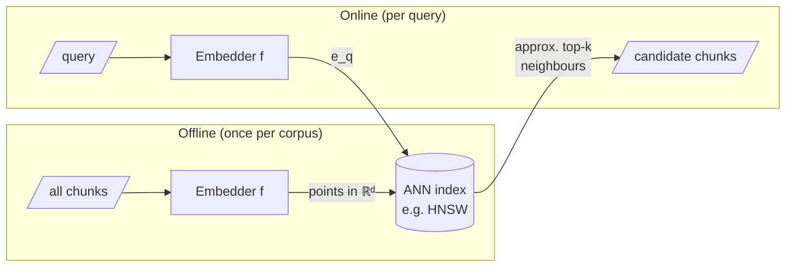

Formally, an embedding model is a function $f$ that maps a piece of text $x$ to a vector in $\mathbb{R}^d$:

$$f : X \to \mathbb{R}^d, \qquad x \mapsto e_x$$

Typical $d$ ranges from a few hundred to a few thousand (the MiniLM model used by this textbook's own search: $d = 384$). Two things to internalise:

1. **No coordinate is a human-interpretable feature.** Meaning is distributed across all of them, *holographically*. What matters is the arrangement: the relative positions of points, the neighbourhoods, the directions.
2. **Dimensionality is representational capacity**: more dimensions, more room to keep distinct meanings apart. But capacity is not free — as $d$ grows, our Euclidean intuitions, built in three dimensions, begin to mislead us, sometimes badly (next two pages).

## Core intuition

An embedding is a point in a very high-dimensional space. The model does not preserve a single human-readable attribute per coordinate; it distributes information across many dimensions so that relative placement becomes the signal.

This is why retrieval can work: we are not matching literal strings, but searching for nearby points in a shared geometry.

## Why it matters

The practical consequence is that semantic search behaves more like finding nearby points than like a memory lookup. That series of nearest-neighbour relationships is what enables modern retrieval systems, but it also introduces geometric pathologies that only show up in high dimensions.

## Instructor framing

This chapter is the bridge between representation and system design. Once meaning is a point, retrieval becomes a nearest-neighbour problem, and the engineering question becomes how to do that fast and reliably at scale.

## Worked example

Suppose we embed every document chunk in a 384-dimensional space and the user asks a question. The query is embedded into the same space. The candidate that wins is not necessarily the one with the same words; it is the one whose direction and neighborhood best match the query vector.

That is the operational definition of retrieval in this course.

## Math explained step by step

Given a query embedding $e_q$, we want the documents that maximise $\text{sim}(e_q, e_d)$. For most semantic search this is a cosine or near-cosine score. When the corpus is large, computing this against every document is too slow, so we lean on **approximate nearest neighbour (ANN)** structures — inverted file indexes, product quantisation, and small-world graphs such as **HNSW** (the index inside Qdrant). The computational reality was first made rigorous by Indyk & Motwani's work on similarity search in high dimension.



```python
# brute-force nearest neighbour — fine for 1k points, hopeless for 100M
# (this is exactly what ANN indexes exist to avoid)
corpus_vecs = {...}   # {doc_id: vector}, embedded offline

def cos(u, v):
    dot = sum(a*b for a, b in zip(u, v))
    return dot / (sum(a*a for a in u)**0.5 * sum(b*b for b in v)**0.5)

def search(query_vec, k=5):
    scored = []
    for doc_id, v in corpus_vecs.items():   # O(N·d) — the pain point
        scored.append((cos(query_vec, v), doc_id))
    scored.sort(reverse=True)
    return scored[:k]
```

## Practical pattern

In production retrieval, the system usually does the following:

1. embed every chunk once;
2. store the vectors in an ANN index;
3. embed the query at runtime;
4. search for top-k nearest neighbors;
5. rerank and filter before generating the answer.

This is the practical geometry of modern search infrastructure.

## Common traps

- thinking nearest-neighbour search is cheap in all spaces;
- ignoring the computational implications of high-dimensional embeddings;
- confusing semantic similarity with exact token overlap;
- assuming that more dimensions always help without trade-offs.

## Takeaways

- Embeddings are points in a high-dimensional space.
- Retrieval is a nearest-neighbour problem in that space.
- ANN indexes solve the speed problem at scale.
- The geometry is useful only if the embedding space is meaningful and well-structured.

## What we worry about, and when

- **Week 2 onward:** *what* do we embed — whole documents? sentences? overlapping windows? — and *how* do we index for speed.
- **Today:** something more fundamental — whether the geometry behaves the way our intuition expects.

It does not. The next two pages meet the two great strangenesses of high dimension: the **curse of dimensionality** (volume flees to the corners) and **concentration of measure** (randomness becomes oddly orderly).
