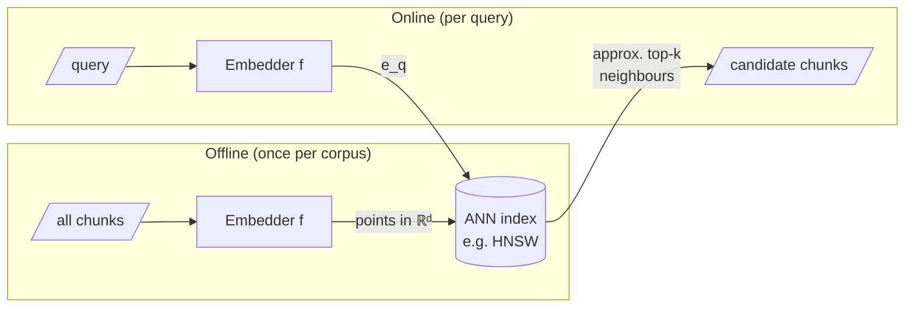

Formally, an embedding model is a function $f$ that maps a piece of text $x$ to a vector in $\mathbb{R}^d$:

$$f : X \to \mathbb{R}^d, \qquad x \mapsto e_x$$

Typical $d$ ranges from a few hundred to a few thousand (the MiniLM model used by this textbook's own search: $d = 384$). Two things to internalise:

1. **No coordinate is a human-interpretable feature.** Meaning is distributed across all of them, *holographically*. What matters is the arrangement: the relative positions of points, the neighbourhoods, the directions.
2. **Dimensionality is representational capacity**: more dimensions, more room to keep distinct meanings apart. But capacity is not free — as $d$ grows, our Euclidean intuitions, built in three dimensions, begin to mislead us, sometimes badly (next two pages).

## Retrieval = nearest-neighbour search

Given a query embedding $e_q$, we want the documents that maximise $\text{sim}(e_q, e_d)$. When the corpus is large, computing this against every document is too slow, so we lean on **approximate nearest neighbour (ANN)** structures — inverted file indexes, product quantisation, and small-world graphs such as **HNSW** (the index inside Qdrant). The computational reality was first made rigorous by Indyk & Motwani's work on similarity search in high dimension.



```python
# brute-force nearest neighbour — fine for 1k points, hopeless for 100M
# (this is exactly what ANN indexes exist to avoid)
corpus_vecs = {...}   # {doc_id: vector}, embedded offline

def cos(u, v):
    dot = sum(a*b for a, b in zip(u, v))
    return dot / (sum(a*a for a in u)**0.5 * sum(b*b for b in v)**0.5)

def search(query_vec, k=5):
    scored = []
    for doc_id, v in corpus_vecs.items():   # O(N·d) — the pain point
        scored.append((cos(query_vec, v), doc_id))
    scored.sort(reverse=True)
    return scored[:k]
```

## What we worry about, and when

- **Week 2 onward:** *what* do we embed — whole documents? sentences? overlapping windows? — and *how* do we index for speed.
- **Today:** something more fundamental — whether the geometry behaves the way our intuition expects.

It does not. The next two pages meet the two great strangenesses of high dimension: the **curse of dimensionality** (volume flees to the corners) and **concentration of measure** (randomness becomes oddly orderly).
