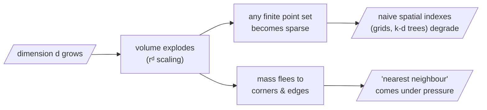

Our intuitions about distance were trained in three dimensions, and **they betray us in three hundred**. The umbrella term for these betrayals is the *curse of dimensionality*: as $d$ grows, volume grows so explosively that any finite set of points becomes hopelessly sparse, and quantities we rely on begin to behave counterintuitively.

## Core intuition

In low dimensions, distance behaves as our intuition expects. In high dimensions, volume concentrates in corners and everything becomes sparse. This is not a small tweak to geometry; it is a complete shift in how the space behaves.

This is why the embedding space is both powerful and dangerous: it gives flexibility to represent meaning, but it also makes naive geometric reasoning unreliable.

## Why it matters

If we build retrieval systems by assuming that “nearest” behaves like it does in 3D, we will make wrong design choices. The volume of the space becomes so dominated by corners that many conventional spatial shortcuts fail.

This is exactly why modern vector search uses ANN indexes and approximate methods instead of pure low-dimensional logic.

## Instructor framing

This chapter is the corrective to the earlier “meaning as geometry” story. The geometry is real and useful, but it is not friendly. It comes with concentration, sparsity, and corner-dominated volume. The course is teaching you not to romanticise high-dimensional space — just to understand it and work within its constraints.

## Worked example

Take a unit cube and a unit ball inside it. In 2D, the ball takes up most of the square. In 10D, it occupies a tiny fraction, and almost all the cube's volume sits near its edges. This means that random points are almost always far apart in a way that would be surprising if you reasoned in three dimensions.

That is the curse of dimensionality in plain language.

## Math explained step by step

A vivid example. Inscribe a unit ball inside a unit cube and ask what fraction of the cube the ball fills. The volume of a $d$-dimensional ball of radius $r$ is

$$V_d(r) = \frac{\pi^{d/2}}{\Gamma\!\left(\frac{d}{2} + 1\right)}\, r^d$$

and as $d$ grows this fraction **collapses toward zero**:

| Dimension $d$ | Ball fills … of the cube |
|---|---|
| 2 | ~79% (disc in square) |
| 3 | ~52% |
| 10 | ~0.25% |
| 20 | ~2.5 × 10⁻⁸ |
| a few dozen | a vanishing sliver |

Almost all the volume of the cube has fled into its **corners**, far from the centre. *Volume, in high dimension, lives at the edges.*

```python
# watch the inscribed ball vanish — straight from the formula
import math

def ball_fraction_of_cube(d):
    # unit-diameter ball (r = 1/2) inside the unit cube
    r = 0.5
    ball = (math.pi ** (d / 2)) / math.gamma(d / 2 + 1) * r ** d
    return ball / 1.0            # cube volume is 1

for d in [2, 3, 5, 10, 20, 50]:
    print(f"d={d:3d}  ball fills {ball_fraction_of_cube(d):.2e} of the cube")
# d=  2  7.85e-01
# d=  3  5.24e-01
# d= 10  2.49e-03
# d= 50  1.54e-28   ← the space is essentially all corners
```



## Practical pattern

This is why practical vector systems use approximate nearest-neighbour methods such as HNSW, IVF, and quantised indexes. The exact geometric intuition in low dimensions no longer holds, so the implementation strategy changes.

The real-world lesson is that retrieval is not just an embedding problem; it is also a high-dimensional indexing problem.

## Common traps

- assuming Euclidean intuition from 3D persists in 384D;
- selecting naive spatial indexes without understanding their limitations;
- forgetting that nearest neighbours become unstable as dimensions rise;
- treating “more dimensions” as always better without considering geometry.

## Takeaways

- High-dimensional spaces behave very differently from low-dimensional intuition.
- Volume concentrates in corners and edges.
- Naive spatial strategies break down, which is why ANN indexing is needed.
- Retrieval remains viable, but it requires geometry-aware algorithms and approximations.

## The practical upshot for retrieval

Twofold:

1. **Naive exhaustive search becomes expensive and naive spatial indexes stop helping.** Brute-force geometric shortcuts that work in low dimensions (grids, k-d trees) degrade — motivating the *approximate* nearest-neighbour indexes (HNSW, IVF, PQ) that real vector databases use.
2. **More subtly, the very notion of a "nearest" neighbour comes under pressure.** If the space is mostly empty, how do distances between points distribute? To understand why — and why retrieval nevertheless survives — we need the most beautiful idea of the day: *concentration of measure* (next page).

> Why this matters for us: the space is mostly empty, and emptiness has consequences for how distances distribute. The curse describes the space we are given; **learning** is how we make it habitable.
