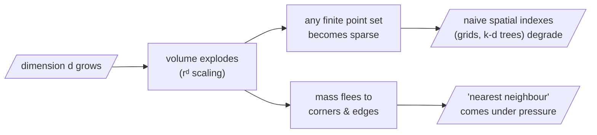

Our intuitions about distance were trained in three dimensions, and **they betray us in three hundred**. The umbrella term for these betrayals is the *curse of dimensionality*: as $d$ grows, volume grows so explosively that any finite set of points becomes hopelessly sparse, and quantities we rely on begin to behave counterintuitively.

## The vanishing ball

A vivid example. Inscribe a unit ball inside a unit cube and ask what fraction of the cube the ball fills. The volume of a $d$-dimensional ball of radius $r$ is

$$V_d(r) = \frac{\pi^{d/2}}{\Gamma\!\left(\frac{d}{2} + 1\right)}\, r^d$$

and as $d$ grows this fraction **collapses toward zero**:

| Dimension $d$ | Ball fills … of the cube |
|---|---|
| 2 | ~79% (disc in square) |
| 3 | ~52% |
| 10 | ~0.25% |
| 20 | ~2.5 × 10⁻⁸ |
| a few dozen | a vanishing sliver |

Almost all the volume of the cube has fled into its **corners**, far from the centre. *Volume, in high dimension, lives at the edges.*

```python
# watch the inscribed ball vanish — straight from the formula
import math

def ball_fraction_of_cube(d):
    # unit-diameter ball (r = 1/2) inside the unit cube
    r = 0.5
    ball = (math.pi ** (d / 2)) / math.gamma(d / 2 + 1) * r ** d
    return ball / 1.0            # cube volume is 1

for d in [2, 3, 5, 10, 20, 50]:
    print(f"d={d:3d}  ball fills {ball_fraction_of_cube(d):.2e} of the cube")
# d=  2  7.85e-01
# d=  3  5.24e-01
# d= 10  2.49e-03
# d= 50  1.54e-28   ← the space is essentially all corners
```



## The practical upshot for retrieval

Twofold:

1. **Naive exhaustive search becomes expensive and naive spatial indexes stop helping.** Brute-force geometric shortcuts that work in low dimensions (grids, k-d trees) degrade — motivating the *approximate* nearest-neighbour indexes (HNSW, IVF, PQ) that real vector databases use.
2. **More subtly, the very notion of a "nearest" neighbour comes under pressure.** If the space is mostly empty, how do distances between points distribute? To understand why — and why retrieval nevertheless survives — we need the most beautiful idea of the day: *concentration of measure* (next page).

> Why this matters for us: the space is mostly empty, and emptiness has consequences for how distances distribute. The curse describes the space we are given; **learning** is how we make it habitable.
