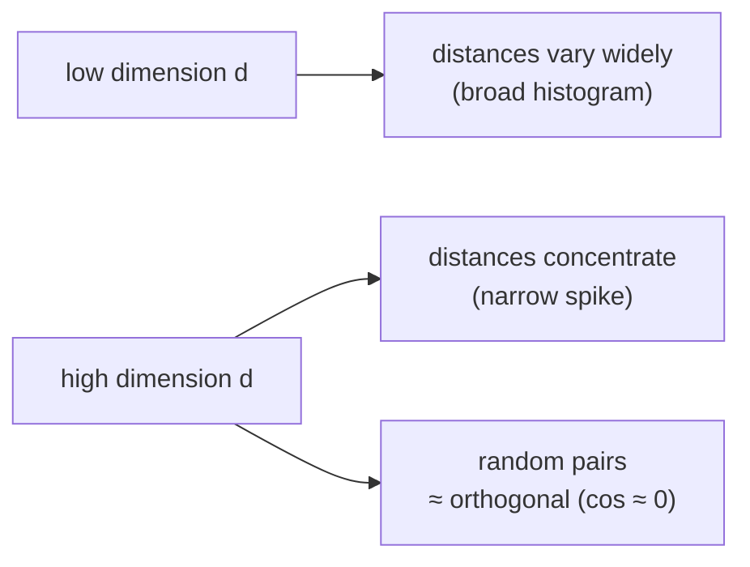

In high dimensions, randomness becomes **oddly orderly**. Draw many points at random in $\mathbb{R}^d$ and measure all their pairwise distances. In low dimension these distances vary widely. In high dimension they **concentrate**: almost all pairs end up at nearly the same distance from one another, and the histogram of distances collapses toward a single sharp spike.

## Core intuition

The geometry of high dimensions is not gentle. Random points behave in a way that is surprisingly regular: most of them are nearly the same distance from each other and nearly orthogonal to one another.

This is the reason the embedding space is powerful but also strange. A random direction in a high-dimensional space is not very informative, which is exactly why learning must carve out meaningful structure deliberately.

## Why it matters

This matters because retrieval systems rely on the difference between a relevant match and a random background point. If random vectors are nearly orthogonal and the distances concentrate, then the margin separating a true match from noise is much thinner than our intuition suggests.

That is why retrieval quality depends strongly on training, re-ranking, and careful evaluation rather than on raw geometric intuition alone.

## Instructor framing

This chapter is the second half of the geometry story. The first half said meanings become points; this half says the points do not behave like everyday 3D objects. In high dimension, the background is not “empty and random”; it is “regularly structured by concentration.”

## Worked example


Imagine two random vectors in 1000 dimensions. Their cosine similarity is not likely to be wildly positive or negative. It is likely to be tiny, near zero. The cloud has shrunk into a thin shell, and most directions are effectively independent.

This tells us that if a model wants to create useful semantic neighborhoods, it must learn them. Random spaces will not do the job on their own.

## Two precise faces of the phenomenon

**1. Distance from the mean concentrates.** For many natural distributions, the relative spread of a random point's distance from the mean shrinks as $d$ grows:

$$\frac{\text{std}\big(\lVert X \rVert\big)}{\mathbb{E}\big[\lVert X \rVert\big]} \longrightarrow 0 \quad \text{as } d \to \infty$$

This is the engine behind the **"thin shell"**: a high-dimensional Gaussian puts almost none of its mass at the centre and almost all of it in a thin spherical shell at radius $\approx \sqrt{d}$.

**2. Random vectors become nearly orthogonal.** Two independent random vectors in high dimension have expected cosine similarity $0$, with variance on the order of $1/d$ — so as $d$ grows, a random pair sits ever closer to a right angle.

```python
# watch concentration appear — sample random vectors, look at cosine spread
import random, statistics

def random_vec(d):
    return [random.gauss(0, 1) for _ in range(d)]

def cos(u, v):
    dot = sum(a*b for a, b in zip(u, v))
    nu  = sum(a*a for a in u) ** 0.5
    nv  = sum(b*b for b in v) ** 0.5
    return dot / (nu * nv)

for d in [2, 10, 100, 1000]:
    sims = [cos(random_vec(d), random_vec(d)) for _ in range(500)]
    print(f"d={d:5d}  mean={statistics.mean(sims):+.3f}  "
          f"stdev={statistics.stdev(sims):.3f}")
# one real run of exactly this code:
# d=    2  mean=-0.033  stdev=0.709   <- wide spread, anywhere from -1 to 1
# d=   10  mean=-0.007  stdev=0.301
# d=  100  mean=-0.011  stdev=0.104
# d= 1000  mean=+0.001  stdev=0.033   <- almost every pair sits within a
#                                        hair's breadth of a right angle
# mean stays pinned near 0 throughout; it is the *stdev* collapsing
# (0.709 -> 0.033) that is the concentration — the histogram of a
# thousand random pairs goes from "all over the place" to "a needle at 0"
```



## The resolution — stated carefully, because it is easy to get wrong

> Concentration of measure says that **uniform randomness in high dimension is nearly featureless**. It does not say retrieval is impossible. It says that any useful structure must be put there by *learning*, and that the margin between a true match and a random one can be thin — which is exactly why re-ranking, hybrid search, and careful evaluation (later instruments) earn their keep.

The near-orthogonality of random directions is a double-edged gift:

- **Good:** it means a high-dimensional space can hold an enormous number of nearly independent directions — exactly the capacity that lets models pack many features in (recall superposition).
- **Sobering:** if random things sit at $90°$ and roughly equidistant, then the margin separating a true match from the background crowd must be **carved in deliberately by learning**.

> The curse describes the space we are given; learning is how we make it habitable; retrieval lives in the thin margin learning carves out.

This sets up the next distinction — the one most often muddled: concentration of measure is a property of the *space*; **anisotropy** is a property of what *learning actually does* to real embeddings within that space.

Put plainly: a random space behaves in a regular, almost law-like way, but a learned space behaves in a way shaped by the task. The first fact tells us why naive geometry is treacherous; the second tells us why representational learning matters.

## Math explained step by step

Walk through why concentration happens, one step at a time, using the two faces already named above.

**Step 1 — a random vector's length stops being random.** Draw $X$ from a $d$-dimensional Gaussian. Its squared length $\|X\|^2$ is a sum of $d$ independent, roughly-equal-sized pieces (one per coordinate). By the law of large numbers, a sum of many independent pieces has a spread (standard deviation) that grows much slower than its average — the average grows like $d$, the spread grows only like $\sqrt{d}$. So the *relative* spread, $\text{std}(\|X\|) / \mathbb{E}[\|X\|]$, shrinks toward $0$. In plain words: the more coordinates you add up, the more the random wobbles in individual coordinates cancel out, and the total length becomes predictable even though each coordinate is random.

**Step 2 — that predictability is the "thin shell."** If length is nearly constant, then almost every random point lands at roughly the same distance from the centre — a thin spherical shell at radius $\approx \sqrt{d}$, not a fuzzy cloud filling the whole ball. This is *why* "most points are about equally far from the mean" stops being surprising once you see it as a law-of-large-numbers statement about $d$ summed coordinates.

**Step 3 — the same averaging argument makes random vectors orthogonal.** The cosine similarity of two independent random vectors is itself an average of $d$ small, independent, sign-flipping products (one per coordinate) divided by their lengths. Averages of many independent, zero-mean terms concentrate near their expected value, which is $0$ here — so the cosine sits near $0$ (a right angle) with a spread that shrinks like $1/\sqrt{d}$, matching the code output above (stdev falling from $0.709$ at $d{=}2$ to $0.033$ at $d{=}1000$).

**Step 4 — why this matters for a retrieval score.** If two *random, unrelated* passages already sit near $\cos \approx 0$ with very little spread, then a *true* match has to clear that same tight background to be distinguishable at all. The retrieval score $s(q,d) = \dfrac{q \cdot d}{\|q\|\,\|d\|}$ is not being compared against "chance = wide open"; it is being compared against "chance = a narrow spike pinned near zero." That is a much easier bar to clear in principle — but it is also thin, meaning small amounts of noise or a barely-relevant chunk can look deceptively close to a truly relevant one. This is precisely why later weeks add re-ranking rather than trusting a single similarity score.

## Practical pattern

In real retrieval systems, the important idea is that random similarity is not strong enough by itself. The model has to create structure so that true matches stand out from the background cloud.

This is why quality depends not merely on a good vector database, but on a good representation and a good scoring pipeline.

## Common traps

- mistaking random high-dimensional behavior for a useful semantic signal;
- ignoring that background similarity may be small but systematically non-zero;
- assuming the embedding space is naturally well-separated;
- forgetting that useful structure must be learned, not assumed.

## Takeaways

- High-dimension random points are surprisingly regular.
- Distances and norms concentrate around narrow values.
- Random vectors become nearly orthogonal.
- Useful semantics arise only when the model learns structure in that space.
