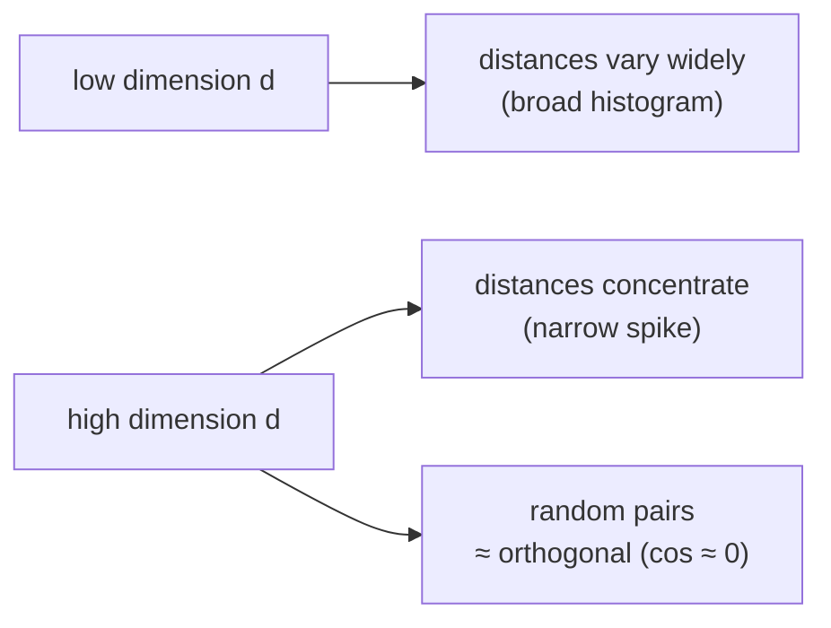

In high dimensions, randomness becomes **oddly orderly**. Draw many points at random in $\mathbb{R}^d$ and measure all their pairwise distances. In low dimension these distances vary widely. In high dimension they **concentrate**: almost all pairs end up at nearly the same distance from one another, and the histogram of distances collapses toward a single sharp spike.

## Two precise faces of the phenomenon

**1. Distance from the mean concentrates.** For many natural distributions, the relative spread of a random point's distance from the mean shrinks as $d$ grows:

$$\frac{\text{std}\big(\lVert X \rVert\big)}{\mathbb{E}\big[\lVert X \rVert\big]} \longrightarrow 0 \quad \text{as } d \to \infty$$

This is the engine behind the **"thin shell"**: a high-dimensional Gaussian puts almost none of its mass at the centre and almost all of it in a thin spherical shell at radius $\approx \sqrt{d}$.

**2. Random vectors become nearly orthogonal.** Two independent random vectors in high dimension have expected cosine similarity $0$, with variance on the order of $1/d$ — so as $d$ grows, a random pair sits ever closer to a right angle.

```python
# watch concentration appear — sample random vectors, look at cosine spread
import random, statistics

def random_vec(d):
    return [random.gauss(0, 1) for _ in range(d)]

def cos(u, v):
    dot = sum(a*b for a, b in zip(u, v))
    nu  = sum(a*a for a in u) ** 0.5
    nv  = sum(b*b for b in v) ** 0.5
    return dot / (nu * nv)

for d in [2, 10, 100, 1000]:
    sims = [cos(random_vec(d), random_vec(d)) for _ in range(500)]
    print(f"d={d:5d}  mean={statistics.mean(sims):+.3f}  "
          f"stdev={statistics.stdev(sims):.3f}")
# one real run of exactly this code:
# d=    2  mean=-0.033  stdev=0.709   <- wide spread, anywhere from -1 to 1
# d=   10  mean=-0.007  stdev=0.301
# d=  100  mean=-0.011  stdev=0.104
# d= 1000  mean=+0.001  stdev=0.033   <- almost every pair sits within a
#                                        hair's breadth of a right angle
# mean stays pinned near 0 throughout; it is the *stdev* collapsing
# (0.709 -> 0.033) that is the concentration — the histogram of a
# thousand random pairs goes from "all over the place" to "a needle at 0"
```



## The resolution — stated carefully, because it is easy to get wrong

> Concentration of measure says that **uniform randomness in high dimension is nearly featureless**. It does not say retrieval is impossible. It says that any useful structure must be put there by *learning*, and that the margin between a true match and a random one can be thin — which is exactly why re-ranking, hybrid search, and careful evaluation (later instruments) earn their keep.

The near-orthogonality of random directions is a double-edged gift:

- **Good:** it means a high-dimensional space can hold an enormous number of nearly independent directions — exactly the capacity that lets models pack many features in (recall superposition).
- **Sobering:** if random things sit at $90°$ and roughly equidistant, then the margin separating a true match from the background crowd must be **carved in deliberately by learning**.

> The curse describes the space we are given; learning is how we make it habitable; retrieval lives in the thin margin learning carves out.

This sets up the next distinction — the one most often muddled: concentration of measure is a property of the *space*; **anisotropy** is a property of what *learning actually does* to real embeddings within that space.
