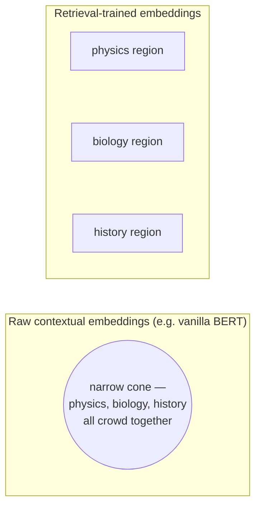

Now a subtle and crucial distinction — the one most often muddled.

- **Concentration of measure** is a property of the *space* — it would hold for points scattered uniformly at random (previous page).
- **Anisotropy** is a property of the *learned distribution* of real embeddings within that space.

The two are not the same. A distribution is **isotropic** if it spreads roughly evenly in all directions; it is **anisotropic** if it crowds into a narrow region — say, a thin cone — leaving most directions unused.

## Measuring it

One clean way: take many random pairs of *real* embeddings and average their cosine similarity.

- In a well-behaved (isotropic) space, this average should sit **near zero**, echoing the near-orthogonality of random vectors.
- For raw, off-the-shelf contextual embeddings, it does **not**: the average cosine of unrelated texts comes out markedly positive, because every vector points in roughly the same general direction.

Equivalently, the covariance of the embedding cloud is dominated by a few large eigenvalues — a few directions soak up most of the variance. This is **representation degeneration**, and its consequence is brutal: **when everything points the same way, "most similar" loses its power to discriminate.**

```python
# a crude anisotropy probe: average cosine of unrelated real sentences
import requests

sentences = [
    "The mitochondria is the powerhouse of the cell.",
    "Interest rates rose half a point this quarter.",
    "The treaty of Westphalia ended the war in 1648.",
    "A stack overflow occurs when recursion never terminates.",
]
r = requests.post("http://10.0.10.51:8000/embed-text/v1/embeddings",
    json={"model": "sentence-transformers/all-MiniLM-L6-v2", "input": sentences})
vecs = [d["embedding"] for d in r.json()["data"]]

def cos(u, v):
    dot = sum(a*b for a, b in zip(u, v))
    return dot / (sum(a*a for a in u)**0.5 * sum(b*b for b in v)**0.5)

pairs, total = 0, 0.0
for i in range(len(vecs)):
    for j in range(i + 1, len(vecs)):
        total += cos(vecs[i], vecs[j])
        pairs += 1
print("average cosine of unrelated sentences:", round(total / pairs, 3))
# a well-separated (isotropic-ish) retrieval model should sit near 0;
# raw, non-retrieval-tuned encoders often sit noticeably positive
```

## The demonstration: Embedding Projector on three subjects

Open Google's Embedding Projector on a small dataset spanning three subjects — physics, biology, history.

- **Raw BERT embeddings:** the three subjects do *not* separate. The whole cloud squeezes into a narrow, funnel-like cone, so even unrelated passages show high cosine similarity.
- **Embeddings from a model trained to place semantically distinct texts apart** (e.g. a Sentence-BERT-style retrieval model): the cloud opens up — physics, biology, and history pull into three visibly separated regions, with finer structure inside each.



The space has become more isotropic and, crucially, **more separated**.

## The lesson for a practitioner

> An embedding model is not a neutral ruler. Its geometry — how isotropic, how separated — determines whether your retrieval can tell a physics passage from a history one at all.

Choosing, and later adapting, the embedder is therefore among the **highest-leverage decisions** in the whole pipeline, not a default to be accepted unexamined. Much of the engineering ahead exists because real embedding spaces are messier than the tidy isotropic ideal — and Week 2 explains *why* training (contrastive learning, in particular) is what pries the cone open.
