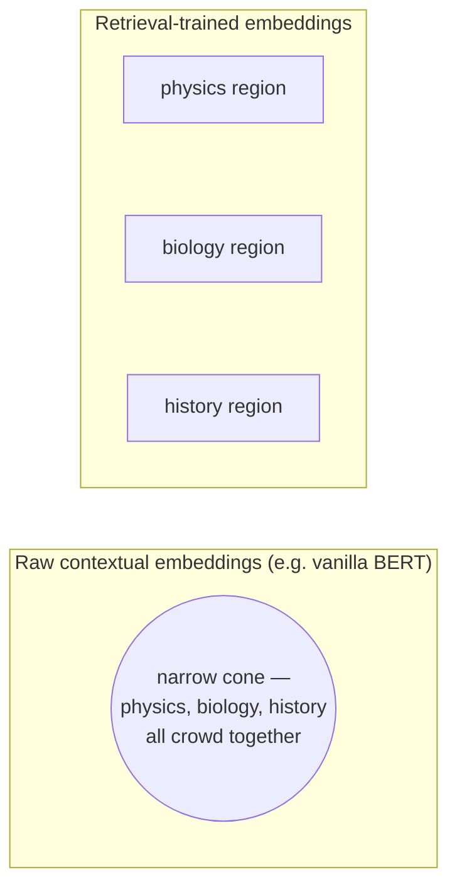

Now a subtle and crucial distinction — the one most often muddled.

- **Concentration of measure** is a property of the *space* — it would hold for points scattered uniformly at random (previous page).
- **Anisotropy** is a property of the *learned distribution* of real embeddings within that space.

The two are not the same. A distribution is **isotropic** if it spreads roughly evenly in all directions; it is **anisotropic** if it crowds into a narrow region — say, a thin cone — leaving most directions unused.

## Core intuition

Concentration tells us the space has a global geometry, but anisotropy tells us how the model has actually used that space. Real embeddings are not random; they are learned. And if the learned cloud collapses into a narrow cone, semantic discrimination becomes weak.

This is the difference between a space that can support meaningful retrieval and a space that merely has many dimensions.

## Why it matters

If an embedding model is anisotropic in the wrong direction, all unrelated texts start looking vaguely similar. That makes retrieval both less discriminative and less calibrated. The model has not failed at the whole idea of vectors; it has failed to spread the concepts apart in a useful way.

## Instructor framing

This chapter is the practical correction to the geometric picture. The world is not just “high-dimensional”; it is “high-dimensional plus learned.” The learning step decides whether the space is open and separable or collapsed and unhelpful.

## Worked example


Imagine three subjects — physics, biology, and history. In a raw contextual embedding space, the points may all cluster into the same cone. In a retrieval-trained embedding model, they separate into distinct neighborhoods.

That separation is not decorative. It is the difference between a system that can answer a user’s question and one that cannot tell what the question is about.

## Measuring it

One clean way: take many random pairs of *real* embeddings and average their cosine similarity.

- In a well-behaved (isotropic) space, this average should sit **near zero**, echoing the near-orthogonality of random vectors.
- For raw, off-the-shelf contextual embeddings, it does **not**: the average cosine of unrelated texts comes out markedly positive, because every vector points in roughly the same general direction.

Equivalently, the covariance of the embedding cloud is dominated by a few large eigenvalues — a few directions soak up most of the variance. This is **representation degeneration**, and its consequence is brutal: **when everything points the same way, "most similar" loses its power to discriminate.**

```python
# a crude anisotropy probe: average cosine of unrelated real sentences
import requests

sentences = [
    "The mitochondria is the powerhouse of the cell.",
    "Interest rates rose half a point this quarter.",
    "The treaty of Westphalia ended the war in 1648.",
    "A stack overflow occurs when recursion never terminates.",
]
r = requests.post("http://10.0.10.51:8000/embed-text/v1/embeddings",
    json={"model": "sentence-transformers/all-MiniLM-L6-v2", "input": sentences})
vecs = [d["embedding"] for d in r.json()["data"]]

def cos(u, v):
    dot = sum(a*b for a, b in zip(u, v))
    return dot / (sum(a*a for a in u)**0.5 * sum(b*b for b in v)**0.5)

pairs, total = 0, 0.0
for i in range(len(vecs)):
    for j in range(i + 1, len(vecs)):
        total += cos(vecs[i], vecs[j])
        pairs += 1
print("average cosine of unrelated sentences:", round(total / pairs, 3))
# a well-separated (isotropic-ish) retrieval model should sit near 0;
# raw, non-retrieval-tuned encoders often sit noticeably positive
```

## The demonstration: Embedding Projector on three subjects

Open Google's Embedding Projector on a small dataset spanning three subjects — physics, biology, history.

- **Raw BERT embeddings:** the three subjects do *not* separate. The whole cloud squeezes into a narrow, funnel-like cone, so even unrelated passages show high cosine similarity.
- **Embeddings from a model trained to place semantically distinct texts apart** (e.g. a Sentence-BERT-style retrieval model): the cloud opens up — physics, biology, and history pull into three visibly separated regions, with finer structure inside each.



The space has become more isotropic and, crucially, **more separated**.


## Math explained step by step

Here is how "a few directions soak up most of the variance" becomes a measurable, step-by-step fact rather than a vibe.

**Step 1 — collect the embeddings into a cloud.** Take every real embedding in your corpus (not random vectors — actual sentences) and stack them as rows of a matrix $E$. The cloud's shape is described by its covariance matrix $C = E^\top E$ (after centring), an average of how each coordinate co-varies with every other.

**Step 2 — decompose that shape into directions and their sizes.** Eigendecompose $C$ into eigenvectors (directions in the space) and eigenvalues (how much variance the cloud has along each direction). If the cloud were isotropic, the eigenvalues would all be roughly equal — variance spread evenly over every direction, like a sphere. If the cloud is anisotropic, a handful of eigenvalues dwarf the rest — the cloud is a cigar or a pancake, not a sphere: almost all the spread lives along one or two directions, and every other direction is nearly flat.

**Step 3 — connect that shape to the cosine score.** Because $s(q,d) = \cos\theta$ measures the angle between two vectors, and because every vector in an anisotropic cloud is dragged toward the same one or two dominant directions, two *unrelated* embeddings end up pointing nearly the same way anyway — not because they mean the same thing, but because the model gave the space almost no room to point elsewhere. The average cosine of unrelated pairs, which should sit near $0$ in an isotropic space (previous page), instead sits noticeably above $0$.

**Step 4 — see why this breaks ranking.** Once background similarity is inflated, the *gap* between "this chunk is what you asked about" and "this chunk is something else entirely" shrinks. Retrieval does not merely get noisier — its whole scoring scale gets compressed toward the top, which is exactly what the physics/biology/history cone in the Embedding Projector demo shows visually: everything crowds close together because the model never learned to use the directions that would keep them apart.

## Practical pattern

The engineering lesson is simple: choose an embedding model that spreads the semantic cloud appropriately, not merely one that makes a vector of the right dimension. A good embedding space creates separation; a bad one compresses everything toward a cone.

## Common traps

- assuming a high-dimensional embedder is automatically useful;
- using raw transformer embeddings without measuring the cloud geometry;
- trusting cosine similarity when the embedding distribution is collapsed;
- ignoring that training and fine-tuning may be the main lever for improving retrieval.

## Takeaways

- The space’s global geometry and the learned distribution are different concepts.
- Anisotropy can collapse unrelated meanings together.
- Retrieval-trained embeddings explicitly combat this collapse.
- The right embedding model is part of the system design, not a default assumption.

## The lesson for a practitioner

> An embedding model is not a neutral ruler. Its geometry — how isotropic, how separated — determines whether your retrieval can tell a physics passage from a history one at all.

Choosing, and later adapting, the embedder is therefore among the **highest-leverage decisions** in the whole pipeline, not a default to be accepted unexamined. Much of the engineering ahead exists because real embedding spaces are messier than the tidy isotropic ideal — and Week 2 explains *why* training (contrastive learning, in particular) is what pries the cone open.
