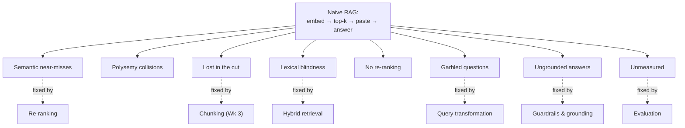

We can now assemble the simplest possible RAG system — and watch the geometry studied this week predict exactly how it fails.

## The three-line recipe

1. Embed every chunk of every document and store the vectors.
2. At query time, embed the question and take the top-$k$ nearest chunks.
3. Paste them into the prompt and let the LLM answer.

```python
# naive RAG in ~15 lines — a fine first prototype, a poor production system
def naive_rag(question, chunks, chunk_vecs, embed_fn, llm_fn, k=4):
    q_vec = embed_fn([question])[0]

    scored = []
    for text, vec in zip(chunks, chunk_vecs):
        scored.append((cosine(q_vec, vec), text))
    scored.sort(reverse=True)
    top_k = [text for _, text in scored[:k]]

    prompt = "Context:\n" + "\n\n".join(top_k) + f"\n\nQuestion: {question}"
    return llm_fn(prompt)   # no check that top_k is actually relevant!
```

It is a fine first prototype and a poor production system. The reasons trace directly back to Acts II and III.

## The catalogue of pathologies

| Pathology | What happens | Geometric root | Fixed by (later week) |
|---|---|---|---|
| **Semantic near-misses** | Top-$k$ "nearest" chunks are only marginally nearer than irrelevant ones; the generator states them confidently | Anisotropy compresses the space, concentration thins the margin | Re-ranking cascade |
| **Polysemy collisions** | A query about one sense of a word retrieves chunks about another (the river bank when you meant the financial one) | Representations not context-preserved enough | Query transformation, better embedders |
| **Lost in the cut** | A fact split across a chunk boundary is unretrievable | No embedding can recover information destroyed at ingestion | Chunking (Week 3) |
| **Lexical blindness** | A rare identifier — part number, statute, gene — carries little semantic signal and is missed by dense search | Dense embeddings compress rare tokens away | Hybrid retrieval |
| **No re-ranking** | Matches concentrate near the noise floor; first-pass similarity is too blunt to order survivors well | Thin margin above concentration's noise floor | The re-ranking cascade |
| **Garbled questions** | A misspelled, contextless, or multi-hop question embeds to the wrong place before retrieval even begins | Query embedding is only as good as the query text | Query transformation |
| **Ungrounded answers** | Nothing checks that the generated answer is actually supported by the retrieved evidence | No verification step exists in the naive loop | Guardrails and grounding |
| **Unmeasured** | Nothing tells us which of these is hurting us; every fix is a guess | No metrics anywhere in the pipeline | Evaluation |



## Why this table is the whole course, compressed

Each pathology above is an instrument waiting to be built — this is the promise of the course made concrete. The fourteen instruments are not a grab-bag of techniques; they are a **precise, point-by-point response** to the ways naive RAG breaks, and every one of those breaks is a direct consequence of a geometric fact met this week: the curse of dimensionality, concentration of measure, and anisotropy.

> The strangeness of high dimension is not academic. It is the mechanism behind every failure of naive RAG, and the justification for every instrument we will build. Understand the geometry, and the syllabus stops looking like a list and starts looking like an argument.

Next week: we make our first irreversible engineering decision. Before we can retrieve a thought, we must decide how to cut it from its document — and we will discover that the size of a thought is harder to measure, and more consequential, than it first appears.
