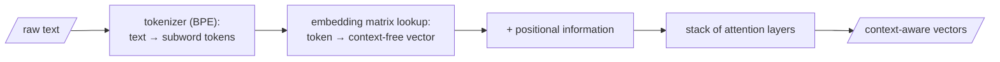

## Core intuition

Text is not naturally segmented into words. Modern models first break text into subword tokens, then assign each token a vector, and only then do they reason over the resulting geometry.

This explains why models handle rare names, typos, and morphology much better than a naive lexicon would suggest. The basic unit is not the whole word — it is the learned subword piece — and that choice is one reason the whole system can learn smoothly at all.

## Why it matters

The tokenization choice shapes the entire system: it determines what information survives, which rare terms can be represented, and how much a model can generalize from one word to a similar one.

This is why the vocabulary and the representation geometry are not separate concerns; they are connected at the root of the model.

## Instructor framing

This chapter makes the deeper point that a model has to operate in a continuous space because learning is gradient descent. The discrete lexicon is too harsh for optimization; the model needs a smooth geometry between points.

## Worked example

A word like “running” may be split into subword pieces such as “run” and “ning.” The model can then generalize from “run” to related forms because the pieces are learned and reused. That is the meaningful reason subword tokenization works so well.

## Before the vector: breaking text into tokens

We've been speaking of "a word becoming a vector" as if a word were the natural atom of text. It isn't, and the gap explains a great many things you'd otherwise find baffling — why models stumble on rare names, why they count letters poorly, why a typo like *runnign* isn't as alien to them as it looks.

A modern tokenizer learns its vocabulary from data by a procedure like **byte-pair encoding (BPE)**: start from individual characters, and repeatedly merge the most frequent adjacent pair into a new unit, until you have a vocabulary of some tens of thousands of subword pieces. Common words survive as single tokens (*the*, *river*); rare or complex ones shatter into familiar fragments (*tokenization* might become *token* + *ization*; an unusual surname might dissolve into a handful of syllables). Each token in the vocabulary owns a row in a giant lookup table — the **embedding matrix** — and that row is its initial vector, the raw, context-free location it occupies before attention has said a word.

So the true pipeline, stated once and exactly: text is split into subword tokens; each token is looked up to its row in the embedding matrix, giving a context-free vector; positional information is added so order isn't lost; and then attention layers turn those raw vectors into context-aware ones. When we say "the word *bank* becomes a vector," we're compressing these steps for the sake of the story — but the full chain is the reason the geometry has anything to work on.

## Why machines must speak "machinese"

Last week we asserted that machines reason in vectors — "machinese" — as points on the surface of a high-dimensional globe. Today we earn that claim, and the reason is gradient descent itself.

Suppose, early in training, a model holds a word $x$ and believes it sits closest in meaning to a word $y$. Suppose the truth is that $x$ belongs near $z$. Learning must move $x$ away from $y$ and toward $z$. But gradient descent only ever makes **infinitesimal** moves — it doesn't leap, it nudges, by a tiny step proportional to the gradient, ten thousand times over. So we need a space in which $x$ can be nudged a little: a space with positions *between* the meaning of one word and another.

Can we make such a nudge in the discrete world of the lexicon? Between *bat* and *ball*, is there a word meaning "99% bat, 1% ball"? There is not. The lexicon is a scatter of isolated islands with nothing but void between them — you cannot stand a hair's breadth off the island of *bat*. A discrete vocabulary offers gradient descent no place to put its small steps, and so no gradient at all. But the surface of a globe — a smooth, continuous **manifold** — offers infinitely many positions between any two points. On a manifold you can slide $x$ a whisker toward $z$ today, and a whisker more tomorrow.

> That is why meaning must become geometry: learning is gradient descent, gradient descent needs small steps, and only a continuous manifold has room for them. The discrete word was always a prison; the vector is the parole.

So the machine builds itself a geometric dictionary: every word becomes a vector, and so does every query. The fuzzy lookup from the previous page becomes a computation the machine can actually perform and, crucially, *differentiate*: proximity becomes a dot product, the weighting becomes a softmax, and the whole librarian's act becomes a smooth function the optimiser can push downhill.

The simplest manifold is flat Euclidean space, $\mathbb{R}^n$, and it's where almost all embeddings live. It isn't the only choice — hyperbolic embeddings (the Poincaré ball), with negative curvature, give exponentially more room near the boundary, useful for representing trees and hierarchies. The manifold can be chosen to fit the shape of the meaning.

## Math explained step by step

Here is the argument for why meaning *has* to live on a manifold, laid out one inference at a time:

**Step 1 — name what training actually does.** Training adjusts a word's vector $x$ by an update $x \leftarrow x - \eta \nabla L$: a small step, of size controlled by the learning rate $\eta$, in the direction that reduces error. This is true of every parameter in every neural network — there is no other move available to gradient descent.

**Step 2 — ask whether the discrete lexicon supports that move.** Suppose the model needs to nudge *bat* very slightly toward *ball*. In the plain dictionary, "bat" and "ball" are two isolated entries with no entries between them — there is no word that means "99% bat, 1% ball." A step of size $\eta$ in that direction lands nowhere, because nowhere is defined.

**Step 3 — see why this kills the gradient, not just the intuition.** A gradient is, by definition, a direction of infinitesimal change. If the space has no points between *bat* and *ball*, the derivative of anything with respect to "position" is undefined or zero almost everywhere — there is nothing there to differentiate. This is the same failure mode as the hard argmax from last week: a function with no slope gives the optimiser nothing to climb down.

**Step 4 — a continuous manifold repairs exactly this.** In $\mathbb{R}^n$, between any two points there are infinitely many others. A step of size $\eta$ always lands somewhere valid, so the gradient is always defined, and training can make its ten-thousand tiny corrections. This is not a modeling convenience bolted on afterward — it is the minimum structural requirement for gradient descent to run at all.

## Practical pattern

In a modern transformer, the tokenization stage and the embedding stage are part of the same learned representation pipeline. The model has to discover a vocabulary and geometry that support smooth optimization and good generalization.

## Common traps

- assuming whole-word tokenization is the natural model of text;
- forgetting the continuous nature of optimization;
- treating tokenization as a preprocessing detail instead of a learned representation decision;
- ignoring that the geometry matters as much as the words themselves.

## Takeaways

- Tokenization defines the basic units of text.
- A discrete lexicon cannot support gradient descent smoothly.
- Continuous embedding spaces are needed for learning and optimization.
- The manifold choice shapes how meaning can be represented.
