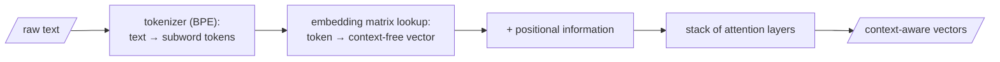

## Before the vector: breaking text into tokens

We've been speaking of "a word becoming a vector" as if a word were the natural atom of text. It isn't, and the gap explains a great many things you'd otherwise find baffling — why models stumble on rare names, why they count letters poorly, why a typo like *runnign* isn't as alien to them as it looks.

A modern tokenizer learns its vocabulary from data by a procedure like **byte-pair encoding (BPE)**: start from individual characters, and repeatedly merge the most frequent adjacent pair into a new unit, until you have a vocabulary of some tens of thousands of subword pieces. Common words survive as single tokens (*the*, *river*); rare or complex ones shatter into familiar fragments (*tokenization* might become *token* + *ization*; an unusual surname might dissolve into a handful of syllables). Each token in the vocabulary owns a row in a giant lookup table — the **embedding matrix** — and that row is its initial vector, the raw, context-free location it occupies before attention has said a word.

So the true pipeline, stated once and exactly: text is split into subword tokens; each token is looked up to its row in the embedding matrix, giving a context-free vector; positional information is added so order isn't lost; and then attention layers turn those raw vectors into context-aware ones. When we say "the word *bank* becomes a vector," we're compressing these steps for the sake of the story — but the full chain is the reason the geometry has anything to work on.

## Why machines must speak "machinese"

Last week we asserted that machines reason in vectors — "machinese" — as points on the surface of a high-dimensional globe. Today we earn that claim, and the reason is gradient descent itself.

Suppose, early in training, a model holds a word $x$ and believes it sits closest in meaning to a word $y$. Suppose the truth is that $x$ belongs near $z$. Learning must move $x$ away from $y$ and toward $z$. But gradient descent only ever makes **infinitesimal** moves — it doesn't leap, it nudges, by a tiny step proportional to the gradient, ten thousand times over. So we need a space in which $x$ can be nudged a little: a space with positions *between* the meaning of one word and another.

Can we make such a nudge in the discrete world of the lexicon? Between *bat* and *ball*, is there a word meaning "99% bat, 1% ball"? There is not. The lexicon is a scatter of isolated islands with nothing but void between them — you cannot stand a hair's breadth off the island of *bat*. A discrete vocabulary offers gradient descent no place to put its small steps, and so no gradient at all. But the surface of a globe — a smooth, continuous **manifold** — offers infinitely many positions between any two points. On a manifold you can slide $x$ a whisker toward $z$ today, and a whisker more tomorrow.

> That is why meaning must become geometry: learning is gradient descent, gradient descent needs small steps, and only a continuous manifold has room for them. The discrete word was always a prison; the vector is the parole.

So the machine builds itself a geometric dictionary: every word becomes a vector, and so does every query. The fuzzy lookup from the previous page becomes a computation the machine can actually perform and, crucially, *differentiate*: proximity becomes a dot product, the weighting becomes a softmax, and the whole librarian's act becomes a smooth function the optimiser can push downhill.

The simplest manifold is flat Euclidean space, $\mathbb{R}^n$, and it's where almost all embeddings live. It isn't the only choice — hyperbolic embeddings (the Poincaré ball), with negative curvature, give exponentially more room near the boundary, useful for representing trees and hierarchies. The manifold can be chosen to fit the shape of the meaning.
