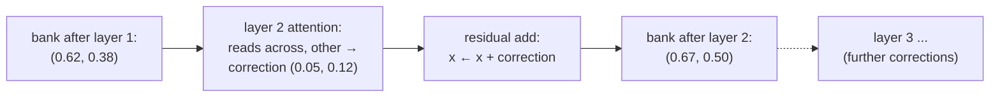

## Core intuition

The model produces a vector for every token, but a search index needs one vector per chunk. Pooling collapses many token vectors into one chunk embedding without losing the essential information.

The residual stream then carries the evolving meaning of each token across many transformer layers, allowing the representation to deepen without forgetting what it already knows.

## Why it matters

This is the technical bridge from token-level language modeling to document-level retrieval. Without pooling, the system would not have a single search vector. Without residual streams, the model would lose gradual refinement across depth.

These two ideas are what make embedding-based retrieval practical.

## Instructor framing

This chapter connects the architecture to the retrieval system. We are moving from “how does a token attend?” to “how do we turn this entire chunk into a single embedding?”

## Worked example


For a sentence like “She swam across the river to the other bank,” each token gets a contextual vector. The chunk vector is then the mean of those token vectors, which yields a single embedding representing the entire phrase in a retrieval-friendly form.

That is the practical representation used for downstream search.

## The missing rung: from words to a single vector

Self-attention gives us a contextual vector for every word in a chunk — nine words in, nine context-aware vectors out. But when we build a retrieval system, what goes into Qdrant? Not nine vectors per chunk — one. A search index wants a single point per document, so a single query point can find it.

The operation is **pooling**, and the workhorse is the gentlest thing imaginable: **mean-pooling**, the simple average of the token vectors. An older recipe took only the vector of a special `[CLS]` token; mean-pooling reliably beats it for retrieval, because averaging listens to every word rather than betting everything on one.

The full pipeline now stands complete: tokens become vectors, attention makes them context-aware, pooling fuses them into one chunk vector, and that vector is what lives in the database.

```python
# mean-pooling: nine per-token context vectors -> one chunk embedding
token_vectors = [
    [0.62, 0.38],   # "bank" (contextualised toward "water", from the previous page)
    [0.10, 0.05],   # "she"
    [0.70, 0.05],   # "swam"
    [0.55, 0.10],   # "across"
    [0.05, 0.02],   # "the"
    [0.80, 0.05],   # "river"
    [0.05, 0.02],   # "to"
    [0.05, 0.02],   # "the"
    [0.15, 0.10],   # "other"
]
n = len(token_vectors)
dims = len(token_vectors[0])
chunk_vector = [sum(v[d] for v in token_vectors) / n for d in range(dims)]
print("mean-pooled chunk embedding:", [round(x, 3) for x in chunk_vector])
```

> Hold this rung. Next week, when we agonise over where to cut a document, the whole anxiety will be about what this average ends up meaning.

## Stacking the lookups: layers and the residual stream

A transformer doesn't run one act of attention — it stacks dozens, and the stacking is where depth of understanding comes from. Picture *bank*'s contextual vector, $(0.62,0.38)$ from the worked example, not as a final answer but as a better question for the next layer to ask. At layer one, *bank* learned from *river* that it's watery. At layer two, now that every word is a little wiser, it can ask a subtler question and discover, say, that *across* and *other* place it on the far side of the river. Meaning is refined in passes, each layer's output becoming the next layer's input.

The vector carrying a token's evolving meaning up through the layers is the **residual stream**. At each layer, attention doesn't replace the token's vector — it computes an update and adds it back: $x \leftarrow x + (\text{attention output})$, and similarly for the feed-forward sublayer. The stream is a running sum, a bus along which every layer reads the meaning so far, writes a contextual correction, and passes it on.

Concretely: *bank* enters layer two carrying $(0.62, 0.38)$, the vector from the worked example on the previous page. Suppose layer two's attention sub-layer looks at *across* and *other* and computes a small correction — a nudge of $(0.05, 0.12)$ toward "the far side." The residual stream doesn't overwrite the old vector with this new information; it adds the two: $(0.62 + 0.05,\ 0.38 + 0.12) = (0.67, 0.50)$. The layer-one meaning survives intact, folded into the sum — only a correction was written on top of it, never a replacement.



This additive design is what lets gradients flow cleanly down a very deep stack — the update is a small correction, never a wholesale overwrite — and it's the structure mechanistic interpretability reads when researchers claim to find a direction in a model's weights encoding "this text is in French" or "this entity is a person." Empirically, lower layers track syntax and the higher layers track semantics — the model rediscovers, on its own, the linguist's ladder from form to meaning.


## Math explained step by step

The page claims residual connections let "gradients flow cleanly down a very deep stack." Derive why, by comparing the two architectures' calculus directly.

**Step 1 — write a plain (non-residual) stack's output.** If each layer replaces its input outright, $x_L = f_L(f_{L-1}(\cdots f_1(x_0)\cdots))$, and by the chain rule the gradient back to the input is a **product** of $L$ Jacobians: $\dfrac{\partial x_L}{\partial x_0} = \dfrac{\partial f_L}{\partial x_{L-1}}\cdot\dfrac{\partial f_{L-1}}{\partial x_{L-2}}\cdots\dfrac{\partial f_1}{\partial x_0}$.

**Step 2 — see why a long product of Jacobians is dangerous.** If each Jacobian has typical scale slightly below 1 (very common with squashing nonlinearities), the product of $L$ of them shrinks geometrically — with each layer scaling by $0.9$, twenty layers scale the gradient by $0.9^{20}\approx 0.12$, and fifty layers by $0.9^{50}\approx 0.005$. The earliest layers receive a gradient signal that has been multiplicatively crushed to near-nothing: the vanishing-gradient problem.

**Step 3 — write the residual stack's output instead.** Each layer now *adds* its computation back: $x_l = x_{l-1} + f_l(x_{l-1})$. Unrolling, $x_L = x_0 + \sum_{l=1}^{L} f_l(x_{l-1})$ — the input survives as a literal additive term, not something every layer must faithfully retransmit.

**Step 4 — differentiate the sum instead of the product.** $\dfrac{\partial x_L}{\partial x_0} = I + \sum_{l=1}^{L}\dfrac{\partial f_l(x_{l-1})}{\partial x_0}$ — an **identity matrix plus corrections**, not a product of $L$ terms that can each shrink the signal. Even if every correction term is small, the leading $I$ guarantees the gradient reaching layer $0$ is never smaller than the gradient that would reach it with zero layers at all.

**Step 5 — connect this back to the worked example.** This is the same arithmetic as $(0.62,0.38)+(0.05,0.12)=(0.67,0.50)$ from the worked example, run in reverse: because the forward pass only ever *adds* a correction, the backward pass only ever *adds* a gradient contribution — nothing downstream is ever multiplicatively responsible for transmitting the upstream signal faithfully, which is exactly what makes stacking dozens of layers trainable at all.

## Practical pattern

The real production pattern is this: tokenize, embed, stack attention layers, add residual updates, pool the final token states into a single chunk vector, and store that vector in a vector database. This is the direct bridge between transformer internals and search infrastructure.

## Common traps

- assuming the final token vector alone captures the whole chunk;
- ignoring the importance of residual connections for deep models;
- forgetting that pooling is a design choice with real semantic consequences;
- treating transformer depth as a black box rather than as repeated contextual refinement.

## Takeaways

- Mean pooling turns many token vectors into one chunk embedding.
- Residual streams preserve previous information while adding new context.
- Layer depth refines representations progressively.
- Retrieval depends on this conversion from token-level meaning to chunk-level geometry.
