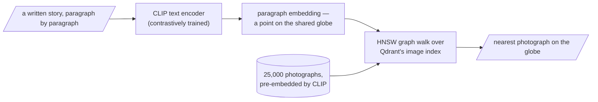

## Core intuition

Once text becomes geometry, retrieval becomes navigation. The index is no longer a list of strings; it is a surface over which queries travel until they land on the nearest relevant semantic neighbors.

## Why it matters

This is the conceptual bridge from representation learning to vector search. The model gives us coordinates; the database gives us a route through them.

## Instructor framing

This is the closing chapter of Week 2, and it is deliberately a synthesis rather than a new topic: KL divergence reuses entropy and cross-entropy from three pages ago, HNSW reuses the ANN indexing problem from Week 1, and CLIP reuses contrastive learning from two pages ago. The pedagogical point is that "search" was never a separate subject bolted onto representation learning — once you accept meaning-as-geometry, search, training, and belief-comparison all turn out to be the same kind of computation: measuring distance on a curved space.

## Worked example

Suppose two weather forecasters both claim to be well-calibrated. Forecaster A says there's a 50% chance of rain tomorrow; the true frequency, over many such days, really is 50%. Forecaster B also says 50%, but is secretly miscalibrated — days B calls "50%" actually rain 90% of the time. Both forecasters emit the same number, but B is much more wrong, and KL divergence is precisely the tool that makes that wrongness a quantity rather than a feeling: it measures the excess surprise you would suffer by trusting B's stated beliefs instead of the true frequencies. This is the same computation, applied to trained models: a language model's training loss is the KL divergence between what it currently believes about the next word and what the data actually shows.

We are now treating embeddings as a physical space, not just a computed artifact. Search becomes motion, indexing becomes graph traversal, and meaning is measurement over distance.

## Search as motion on a globe

Here is the message of the day, the one sentence to carry out the door: once meaning is geometry, search is navigation — and the surface we navigate is curved. Our embeddings, normalised to unit length, all live on the surface of a hypersphere, not its interior. The natural notion of "how similar" is the cosine of the angle between two points — how far apart they are along the surface, the great-circle distance, exactly as the distance between two cities is measured along the Earth's curve and not by tunnelling through the rock. Approximate nearest-neighbour search, re-ranking, and last week's curse of dimensionality and concentration of measure are all statements about how points distribute on this surface as it gains dimensions.

There is a deeper sense in which this geometry and Act I's mathematics are the same study. When the points of a space are not embeddings but probability distributions — a model's beliefs — the natural notion of "how far apart" is no longer the cosine but the **Kullback–Leibler divergence**:

$$D_{KL}(p \parallel q) = \sum_i p_i \log\frac{p_i}{q_i} = H(p,q) - H(p)$$

Look at what it decomposes into: the cross-entropy of $q$ relative to $p$, minus the entropy of $p$ — the two quantities built earlier this morning. The KL divergence is exactly the excess surprise you suffer for holding the wrong beliefs $q$ instead of the truth $p$, and it's zero only when $q=p$.

Make it concrete with the fair coin from this morning. Let the truth be $p=[0.5,0.5]$ — an honest coin — but suppose your model believes $q=[0.9,0.1]$, badly overconfident on heads. The entropy of the truth is $H(p)=1$ bit, the one unavoidable question per flip. The cross-entropy is $H(p,q) = -(0.5\log_2 0.9 + 0.5\log_2 0.1) \approx -(0.5\times(-0.152) + 0.5\times(-3.322)) \approx 1.74$ bits — how surprised you actually are, on average, carrying belief $q$ instead of the truth. The KL divergence is the gap between them, $D_{KL}(p\|q) \approx 1.74 - 1 = 0.74$ bits: the extra surprise $q$ costs you above the unavoidable floor, purely for being wrong.

So minimising cross-entropy — the thing every model on earth does — is minimising the KL distance from your model to the world: walking your belief, step by step, toward the truth across a curved space of distributions.

> Note that KL is **not symmetric**: $D_{KL}(p\|q) \neq D_{KL}(q\|p)$. It's a *divergence*, not a distance — a directed measure of "how surprised $p$ is by $q$." **Information geometry** takes this "space of distributions" seriously as a manifold with its own curvature and its own straight lines (geodesics): a distribution is a point; a family of distributions is a surface; and learning is a trajectory across it.

## Indexing the globe

A hard practical problem lurks under "find the nearest point on the globe." With ten million document vectors and a query in hand, the honest way to find the closest is to compute ten million dot products — an exact search that is correct and far too slow for an interactive system. **Approximate nearest-neighbour (ANN) search** finds the nearest neighbour without measuring distance to everyone, trading a willingness to be occasionally, slightly wrong for speed.

The dominant idea, used inside Qdrant, is a **navigable small-world graph (HNSW)**: connect each vector to a handful of near neighbours and a few long-range "shortcut" links. To answer a query, you don't scan the globe — you *walk* it: start anywhere, hop to whichever neighbour is closer to the query, and repeat, descending greedily toward the query's region like water finding a drain. The long-range shortcuts let you cross the globe in a few hops (the same six-degrees "small-world" structure that connects distant strangers in a social network), and the local links let you home in precisely once you're close. A few dozen hops, not ten million comparisons.

## One space for words and pictures: CLIP

We close with something that should feel like magic and, by now, feels like an obvious consequence. **CLIP** was trained contrastively — the same attraction-and-repulsion game from the previous page — on hundreds of millions of image–caption pairs, with one rule: pull each image and its true caption together, push mismatched pairs apart. After enough of this, images and the texts that describe them land in the same place on a shared globe: a photograph of a child hugging a dog and the words "learning to love an animal" become neighbours — not because pixels resemble letters, but because both were dragged to the same coordinates by the contrastive game. To find a picture for a paragraph, embed the paragraph as a point and ask Qdrant for the nearest image points. Text goes in, images come out, because they were never in separate spaces to begin with.

> This is every idea of the day standing in a row. Contrastive learning built the shared space; the embeddings are the contextual meanings forged by attention and the masked-word game; the nearest-neighbour search is motion on the globe; and the softmax-shaped notion of "nearby" that ranks the candidates is the same softmax we built this morning from a cow, a duck, and a sofa, taking its final bow.

## Math explained step by step

Rebuild the fair-coin KL example above, step by step, so the formula stops being symbols.

**Step 1 — name the truth and the belief.** $p=[0.5,0.5]$ is what actually happens (a fair coin); $q=[0.9,0.1]$ is what your model believes (badly overconfident on heads). KL divergence always compares a "true" distribution to a "held" one — order matters, which is why it's a divergence and not a symmetric distance.

**Step 2 — compute the unavoidable floor, entropy of the truth.** $H(p) = -\sum_i p_i \log_2 p_i = 1$ bit for a fair coin: even a perfectly calibrated observer needs one yes/no question per flip.

**Step 3 — compute what you actually pay, cross-entropy.** $H(p,q) = -\sum_i p_i \log_2 q_i = -(0.5\log_2 0.9 + 0.5\log_2 0.1) \approx 1.74$ bits. Notice this uses the *true* frequencies ($p$) to weight how often each outcome occurs, but the *model's* probabilities ($q$) to score the surprise — that mismatch is precisely what makes an overconfident wrong belief expensive.

**Step 4 — subtract to isolate the cost of being wrong.** $D_{KL}(p\|q) = H(p,q) - H(p) \approx 1.74 - 1 = 0.74$ bits. This is the part of your surprise that exists purely because your beliefs ($q$) differ from reality ($p$) — the unavoidable 1 bit has been subtracted out.

**Step 5 — connect this back to training.** Every model minimising cross-entropy loss is, by this same arithmetic, minimising its KL divergence from the true data distribution (since $H(p)$ is a fixed constant it cannot change). "Training reduces loss" and "training moves beliefs closer to truth on a curved space of distributions" are the same sentence.

## Practical pattern

For a practitioner, this page cashes out into three operational habits:

1. when comparing two models' calibration or two systems' belief quality, use KL divergence (or its close relative, cross-entropy) rather than a raw accuracy number — accuracy hides *how* wrong a miss is, KL does not;
2. do not hand-roll exhaustive nearest-neighbour search past a few tens of thousands of vectors — use an HNSW-backed index (Qdrant, or equivalent) and tune its recall/speed trade-off (`ef_search` and similar parameters) against your own precision requirements rather than accepting defaults blindly;
3. when building cross-modal retrieval (text-to-image, text-to-audio), reach for a model already contrastively trained to share a single space (CLIP-family for images) rather than trying to bridge two separately-trained encoders after the fact — the shared space is the entire trick, and it cannot be retrofitted cheaply.

## Common traps

- treating KL divergence as symmetric and swapping its arguments carelessly — $D_{KL}(p\|q) \neq D_{KL}(q\|p)$, and mixing them up silently changes what you're actually measuring;
- assuming approximate nearest-neighbour search is always exact enough without checking recall against a brute-force baseline on a validation set — HNSW's speed comes from a real, tunable accuracy trade-off, not a free lunch;
- bolting together two independently-trained encoders (say, a text embedder and an image embedder trained separately) and expecting their vectors to be comparable — without joint contrastive training, the two spaces have no shared coordinate system at all;
- forgetting that HNSW graph quality depends on construction-time parameters (`ef_construct`, `M`) — an index built cheaply can silently underperform for the lifetime of the deployment.

## Takeaways

- KL divergence is cross-entropy minus entropy — the excess surprise caused specifically by holding the wrong belief, and it is what every cross-entropy training loop is implicitly minimising.
- Search at scale is graph traversal (HNSW), not brute-force comparison — know your index's recall/speed knobs and validate them against exact search periodically.
- Cross-modal retrieval (text-to-image and beyond) works because contrastive training puts both modalities in one shared space during training, not because of anything done at query time.
- When auditing a model's confidence, prefer KL/cross-entropy-based diagnostics over raw accuracy — they reveal how expensive a wrong belief actually is.
