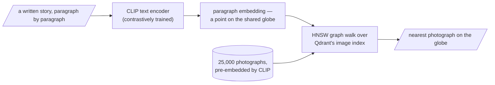

## Search as motion on a globe

Here is the message of the day, the one sentence to carry out the door: once meaning is geometry, search is navigation — and the surface we navigate is curved. Our embeddings, normalised to unit length, all live on the surface of a hypersphere, not its interior. The natural notion of "how similar" is the cosine of the angle between two points — how far apart they are along the surface, the great-circle distance, exactly as the distance between two cities is measured along the Earth's curve and not by tunnelling through the rock. Approximate nearest-neighbour search, re-ranking, and last week's curse of dimensionality and concentration of measure are all statements about how points distribute on this surface as it gains dimensions.

There is a deeper sense in which this geometry and Act I's mathematics are the same study. When the points of a space are not embeddings but probability distributions — a model's beliefs — the natural notion of "how far apart" is no longer the cosine but the **Kullback–Leibler divergence**:

$$D_{KL}(p \parallel q) = \sum_i p_i \log\frac{p_i}{q_i} = H(p,q) - H(p)$$

Look at what it decomposes into: the cross-entropy of $q$ relative to $p$, minus the entropy of $p$ — the two quantities built earlier this morning. The KL divergence is exactly the excess surprise you suffer for holding the wrong beliefs $q$ instead of the truth $p$, and it's zero only when $q=p$.

Make it concrete with the fair coin from this morning. Let the truth be $p=[0.5,0.5]$ — an honest coin — but suppose your model believes $q=[0.9,0.1]$, badly overconfident on heads. The entropy of the truth is $H(p)=1$ bit, the one unavoidable question per flip. The cross-entropy is $H(p,q) = -(0.5\log_2 0.9 + 0.5\log_2 0.1) \approx -(0.5\times(-0.152) + 0.5\times(-3.322)) \approx 1.74$ bits — how surprised you actually are, on average, carrying belief $q$ instead of the truth. The KL divergence is the gap between them, $D_{KL}(p\|q) \approx 1.74 - 1 = 0.74$ bits: the extra surprise $q$ costs you above the unavoidable floor, purely for being wrong.

So minimising cross-entropy — the thing every model on earth does — is minimising the KL distance from your model to the world: walking your belief, step by step, toward the truth across a curved space of distributions.

> Note that KL is **not symmetric**: $D_{KL}(p\|q) \neq D_{KL}(q\|p)$. It's a *divergence*, not a distance — a directed measure of "how surprised $p$ is by $q$." **Information geometry** takes this "space of distributions" seriously as a manifold with its own curvature and its own straight lines (geodesics): a distribution is a point; a family of distributions is a surface; and learning is a trajectory across it.

## Indexing the globe

A hard practical problem lurks under "find the nearest point on the globe." With ten million document vectors and a query in hand, the honest way to find the closest is to compute ten million dot products — an exact search that is correct and far too slow for an interactive system. **Approximate nearest-neighbour (ANN) search** finds the nearest neighbour without measuring distance to everyone, trading a willingness to be occasionally, slightly wrong for speed.

The dominant idea, used inside Qdrant, is a **navigable small-world graph (HNSW)**: connect each vector to a handful of near neighbours and a few long-range "shortcut" links. To answer a query, you don't scan the globe — you *walk* it: start anywhere, hop to whichever neighbour is closer to the query, and repeat, descending greedily toward the query's region like water finding a drain. The long-range shortcuts let you cross the globe in a few hops (the same six-degrees "small-world" structure that connects distant strangers in a social network), and the local links let you home in precisely once you're close. A few dozen hops, not ten million comparisons.

## One space for words and pictures: CLIP

We close with something that should feel like magic and, by now, feels like an obvious consequence. **CLIP** was trained contrastively — the same attraction-and-repulsion game from the previous page — on hundreds of millions of image–caption pairs, with one rule: pull each image and its true caption together, push mismatched pairs apart. After enough of this, images and the texts that describe them land in the same place on a shared globe: a photograph of a child hugging a dog and the words "learning to love an animal" become neighbours — not because pixels resemble letters, but because both were dragged to the same coordinates by the contrastive game. To find a picture for a paragraph, embed the paragraph as a point and ask Qdrant for the nearest image points. Text goes in, images come out, because they were never in separate spaces to begin with.

> This is every idea of the day standing in a row. Contrastive learning built the shared space; the embeddings are the contextual meanings forged by attention and the masked-word game; the nearest-neighbour search is motion on the globe; and the softmax-shaped notion of "nearby" that ranks the candidates is the same softmax we built this morning from a cow, a duck, and a sofa, taking its final bow.
