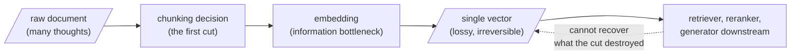

Twice now we have stood at the edge of a sphere. On Day 1, meaning became geometry — points on a high-dimensional manifold, nearness as kinship. On Day 2, we earned that geometry with attention and softmax, and ended on anisotropy, the huddling of embeddings into a narrow cone. This week takes the next, deceptively simple step: before a single vector can be computed, a document must be turned into the things we embed. That act has a name — **chunking** — and it is treated everywhere as settled plumbing: parse, slice, embed, retrieve.

It is not settled. It hides the first irreversible decision in the entire pipeline.

## Every embedding is a lossy projection

Recall the children's telephone game from Day 1 — the whisper that degrades with each relay. Embedding is the first relay. If that very first step introduces significant loss, no amount of downstream sophistication — no reranker, no clever prompt — can restore it. This is why chunking is not preprocessing. It is the first **ontological** decision in your retrieval pipeline: what you decide to embed as one unit fixes what the system can and cannot ever retrieve.

## The information bottleneck

The loss is structural, not incidental. Here is the plain-English version before the symbols: any time you compress something, you face a trade-off between throwing away as much as possible — to keep the result small and cheap — and keeping whatever part will actually matter later. The **information bottleneck** is that trade-off written as math. Given an input $X$ (the full text of a chunk) and a target $Y$ (whatever you will eventually ask of it — a topic, an answer to a query), we want a representation $Z$ — the embedding — that keeps as much information about $Y$ as possible while discarding as much of the rest of $X$ as possible:

$$\mathcal{L}_{IB} = I(X; Z) - \beta\, I(Z; Y)$$

Read it piece by piece. $I(\cdot;\cdot)$ is **mutual information** — a number answering "if I know one of these, how much less uncertain am I about the other?" $I(X;Z)$ measures how much of the raw chunk survived into the embedding — we want this *small*, since small means compact and cheap. $I(Z;Y)$ measures how much of what actually matters survived — we want this *large*. Because it is subtracted and weighted by $\beta$, a bigger $I(Z;Y)$ always shrinks the loss $\mathcal{L}_{IB}$ we are trying to minimize. So minimizing this loss means: compress hard, but not the part that matters.

**A tiny worked example.** Suppose a chunk is about one of two equally likely topics — cows or the stock market — so knowing $Y$ (the topic) is worth exactly 1 bit of information ($\log_2 2 = 1$, two equally likely options). Compare two ways of building $Z$:

| Representation $Z$ | $I(Z; Y)$ | What happened |
|---|---|---|
| $Z$ = which topic the chunk is about | 1 bit (perfect) | $Z$ is small *and* keeps everything that matters |
| $Z$ = the average of a cow-sentence and a stock-sentence embedding (the mixing principle, below) | ≈0 bits | $Z$ still costs bits to store, but a query can no longer tell which topic it came from |

The second row is the trap: mixing two thoughts does not just fail to save you anything — it can cost you *all* of $I(Z;Y)$, the one term in the loss that was supposed to pay for itself. When we embed a chunk, we pass it through exactly such a bottleneck. If the chunk holds two distinct thoughts — cows and the stock market — the bottleneck must crush both into one point. The result is faithful to neither. This is why chunk composition matters so profoundly.

> Every embedding is a lossy projection, and the first projection — from source to embedded unit — is the one no downstream cleverness can undo. What the encoder cannot see, the generator cannot recover.

The dominant narrative is parse → chunk → embed → retrieve, and almost every RAG pipeline opens with this unquestioned first step. This week questions it, beginning with the decision itself: what counts as one thought worth embedding as one unit?
