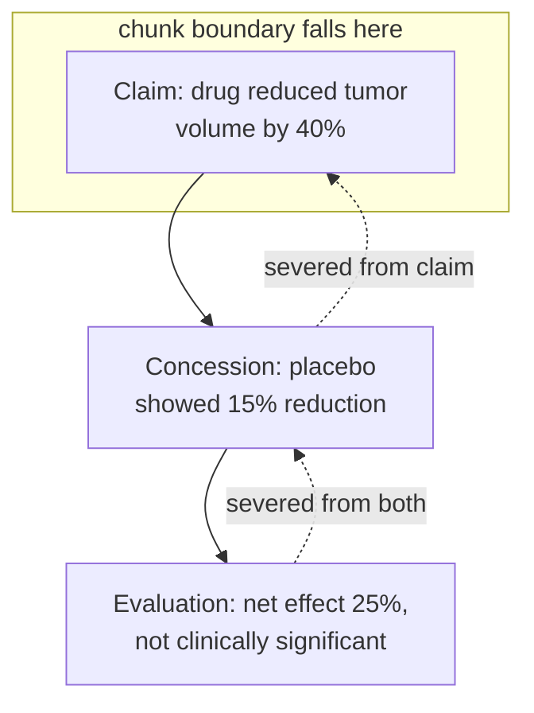

Documents are not sequences of independent sentences. They are hierarchical networks of rhetorical relations. Rhetorical Structure Theory (RST) formalizes what you already feel: a document decomposes into a tree of units bound by relations — cause–effect, contrast, elaboration, evidence, concession. These are the logical skeleton of the argument. Sever them and you do not merely lose information; you get **structurally misleading information that reads true but is not.**

## A worked example

> "The drug reduced tumor volume by 40% (p < 0.01). However, the placebo group showed a 15% reduction, suggesting a placebo effect. Adjusted for this baseline, the drug's net effect was a modest 25%, which did not reach clinical significance."

Three units bound by a concession and an evaluation. Surface only the first sentence — the one a query about efficacy would rank highest — and you deliver the opposite of the document's conclusion. The chunk is not incomplete; it is **actively deceptive**.

Lawyers call this "taking out of context"; engineers call it a chunking failure. They are the same thing. A clause reading "The licensee shall have no obligation to pay royalties" is devastating — until you read the preceding condition, "In the event that cumulative sales do not exceed $1 million in any calendar year." The conditional frame *is* the meaning.

## The Toulmin lens

Stephen Toulmin models an argument in six parts: **claim, data, warrant, backing, qualifier, and rebuttal.** Chunking can sever any link between them:

| Severed piece | What you get |
|---|---|
| Rebuttal without its claim | A mysterious negative |
| Claim without its qualifier | An absolute where none was intended |
| Warrant without its backing | An unsupported assumption |

When a retriever surfaces a chunk, ask: **is this a complete Toulmin unit?** If not, you may be handing the generator half an argument dressed as the whole.

> Sever a rhetorical relation and you don't just lose information — you manufacture a falsehood that reads fluently.

Discourse relations are the connective logic of an argument. The next pathology, negation and scope, is the sharpest form of this failure: it does not merely omit, it **inverts**.
