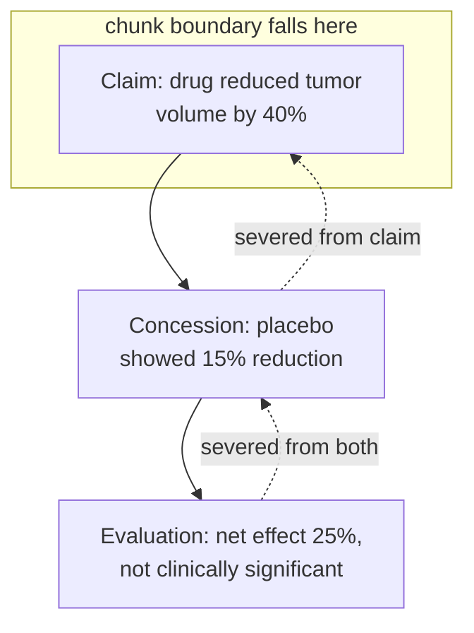

Documents are not sequences of independent sentences. They are hierarchical networks of rhetorical relations. Rhetorical Structure Theory (RST) formalizes what you already feel: a document decomposes into a tree of units bound by relations — cause–effect, contrast, elaboration, evidence, concession. These are the logical skeleton of the argument. Sever them and you do not merely lose information; you get **structurally misleading information that reads true but is not.**

## Core intuition

The document's meaning is carried not only by the individual sentences, but by the relations between them. A claim is often only meaningful in the presence of its contrast, evidence, or concession.

When chunking cuts these relations apart, the retriever surfaces “truthy” fragments that are locally plausible but globally misleading.

## Why it matters

This is where retrieval quality starts to depend on discourse structure rather than mere lexical matching. The best answer is not the sentence that sounds strongest in isolation — it is the sentence whose role in the argument is preserved.

## Instructor framing

This chapter turns the earlier chunking critique into a structural one. The issue is not only missing context, but altered argument structure.

## Worked example

> "The drug reduced tumor volume by 40% (p < 0.01). However, the placebo group showed a 15% reduction, suggesting a placebo effect. Adjusted for this baseline, the drug's net effect was a modest 25%, which did not reach clinical significance."

Three units bound by a concession and an evaluation. Surface only the first sentence — the one a query about efficacy would rank highest — and you deliver the opposite of the document's conclusion. The chunk is not incomplete; it is **actively deceptive**.

Lawyers call this "taking out of context"; engineers call it a chunking failure. They are the same thing. A clause reading "The licensee shall have no obligation to pay royalties" is devastating — until you read the preceding condition, "In the event that cumulative sales do not exceed $1 million in any calendar year." The conditional frame *is* the meaning.

## The Toulmin lens

Stephen Toulmin models an argument in six parts: **claim, data, warrant, backing, qualifier, and rebuttal.** Chunking can sever any link between them:

| Severed piece | What you get |
|---|---|
| Rebuttal without its claim | A mysterious negative |
| Claim without its qualifier | An absolute where none was intended |
| Warrant without its backing | An unsupported assumption |

When a retriever surfaces a chunk, ask: **is this a complete Toulmin unit?** If not, you may be handing the generator half an argument dressed as the whole.

> Sever a rhetorical relation and you don't just lose information — you manufacture a falsehood that reads fluently.

Discourse relations are the connective logic of an argument. The next pathology, negation and scope, is the sharpest form of this failure: it does not merely omit, it **inverts**.

## Math explained step by step

Trace why the drug-trial example is not just "missing information" but actively wrong, one step at a time.

**Step 1 — a query about efficacy is a similarity search, and similarity rewards confident, on-topic wording.** "The drug reduced tumor volume by 40%" contains strong, unhedged, topical language — exactly the profile a cosine-similarity search ranks highest for a query like "how effective was the drug."

**Step 2 — the concession sentence loses that ranking race by construction.** "However, the placebo group showed a 15% reduction" is *about* the placebo, lexically and topically — a pure similarity search has little reason to retrieve it alongside the first sentence unless the two are forced to travel together as one chunk.

**Step 3 — see the arithmetic of what got lost.** The document's actual conclusion is a 25-point net effect that "did not reach clinical significance." Retrieving only sentence one reports 40% efficacy — not an approximation of the truth, but a number the paper explicitly does not endorse once you read three sentences further.

**Step 4 — generalize the failure mode.** This is not a retrieval *recall* problem (the right document was found) — it is a retrieval *unit* problem: the atomic thing being scored and returned was smaller than the atomic thing needed to be true. No amount of retrieving more chunks fixes this if the ranker still prefers the confident-sounding fragment over the qualified one; the fix has to happen at chunk-construction time, by keeping a Toulmin unit (claim + qualifier + rebuttal) together as one retrievable object.

## Practical pattern

A reliable chunker should preserve argumentative units, not just sentence boundaries. If a clause depends on contrast, concession, or evidence elsewhere, it should stay attached to that context or be represented as a larger unit. Concretely: detect discourse connectives ("however," "but," "in contrast," "notwithstanding") and treat the sentence before and after as a single non-splittable unit; for structured documents (clinical papers, contracts), consider chunking at the rhetorical-unit level (claim+qualifier together) rather than the sentence level.

## Common traps

- treating each sentence as standalone evidence, especially the most confident-sounding one — confidence of wording is not a proxy for the document's actual conclusion;
- overlooking contrastive or concession relations signaled by words like "however," "but," "although," and splitting exactly at those words;
- losing the argument frame when retrieving a claim, then having the generator present a superseded or heavily-qualified number as if it were the final answer;
- assuming a higher similarity score means a more relevant *or more true* fragment — a fragment can score highly on similarity while representing the opposite of the source's actual conclusion.

## Takeaways

- The logic of the argument is as important as the sentence itself — a locally true sentence can be globally false once severed from its qualifier.
- Chunking can convert a partial argument into a convincing falsehood that passes every fluency check.
- Concretely: never split a chunk between a claim and a sentence beginning with "however," "but," "yet," or "adjusted for" — treat discourse connectives as a hard signal to keep the surrounding sentences in one chunk.
