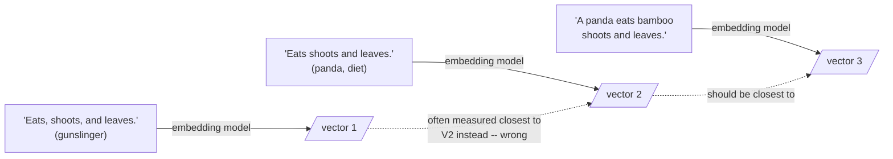

The pathologies so far are textual. But chunking also distorts the embedding space itself.

## Core intuition

An embedding is not a memory of a thought; it is a point in a geometric space. When a chunk mixes multiple thoughts, the resulting point can drift to a location that is near none of them.

## Why it matters

This is the geometric explanation for the retrieval pathology we keep seeing: one chunk can represent a muddy average, not a meaningful answer. The remedy is to preserve semantic units that are narrow enough to remain faithful to a single interpretation.

## Instructor framing

This chapter is the geometric summary of the whole field guide. Every pathology so far (endophora, discourse severing, negation, lexical cohesion, bridging inference) has a textual description and a geometric consequence: they all eventually cash out as "the resulting vector sits somewhere unhelpful." Teaching this page after the others lets students see that the field guide was never seven unrelated failure modes — it was one geometric failure (a fixed-size vector cannot faithfully represent multiple ideas) observed from seven different textual angles.

## Worked example

Take a customer-support transcript chunk that happens to span a topic change: "...so the refund was processed on the 14th. Separately, we noticed your account is eligible for the new loyalty tier — would you like to opt in?" A query about "when was my refund processed" and a query about "how do I join the loyalty program" both hit the *same* chunk, and both get a mediocre similarity score, because the chunk's embedding is the centroid of a refund-topic and a loyalty-topic — a point that is moderately close to both questions and confidently close to neither. A cleaner split at "Separately," would give each query a chunk whose embedding sits much nearer its true answer.

The model never sees a paragraph as a thought; it sees a vector. When that vector is an average, the retrieval system can no longer tell which idea the paragraph was actually trying to express.

## The centroid delusion

A chunk's embedding is the centroid of its content — the average meaning. Pack three distinct thoughts into a 400-token chunk and its embedding sits equidistant from all three, which is to say near none of them. It is a phantom: a location where no actual thought resides. You are hunting a needle, and the embedding has helpfully averaged it with the haystack. This is Simpson's paradox in vector form: an aggregate can be far from every constituent.

```python
# the centroid delusion, concretely: three unrelated sentences packed into
# one chunk produce an embedding near none of the three individual meanings
import numpy as np

# stand-in "embeddings" for three orthogonal thoughts
cow    = np.array([1.0, 0.0, 0.0])
nvidia = np.array([0.0, 1.0, 0.0])
beach  = np.array([0.0, 0.0, 1.0])

chunk_embedding = (cow + nvidia + beach) / 3   # the chunk's centroid

for name, vec in [("cow", cow), ("nvidia", nvidia), ("beach", beach)]:
    sim = chunk_embedding @ vec / np.linalg.norm(chunk_embedding)
    print(f"cosine(chunk, {name}): {sim:.3f}")
# every similarity is mediocre -- the chunk embedding is "near" nothing
```

## Anisotropy compounds it

Anisotropy — our Day-2 antagonist — compounds this. In an anisotropic space, large diverse chunks drift toward the mean direction of the cone and become similar to everything yet particularly similar to nothing: the "popular but useless" results that appear in every query's top-k and answer none of them.

> The cure is not filtering but re-chunking into focused units whose embeddings escape the dense center.

## When the embedder cannot see the comma

Take Lynne Truss's title *Eats, Shoots & Leaves*. With commas it is a gunslinger; without, a panda. Test three sentences: (1) "Eats, shoots, and leaves," (2) "Eats shoots and leaves," (3) "A panda eats bamboo shoots and leaves." Any reader knows (2) is closer to (3) than to (1). In classroom experiments, many popular encoders get the ordering wrong: they weight lexical overlap above the compositional semantics that punctuation controls.



The lesson: if your chunks differ by syntactic cues rather than vocabulary — as legal, medical, and regulatory text so often do — your embedding model may simply fail to tell them apart. **Embedding model selection is itself a first-order chunking decision.**

And yet, after this catalogue of horrors, chunking lives on — because it is a compromise born of constraints (context windows, retrieval precision, cost, answer isolation), not ignorance. Act III turns to what we do about it.


## Math explained step by step

Walk the centroid code above through to its consequence for ranking.

**Step 1 — averaging is the operative arithmetic.** `chunk_embedding = (cow + nvidia + beach) / 3` is literally what happens (approximately) when an encoder is asked to summarize text spanning three unrelated topics into one fixed-size vector — pooling averages, and averaging three orthogonal directions produces a point equidistant from all three.

**Step 2 — measure the damage in cosine terms.** Each printed similarity comes out mediocre — around $1/\sqrt{3} \approx 0.577$ for perfectly orthogonal unit vectors averaged three ways — far below the $1.0$ a clean, single-topic chunk would score against its own topic.

**Step 3 — see why this loses a ranking race, not just accuracy in the abstract.** In a real corpus, a competing chunk that is *only* about "cow" will score close to $1.0$ against a cow query, comfortably beating the $0.577$-ish mixed chunk — even if the mixed chunk happens to contain the single most precise, most recent, or most authoritative fact about cows in the entire corpus. Top-$k$ ranking punishes the mixed chunk for its company, not for the quality of what it actually says.

**Step 4 — see why anisotropy makes the exact same arithmetic worse.** In an anisotropic space (Week 1-2), the "average direction" that mixed chunks drift toward is not a neutral midpoint — it is the same crowded, dominant cone that *everything* drifts toward. So a mixed chunk doesn't just score moderately against its true topics; it scores deceptively *high* against many unrelated queries too, because it has drifted toward the region every embedding is already crowded into. That is the mechanism behind "popular but useless" chunks appearing in every query's top-k.

## Practical pattern

The direct response to the centroid delusion is: keep chunks topically singular. Concretely — (1) detect topic-shift points during chunking (a cheap signal: a sharp drop in adjacent-sentence embedding similarity, or a clear paragraph/section break) and cut there rather than at a fixed token count; (2) after chunking, spot-check a sample of chunks by embedding each and checking whether within-chunk sentence-to-sentence cosine similarity is high — a low, scattered internal similarity is a live signal that a chunk is a centroid-delusion candidate; (3) treat embedding-model choice itself as a chunking decision, not an independent one — run the "Eats, Shoots & Leaves" style test (syntactically distinct, lexically similar sentences) against any candidate embedding model before trusting it on syntax-sensitive domains like contracts or dosage instructions.

## Common traps

- assuming a lower similarity score always means "less relevant," when it may mean "relevant but diluted by unrelated content in the same chunk" — the centroid delusion produces false negatives that look like the document simply lacks a good answer;
- trusting an off-the-shelf embedding model on syntax-sensitive text (legal, medical, regulatory) without testing whether it can distinguish sentences that differ mainly in punctuation or word order rather than vocabulary;
- treating "popular in every top-k" as evidence a chunk is broadly useful, when in an anisotropic space it may just mean the chunk has drifted toward the crowded center that resembles everything and helps nothing;
- trying to fix a centroid-delusion problem by filtering or re-ranking after retrieval, when the actual fix is re-chunking so the embedding is never built from mixed content in the first place.

## Takeaways

- A chunk's embedding is a centroid; packing distinct thoughts into one chunk produces a phantom vector meaningfully near none of them.
- Anisotropy compounds this: mixed chunks drift toward the space's already-crowded center, producing "popular but useless" top-k results.
- Embedding model choice is itself a chunking decision — some models cannot distinguish syntactically different, lexically similar sentences, which matters enormously for punctuation- and order-sensitive domains.
- Concretely: when auditing weak retrieval, check within-chunk sentence-to-sentence similarity before blaming the embedding model — a low, scattered score means the chunk boundary, not the model, is the bug.
