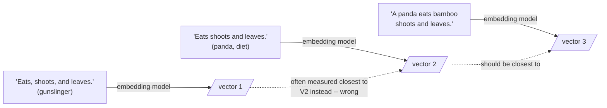

The pathologies so far are textual. But chunking also distorts the embedding space itself.

## The centroid delusion

A chunk's embedding is the centroid of its content — the average meaning. Pack three distinct thoughts into a 400-token chunk and its embedding sits equidistant from all three, which is to say near none of them. It is a phantom: a location where no actual thought resides. You are hunting a needle, and the embedding has helpfully averaged it with the haystack. This is Simpson's paradox in vector form: an aggregate can be far from every constituent.

```python
# the centroid delusion, concretely: three unrelated sentences packed into
# one chunk produce an embedding near none of the three individual meanings
import numpy as np

# stand-in "embeddings" for three orthogonal thoughts
cow    = np.array([1.0, 0.0, 0.0])
nvidia = np.array([0.0, 1.0, 0.0])
beach  = np.array([0.0, 0.0, 1.0])

chunk_embedding = (cow + nvidia + beach) / 3   # the chunk's centroid

for name, vec in [("cow", cow), ("nvidia", nvidia), ("beach", beach)]:
    sim = chunk_embedding @ vec / np.linalg.norm(chunk_embedding)
    print(f"cosine(chunk, {name}): {sim:.3f}")
# every similarity is mediocre -- the chunk embedding is "near" nothing
```

## Anisotropy compounds it

Anisotropy — our Day-2 antagonist — compounds this. In an anisotropic space, large diverse chunks drift toward the mean direction of the cone and become similar to everything yet particularly similar to nothing: the "popular but useless" results that appear in every query's top-k and answer none of them.

> The cure is not filtering but re-chunking into focused units whose embeddings escape the dense center.

## When the embedder cannot see the comma

Take Lynne Truss's title *Eats, Shoots & Leaves*. With commas it is a gunslinger; without, a panda. Test three sentences: (1) "Eats, shoots, and leaves," (2) "Eats shoots and leaves," (3) "A panda eats bamboo shoots and leaves." Any reader knows (2) is closer to (3) than to (1). In classroom experiments, many popular encoders get the ordering wrong: they weight lexical overlap above the compositional semantics that punctuation controls.



The lesson: if your chunks differ by syntactic cues rather than vocabulary — as legal, medical, and regulatory text so often do — your embedding model may simply fail to tell them apart. **Embedding model selection is itself a first-order chunking decision.**

And yet, after this catalogue of horrors, chunking lives on — because it is a compromise born of constraints (context windows, retrieval precision, cost, answer isolation), not ignorance. Act III turns to what we do about it.
