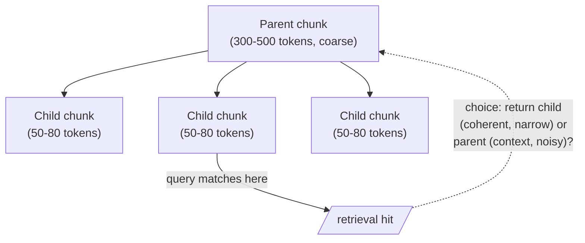

Act III offers two roads out of the swamp. The first improves the cut: a spectrum of strategies that lose less. The second questions the cut entirely — that's Road Two, page ahead. First, the taxonomy.

## Core intuition

Chunking is a design choice about how to slice meaning. Every strategy encodes a different philosophy about where boundaries ought to live and what information is acceptable to lose.

## Why it matters

There is no free lunch in chunking. Every method trades off coherence, context, cost, and retrieval precision. The field is a catalog of compromises, not a single correct answer.

## Instructor framing

Teach this page as a spectrum, not a menu of unrelated options: fixed-size, recursive, semantic, and hierarchical chunking are each a strictly better answer to "where do we cut," in roughly that order of sophistication and cost. The trap for a student is assuming the most sophisticated option is always correct — semantic chunking costs real compute per document, and a low-stakes internal wiki may not need it. The judgment call, not the ranking, is the actual skill being taught.

## Worked example

Take one real support ticket: "Customer reports login failures since Tuesday. Password reset was attempted twice with no success. Escalating to tier 2. Update: root cause was an expired SSL certificate on the auth service, resolved 14:32 UTC." A fixed-size chunker at 40 tokens might cut mid-sentence between "no success" and "Escalating," destroying the causal link. Recursive chunking would at least cut at the sentence boundary, keeping "Escalating to tier 2" whole but still severing it from "Password reset was attempted twice" — the very reason for escalation. Semantic chunking, measuring embedding similarity between consecutive sentences, would likely detect the topic shift at "Update:" and group the diagnosis narrative together, correctly separating the initial report from the resolution. None of the three, however, would know to attach the resolution back to the original complaint it resolves — that requires the hierarchical parent-child structure below.

This page gives the taxonomy so we can stop mistaking one chunking heuristic for a universal truth. The question is not "what is the best chunk size?" but "what semantic pressure are we optimizing for?"

## Fixed-size chunking

The baker's approach: treat text as a loaf and cut equal slices. Simple, deterministic, fast — and wrong for text, because a fixed boundary may bisect a thought, a sentence, even a word. What is worse than a worm in your apple? Half a worm.

```python
# fixed-size chunking -- deterministic, fast, and blind to word boundaries
def fixed_size_chunk(text, size=512):
    return [text[i:i + size] for i in range(0, len(text), size)]
```

## Recursive chunking

Improves matters by cutting preferentially at word, then sentence, then paragraph boundaries — but it is still about size, not meaning. Sentence boundaries barely exist in Chinese or Japanese, while paragraph boundaries swing wildly between a journalist and Sir Francis Bacon.

```python
# recursive chunking -- degrade gracefully from paragraph, to sentence, to word
def recursive_chunk(text, target_size=512):
    if len(text) <= target_size:
        return [text]
    for sep in ["\n\n", ". ", " "]:          # paragraph, then sentence, then word
        if sep in text:
            parts = text.split(sep)
            break
    else:
        parts = list(text)                    # last resort: characters
    chunks, current = [], ""
    for part in parts:
        if len(current) + len(part) > target_size:
            chunks.append(current)
            current = part
        else:
            current += sep + part if current else part
    if current:
        chunks.append(current)
    return chunks
```

## Semantic chunking

Cuts where meaning actually shifts. Embed consecutive sentences, measure the distance between neighbors, and cut where the distance spikes — a genuine topic transition. Libraries such as **Chonkie** implement this. It is far better than fixed-size, at a modest cost in compute. But it improves *where* we cut; it does not heal *what* the cut severs. "It was rather pleased with itself" is correctly marked as a unit's end — and remains incomplete without its referent.

```python
# semantic chunking -- cut where consecutive-sentence similarity drops sharply
def semantic_chunk(sentence_embeddings, sentences, threshold=0.3):
    chunks, current = [], [sentences[0]]
    for i in range(1, len(sentences)):
        sim = cosine_sim(sentence_embeddings[i - 1], sentence_embeddings[i])
        if sim < threshold:          # meaning has shifted -- cut here
            chunks.append(" ".join(current))
            current = [sentences[i]]
        else:
            current.append(sentences[i])
    chunks.append(" ".join(current))
    return chunks
```

## Hierarchical chunking

Embraces that documents have levels. Chunk coarsely (sections, ≈300–500 tokens) and finely (atoms, ≈50–80 tokens), building a tree of parents and children. Parents preserve context; children are coherent. At retrieval time the system chooses which to feed — and that choice is a trap.

| Trap | The problem |
|---|---|
| **The illusion of overlap** | Overlapping windows ensure a severed sentence survives intact in some neighbor, but do nothing for references spanning paragraphs or pages, and they breed near-duplicate chunks that crowd the top-k. Overlap is a local bandage on a global wound. |
| **The derailment of parents** | Substitute a parent for richer context and the LLM receives every sentence in it — including irrelevant ones — with no way to know which triggered retrieval. A parent about supply-chain logistics that happens to mention pricing will weave logistics into your pricing answer. |



> No single technique in this taxonomy solves all problems on its own — markup respects intent, semantic finds boundaries, hierarchy balances purity against amnesia. Each improves *where* we cut. None of them, by itself, restores what a cut severs.


## Math explained step by step

Unpack the semantic-chunking function above, since it is the one genuinely new piece of math in this taxonomy.

**Step 1 — embed every sentence, not the document as a whole.** `sentence_embeddings[i]` gives each sentence its own point in the space, independent of chunk boundaries — this is preparatory work, not yet a decision about where to cut.

**Step 2 — measure how similar each sentence is to the one right before it.** `cosine_sim(sentence_embeddings[i-1], sentence_embeddings[i])` answers "does sentence $i$ continue the same thought as sentence $i-1$, or has the topic moved?" A high similarity means adjacent sentences occupy nearby regions of the space; a low one means they don't.

**Step 3 — set a threshold and treat a drop below it as a detected topic boundary.** `if sim < threshold: cut here` operationalizes "meaning shifted" as a concrete, computable event — the algorithm doesn't know what the new topic *is*, only that consecutive-sentence similarity fell enough to suggest one started.

**Step 4 — see the limits this reveals about what similarity-based cutting can and cannot detect.** A threshold cut catches abrupt topic changes (cosine similarity plunges) but is nearly blind to the pathologies from Act II: a pronoun losing its antecedent, or a claim losing its qualifier, does *not* necessarily produce a big similarity drop between adjacent sentences — "It was rather pleased with itself" can be nearly as similar, cosine-wise, to the sentence before it as any other sentence pair, even though it desperately needs that sentence's antecedent. This is the precise, quantitative version of "semantic chunking improves *where* we cut, but does not heal *what* the cut severs."

## Practical pattern

Match the technique to the stakes and the corpus, not to novelty:

1. use fixed-size chunking only for low-stakes, exploratory, or throwaway indexes where retrieval quality is not load-bearing;
2. default to recursive chunking (paragraph → sentence → word fallback) as the pragmatic baseline for most production systems — cheap, deterministic, and meaningfully better than fixed-size;
3. upgrade to semantic chunking when topic-drift within documents is common and you can afford one embedding pass per sentence at ingestion time;
4. use hierarchical (parent-child) chunking when queries need both precision (a narrow matching child) and context (a broader parent) — but budget explicitly for its two named traps: near-duplicate chunks from overlap, and noise smuggled in when a parent is substituted for its child.

## Common traps

- reaching for the most sophisticated chunker (semantic or hierarchical) as a default without checking whether the corpus and stakes justify the added cost and complexity;
- assuming recursive chunking's fallback separators ("\n\n", ". ", " ") generalize across languages — sentence-final punctuation is a weak signal in Chinese and Japanese, and paragraph conventions vary wildly by author and genre;
- using overlapping windows as a universal fix for lost context, when overlap only helps references that fall within the overlap window and does nothing for a reference two paragraphs away, while quietly creating near-duplicate chunks that crowd out diverse results in top-k;
- feeding an LLM a hierarchical "parent" chunk for extra context without telling it which sentence actually matched the query — the model then has no signal for which part of the parent is relevant and may blend unrelated content into the answer.

## Takeaways

- Every chunking strategy in this taxonomy improves *where* the cut falls; none of them, on its own, repairs what a cut severs — that requires the re-contextualization techniques on the next page.
- Semantic chunking detects topic shifts via consecutive-sentence similarity, but is nearly blind to reference and scope failures that don't produce a similarity drop.
- Hierarchical chunking trades one problem for two new ones (overlap duplication, parent-derailment) — budget for both if you adopt it.
- Concretely: pick recursive chunking as your default, and justify any upgrade to semantic or hierarchical chunking by a specific, named failure mode you've actually observed in your retrieval quality — not by assuming more sophistication is free.
