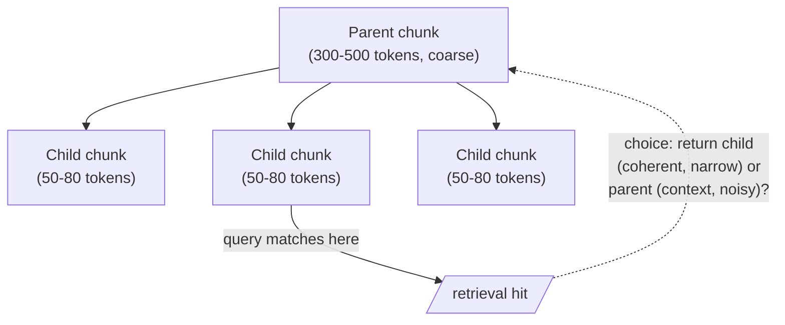

Act III offers two roads out of the swamp. The first improves the cut: a spectrum of strategies that lose less. The second questions the cut entirely — that's Road Two, page ahead. First, the taxonomy.

## Fixed-size chunking

The baker's approach: treat text as a loaf and cut equal slices. Simple, deterministic, fast — and wrong for text, because a fixed boundary may bisect a thought, a sentence, even a word. What is worse than a worm in your apple? Half a worm.

```python
# fixed-size chunking -- deterministic, fast, and blind to word boundaries
def fixed_size_chunk(text, size=512):
    return [text[i:i + size] for i in range(0, len(text), size)]
```

## Recursive chunking

Improves matters by cutting preferentially at word, then sentence, then paragraph boundaries — but it is still about size, not meaning. Sentence boundaries barely exist in Chinese or Japanese, while paragraph boundaries swing wildly between a journalist and Sir Francis Bacon.

```python
# recursive chunking -- degrade gracefully from paragraph, to sentence, to word
def recursive_chunk(text, target_size=512):
    if len(text) <= target_size:
        return [text]
    for sep in ["\n\n", ". ", " "]:          # paragraph, then sentence, then word
        if sep in text:
            parts = text.split(sep)
            break
    else:
        parts = list(text)                    # last resort: characters
    chunks, current = [], ""
    for part in parts:
        if len(current) + len(part) > target_size:
            chunks.append(current)
            current = part
        else:
            current += sep + part if current else part
    if current:
        chunks.append(current)
    return chunks
```

## Semantic chunking

Cuts where meaning actually shifts. Embed consecutive sentences, measure the distance between neighbors, and cut where the distance spikes — a genuine topic transition. Libraries such as **Chonkie** implement this. It is far better than fixed-size, at a modest cost in compute. But it improves *where* we cut; it does not heal *what* the cut severs. "It was rather pleased with itself" is correctly marked as a unit's end — and remains incomplete without its referent.

```python
# semantic chunking -- cut where consecutive-sentence similarity drops sharply
def semantic_chunk(sentence_embeddings, sentences, threshold=0.3):
    chunks, current = [], [sentences[0]]
    for i in range(1, len(sentences)):
        sim = cosine_sim(sentence_embeddings[i - 1], sentence_embeddings[i])
        if sim < threshold:          # meaning has shifted -- cut here
            chunks.append(" ".join(current))
            current = [sentences[i]]
        else:
            current.append(sentences[i])
    chunks.append(" ".join(current))
    return chunks
```

## Hierarchical chunking

Embraces that documents have levels. Chunk coarsely (sections, ≈300–500 tokens) and finely (atoms, ≈50–80 tokens), building a tree of parents and children. Parents preserve context; children are coherent. At retrieval time the system chooses which to feed — and that choice is a trap.

| Trap | The problem |
|---|---|
| **The illusion of overlap** | Overlapping windows ensure a severed sentence survives intact in some neighbor, but do nothing for references spanning paragraphs or pages, and they breed near-duplicate chunks that crowd the top-k. Overlap is a local bandage on a global wound. |
| **The derailment of parents** | Substitute a parent for richer context and the LLM receives every sentence in it — including irrelevant ones — with no way to know which triggered retrieval. A parent about supply-chain logistics that happens to mention pricing will weave logistics into your pricing answer. |



> No single technique in this taxonomy solves all problems on its own — markup respects intent, semantic finds boundaries, hierarchy balances purity against amnesia. Each improves *where* we cut. None of them, by itself, restores what a cut severs.
