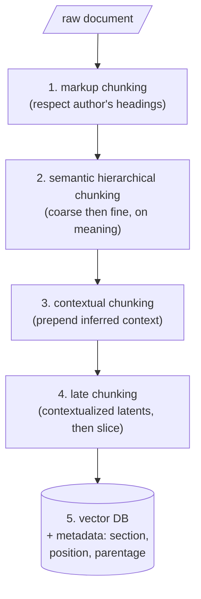

In practice the best systems combine every technique from the taxonomy as layers of defense, not as competing choices.

## The five-layer pipeline

1. **Markup chunking first** — if the document has headings, sections, or markdown structure, respect it; the author already marked the boundaries.
2. **Semantic hierarchical chunking** — with a tool like Chonkie, coarse then fine, cutting on meaning rather than size.
3. **Contextual chunking**, if budget allows — prepending inferred context to each fine chunk.
4. **Late chunking** before embedding — slicing contextualized latents at the chosen boundaries.
5. **Store in a vector database with metadata intact** — section, position, parentage.

> This pipeline is a framework, not dogma. No single technique solves all problems — markup respects intent, semantic finds boundaries, contextual recovers references, late chunking integrates global context.

## All chunking is wrong, but some is useful

For any new domain, run a tournament: try strategies, measure retrieval quality, and let the empirical winner decide. Borrowing George Box's aphorism about statistical models: **all chunking is wrong, but some is useful.** The goal is not to eliminate loss but to choose which losses you can afford.

| Technique | What it fixes | What it does not fix |
|---|---|---|
| Markup chunking | Respects author-intended boundaries | Nothing if the document has no structure |
| Semantic chunking | Finds genuine topic transitions | Does not heal what the cut severs (e.g. endophora) |
| Hierarchical chunking | Balances purity vs. context via parent/child | Overlap and parent-substitution traps remain |
| Contextual chunking | Repairs endophora in text space | One LLM call per chunk (cost, latency) |
| Late chunking | Repairs endophora in latent space | Still needs chosen boundaries; long-context encoder required |

Chunking is the first opportunity to lose information, and every step thereafter struggles to recover what was lost at the beginning. The goal is not to lose nothing — that is impossible. **The goal is to lose wisely.**
