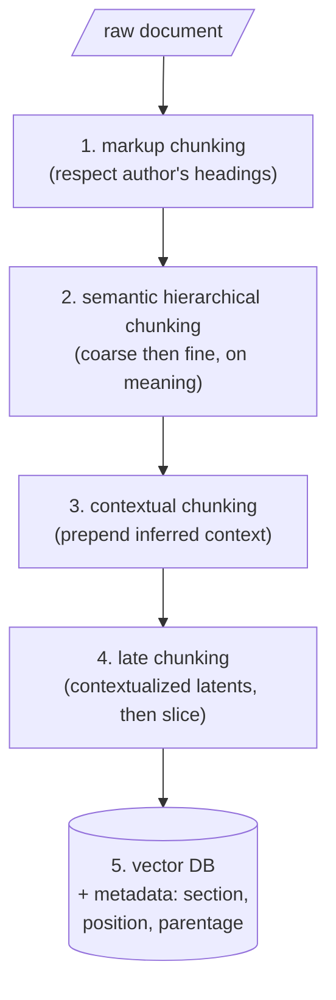

In practice the best systems combine every technique from the taxonomy as layers of defense, not as competing choices.

## Core intuition

Chunking quality comes from layering, not purity. No single rule can recover all lost context, so a robust pipeline uses multiple techniques that compensate for each other's blind spots.

## Why it matters

This is the engineering answer to the chunking problem. The goal is not to invent a single perfect boundary, but to compose a pipeline that loses information wisely and keeps the most important context intact.

## Instructor framing

This page is deliberately anticlimactic: after two acts building a catalogue of failures and a taxonomy of remedies, the "answer" is not a single winning technique but a layered pipeline plus an empirical tournament. Resist the student urge to ask "so which one is best" — the honest answer, and the one this course models, is "measure it on your corpus," which is a harder and more valuable habit than memorizing a ranked list.

## Worked example

Picture a compliance team indexing a mix of regulatory PDFs (heavily structured, numbered clauses) and internal Slack export threads (unstructured, conversational). Running the five-layer pipeline: markup chunking cleanly splits the regulatory PDFs at their numbered clause headings (layer 1 does almost all the work there) but has nothing to grab onto in the Slack threads, which fall through to semantic hierarchical chunking (layer 2). Both document types then get contextual chunking (layer 3) to repair references — "the above requirement" in a regulation, "what he said earlier" in a Slack thread — and late chunking (layer 4) to catch anything the LLM-written context missed. The team stores everything with section/thread metadata (layer 5) so a retrieved chunk always carries its position back to its source. No single layer handles both document types; the layering is the point.

A production system does not choose between chunking techniques; it chooses a sequence of defenses. The system's job is to reduce the cost of the cut, not to pretend the cut does not exist.

## The five-layer pipeline

1. **Markup chunking first** — if the document has headings, sections, or markdown structure, respect it; the author already marked the boundaries.
2. **Semantic hierarchical chunking** — with a tool like Chonkie, coarse then fine, cutting on meaning rather than size.
3. **Contextual chunking**, if budget allows — prepending inferred context to each fine chunk.
4. **Late chunking** before embedding — slicing contextualized latents at the chosen boundaries.
5. **Store in a vector database with metadata intact** — section, position, parentage.

> This pipeline is a framework, not dogma. No single technique solves all problems — markup respects intent, semantic finds boundaries, contextual recovers references, late chunking integrates global context.

## All chunking is wrong, but some is useful

For any new domain, run a tournament: try strategies, measure retrieval quality, and let the empirical winner decide. Borrowing George Box's aphorism about statistical models: **all chunking is wrong, but some is useful.** The goal is not to eliminate loss but to choose which losses you can afford.

| Technique | What it fixes | What it does not fix |
|---|---|---|
| Markup chunking | Respects author-intended boundaries | Nothing if the document has no structure |
| Semantic chunking | Finds genuine topic transitions | Does not heal what the cut severs (e.g. endophora) |
| Hierarchical chunking | Balances purity vs. context via parent/child | Overlap and parent-substitution traps remain |
| Contextual chunking | Repairs endophora in text space | One LLM call per chunk (cost, latency) |
| Late chunking | Repairs endophora in latent space | Still needs chosen boundaries; long-context encoder required |

Chunking is the first opportunity to lose information, and every step thereafter struggles to recover what was lost at the beginning. The goal is not to lose nothing — that is impossible. **The goal is to lose wisely.**

## Math explained step by step

Formalize "run a tournament" so it's a procedure, not a slogan.

**Step 1 — define a held-out evaluation set specific to your domain.** Collect real (or realistic) queries paired with the passages that should answer them — even 30-50 pairs is enough to start distinguishing strategies, because you are comparing relative, not absolute, performance.

**Step 2 — run each candidate chunking strategy through the same embedding model and index.** Hold everything else fixed — same embedder, same top-$k$, same query set — so that the only variable that changes between runs is the chunking strategy. This isolates the chunking decision's actual effect instead of confounding it with model or ranking changes.

**Step 3 — score each strategy with a retrieval metric, not a vibe.** Compute recall@$k$ (of the relevant passages, how many appeared in the top $k$) and, ideally, mean reciprocal rank (how high the first relevant hit ranked) for each strategy against your evaluation set from Step 1.

**Step 4 — let the winner be whichever strategy scores highest on *your* data, and re-run the tournament when the corpus changes materially.** George Box's "all models are wrong, but some are useful" applies literally here: no chunking strategy is correct in any absolute sense, but one will measurably serve your query distribution better than the others — and that empirical fact, not intuition about which technique "sounds most sophisticated," should decide the pipeline.

## Practical pattern

To stand up this pipeline concretely:

1. implement layers 1-2 (markup-aware, then semantic hierarchical chunking) first — they are the highest-value, lowest-cost layers and should be your baseline before adding anything else;
2. add layer 3 (contextual chunking) only for chunks that plausibly contain unresolved references — running an LLM call over every chunk when most don't need it wastes budget; a cheap heuristic (does this chunk start with a pronoun, "the above," or similar?) can gate which chunks get the expensive treatment;
3. add layer 4 (late chunking) when your encoder and document lengths support it, as a cheaper complement to layer 3 rather than a replacement;
4. before shipping any pipeline change, re-run the Step 1-4 tournament above against your held-out set — a chunking change that "feels" better can regress on the metric that matters.

## Common traps

- shipping a chunking pipeline based on which technique "sounds most sophisticated" rather than measured recall/MRR on your own held-out query set;
- running expensive layers (contextual chunking's LLM call, late chunking's long-context encoding) over every chunk uniformly, when a cheap gate could route only chunks that need it;
- changing chunking strategy without re-running the tournament, then attributing a later retrieval regression to the wrong cause (embedding model, re-ranker) when the chunking change was the actual culprit;
- treating the five-layer pipeline as mandatory in full — for a small, low-stakes, well-structured corpus, layers 1-2 alone may already be sufficient, and adding 3-4 only adds cost without measurable benefit.

## Takeaways

- The best chunking pipelines layer defenses (markup, semantic, contextual, late chunking) rather than picking one universally "correct" technique.
- No technique is free — each layer added should be justified by a specific failure mode observed in your own data, not adopted by default.
- Run an empirical tournament (fixed embedder and query set, varying only the chunking strategy) before trusting any chunking change in production.
- Concretely: build a 30-50 pair query/relevant-passage evaluation set for your domain before optimizing chunking at all — without it, every chunking decision is a guess.
