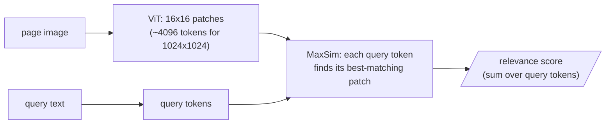

Every strategy in the taxonomy shares a hidden premise: that we should parse the document into text at all. Ask what parsing destroys. Picture a single page of a physics textbook: running prose, the equation $PV = nRT$, a pressure–temperature graph, a table of measurements, a diagram of a piston with steam rising. A parser extracts "As shown in the figure above, pressure and temperature are proportional. $PV = nRT$ formalizes this." What is lost? The spatial relationships, the diagram, the graph, the tabular data — and the referential integrity, since "as shown in the figure above" now floats untethered.

A printed page is a two-dimensional signal; parsed text is one-dimensional. Flattening 2D to 1D is not a minor inconvenience — it is a fundamental reduction in channel capacity.

## Vision-language models invert the premise

In a striking result, Alibaba Research took scientific documents and, instead of parsing, rendered each page to an image, embedded the screenshots with a VLM, and indexed those. Semantic search over page images dramatically outperformed parse-and-chunk. VLMs often handle visual information better than text because they preserve the spatial grammar — table position-as-semantics, the numerator above the denominator, indentation that carries legal force — that parsing flattens away.

The Vision Transformer cuts a page into a grid of 16×16-pixel patches and treats each as a token; a 1024×1024 page becomes ≈4096 patch tokens, and self-attention discovers relationships between any two regions — caption and figure, footnote marker and text. To the transformer, a patch and a subword are merely different tokens — that architectural indifference to modality is the foundation of the whole enterprise.

## ColPali and late interaction

**ColPali** made this practical at scale. It marries a vision encoder to ColBERT-style late interaction: rather than crush a page into one vector, it keeps a vector per patch and scores relevance by **MaxSim** — for each query token, find its most similar page patch, then sum.

**A tiny worked example.** Suppose a page has just 3 patches and a query has 2 tokens, with cosine similarities between each query token and each patch:

| | patch 1 | patch 2 | patch 3 |
|---|---|---|---|
| query token "revenue" | 0.20 | 0.85 | 0.10 |
| query token "2023" | 0.75 | 0.30 | 0.15 |

MaxSim takes each query token's *best*-matching patch — $0.85$ for "revenue" (patch 2), $0.75$ for "2023" (patch 1) — and sums them: $0.85 + 0.75 = 1.60$. The two tokens are free to point at two *different* patches; nothing forces the whole query onto one region of the page. That is what it means to say the system can, in effect, point at the region of the page that answers the query, without ever extracting text. A text query can match an image patch because contrastive training (CLIP, SigLIP) projects both modalities into one shared space: the bridge is geometric, not symbolic.

## Where the field stands (2026)

The open ColVision line now spans ColQwen2.5, the smaller ColSmol, and the Qwen3-based ColQwen3-4B, posting state-of-the-art numbers on **ViDoRe**, the standard visual-document-retrieval benchmark. Storage cost is being engineered away — HPC-ColPali compresses patch embeddings via k-means quantization and dynamic pruning; NanoVDR distills a 2B visual retriever into a 70M text-only encoder.

| Corpus type | Dense text-only recall | ColQwen-class visual retriever |
|---|---|---|
| Financial PDFs (tables, figures) | ≈62% | ≈84% |

If your corpus looks like that, page-image retrieval is no longer exotic — it is the baseline you must beat.

## The trade-offs, honestly

Vision retrieval gives up exact text fidelity (a VLM's reading is approximate — for character-perfect keyword search, parsed text is indispensable); it gives up cross-page attention (a 500-page PDF is 500 independently encoded images); and it costs more compute per page.

## DeepSeek-OCR: the page as an efficient container

DeepSeek asked the inverse of the usual OCR question: how few vision tokens does it take to faithfully encode a page of text? Their DeepEncoder — local-attention (SAM), a 16× convolutional compressor, then global-attention (CLIP) — produces as few as **64 vision tokens per page**, from which a compact decoder reconstructs the full text at 97% precision; even at 20× compression, accuracy holds near 60%. If a decoder can rebuild 97% of a page from 64 vision tokens, those tokens preserve nearly all its semantic content — the page image is already a remarkably efficient semantic container.

> So: parse and chunk, or not? It depends — and the honest engineer runs the experiment. If your documents are mostly prose, parse-and-chunk remains sensible. If they are technical, dense with diagrams and tables, run a tournament: text parse-and-chunk versus direct page-image embedding versus a hybrid index where both contribute and reinforce.

The no-free-lunch theorem guarantees no single strategy dominates all domains. Running this tournament is the single highest-leverage thing a RAG team can do — and the winner often surprises everyone. Next week, we pull the thread we left dangling: what if, before chunking, you transformed the source into something purer than the author's raw prose ever was?
