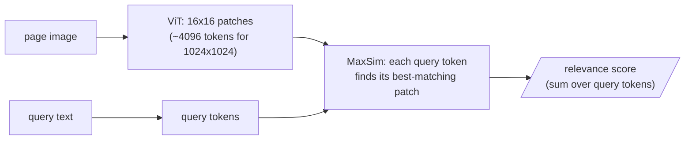

Every strategy in the taxonomy shares a hidden premise: that we should parse the document into text at all. Ask what parsing destroys. Picture a single page of a physics textbook: running prose, the equation $PV = nRT$, a pressure–temperature graph, a table of measurements, a diagram of a piston with steam rising. A parser extracts "As shown in the figure above, pressure and temperature are proportional. $PV = nRT$ formalizes this." What is lost? The spatial relationships, the diagram, the graph, the tabular data — and the referential integrity, since "as shown in the figure above" now floats untethered.

A printed page is a two-dimensional signal; parsed text is one-dimensional. Flattening 2D to 1D is not a minor inconvenience — it is a fundamental reduction in channel capacity.

## Core intuition

The real semantic unit is often the page, not the paragraph. If the document's meaning lives in layout, diagrams, and tables, then parsing it into a linear text stream discards the very structure that answers the user's question.

## Why it matters

This is the strong argument for direct visual retrieval: the page image preserves the geometry of meaning. When a query references visual structure, chunking text is not optimization — it is information loss.

## Instructor framing

This is the most conceptually radical page in the chapter: every previous page assumed parsing to text was the right first move and asked only "how do we chunk it well." This page questions that assumption directly. Present it as a genuine open question resolved empirically (the tournament from the previous page), not as "visual retrieval wins" — the trade-offs section below is not a footnote, it is half the lesson.

## Worked example

Consider a quarterly earnings report page containing a paragraph of prose, a revenue table with a "2023 vs. 2022" column header spanning three sub-columns, and a footnote in 6-point type referencing an accounting standard. A text parser reading left-to-right, top-to-bottom typically shreds the table: column headers become disconnected from their data cells, the footnote marker gets separated from its footnote text by two pages of parsed content, and a query like "what was the year-over-year revenue change" retrieves parsed numbers with no reliable way to know which number belongs to which year or column. A page-image embedding, by contrast, hands a vision-language model the table exactly as a human reader would see it — the spatial alignment between "2023" and the number beneath it is preserved because it was never destroyed in the first place.

The lesson is not that text retrieval is wrong. It is that the page itself is often the better semantic object when spatial, visual, and symbolic information are all part of the meaning.

## Vision-language models invert the premise

In a striking result, Alibaba Research took scientific documents and, instead of parsing, rendered each page to an image, embedded the screenshots with a VLM, and indexed those. Semantic search over page images dramatically outperformed parse-and-chunk. VLMs often handle visual information better than text because they preserve the spatial grammar — table position-as-semantics, the numerator above the denominator, indentation that carries legal force — that parsing flattens away.

The Vision Transformer cuts a page into a grid of 16×16-pixel patches and treats each as a token; a 1024×1024 page becomes ≈4096 patch tokens, and self-attention discovers relationships between any two regions — caption and figure, footnote marker and text. To the transformer, a patch and a subword are merely different tokens — that architectural indifference to modality is the foundation of the whole enterprise.

## ColPali and late interaction

**ColPali** made this practical at scale. It marries a vision encoder to ColBERT-style late interaction: rather than crush a page into one vector, it keeps a vector per patch and scores relevance by **MaxSim** — for each query token, find its most similar page patch, then sum.

**A tiny worked example.** Suppose a page has just 3 patches and a query has 2 tokens, with cosine similarities between each query token and each patch:

| | patch 1 | patch 2 | patch 3 |
|---|---|---|---|
| query token "revenue" | 0.20 | 0.85 | 0.10 |
| query token "2023" | 0.75 | 0.30 | 0.15 |

MaxSim takes each query token's *best*-matching patch — $0.85$ for "revenue" (patch 2), $0.75$ for "2023" (patch 1) — and sums them: $0.85 + 0.75 = 1.60$. The two tokens are free to point at two *different* patches; nothing forces the whole query onto one region of the page. That is what it means to say the system can, in effect, point at the region of the page that answers the query, without ever extracting text. A text query can match an image patch because contrastive training (CLIP, SigLIP) projects both modalities into one shared space: the bridge is geometric, not symbolic.

## Where the field stands (2026)

The open ColVision line now spans ColQwen2.5, the smaller ColSmol, and the Qwen3-based ColQwen3-4B, posting state-of-the-art numbers on **ViDoRe**, the standard visual-document-retrieval benchmark. Storage cost is being engineered away — HPC-ColPali compresses patch embeddings via k-means quantization and dynamic pruning; NanoVDR distills a 2B visual retriever into a 70M text-only encoder.

| Corpus type | Dense text-only recall | ColQwen-class visual retriever |
|---|---|---|
| Financial PDFs (tables, figures) | ≈62% | ≈84% |

If your corpus looks like that, page-image retrieval is no longer exotic — it is the baseline you must beat.

## The trade-offs, honestly

Vision retrieval gives up exact text fidelity (a VLM's reading is approximate — for character-perfect keyword search, parsed text is indispensable); it gives up cross-page attention (a 500-page PDF is 500 independently encoded images); and it costs more compute per page.

## DeepSeek-OCR: the page as an efficient container

DeepSeek asked the inverse of the usual OCR question: how few vision tokens does it take to faithfully encode a page of text? Their DeepEncoder — local-attention (SAM), a 16× convolutional compressor, then global-attention (CLIP) — produces as few as **64 vision tokens per page**, from which a compact decoder reconstructs the full text at 97% precision; even at 20× compression, accuracy holds near 60%. If a decoder can rebuild 97% of a page from 64 vision tokens, those tokens preserve nearly all its semantic content — the page image is already a remarkably efficient semantic container.

> So: parse and chunk, or not? It depends — and the honest engineer runs the experiment. If your documents are mostly prose, parse-and-chunk remains sensible. If they are technical, dense with diagrams and tables, run a tournament: text parse-and-chunk versus direct page-image embedding versus a hybrid index where both contribute and reinforce.

The no-free-lunch theorem guarantees no single strategy dominates all domains. Running this tournament is the single highest-leverage thing a RAG team can do — and the winner often surprises everyone. Next week, we pull the thread we left dangling: what if, before chunking, you transformed the source into something purer than the author's raw prose ever was?

## Math explained step by step

Rebuild MaxSim from the table above, one step at a time, to see why it beats collapsing a page into one vector.

**Step 1 — why not just pool all the patches into one vector, the way we pool tokens into a chunk vector?** Because a page mixes unrelated regions (a chart, a caption, a paragraph) the same way a mixed-topic text chunk does — the "centroid delusion" from two pages ago applies just as much to patches as to sentences. ColPali keeps one vector *per patch* specifically to avoid pre-emptively averaging them together.

**Step 2 — score every query token against every patch, don't pick just one match for the whole query.** The table gives two rows (query tokens "revenue" and "2023") and three columns (patches). Each of the six cells is an independent cosine similarity — the model has not yet decided which patch answers which token.

**Step 3 — for each query token, keep only its single best-matching patch (that's the "Max" in MaxSim).** "revenue" ignores patches 1 and 3 (scores $0.20$, $0.10$) and keeps patch 2 ($0.85$); "2023" ignores patches 2 and 3 and keeps patch 1 ($0.75$). This is deliberate: it lets different query tokens point at *different* regions of the page, which a single pooled vector could never do.

**Step 4 — sum the per-token best scores into one relevance number.** $0.85 + 0.75 = 1.60$. A competing page whose "revenue" and "2023" patches both score only moderately (say $0.5$ each, summing to $1.0$) loses the ranking, even if its single best patch scores higher than any individual patch here — because MaxSim rewards a page that has a strong match *for every query token*, not a page with one lucky strong match and one weak one.

## Practical pattern

Decide between text parsing and page-image retrieval using the evidence in this page, not a default:

1. run the tournament from the previous page on a sample of *your* documents — if they are mostly running prose (contracts, emails, narrative reports), text parse-and-chunk is usually still the pragmatic choice;
2. if your documents are layout-rich (financial tables, scientific figures, forms, dense schematics), budget for a page-image retriever (ColPali-family) and expect a real accuracy jump — the financial-PDF numbers above (≈62% vs. ≈84% recall) are not a marginal difference;
3. do not throw away text search when you add visual retrieval — for exact keyword, identifier, or statute lookups, a VLM's approximate reading of a page is no substitute for character-perfect parsed text, so a hybrid index (both contributing) is usually the right production shape, not a replacement;
4. budget for the real costs: page-image retrieval loses cross-page attention (each page is encoded independently) and costs more compute and storage per page than a single dense text vector — evaluate whether compression approaches (HPC-ColPali, NanoVDR-style distillation) are mature enough for your latency and cost constraints before committing.

## Common traps

- assuming visual retrieval strictly dominates text retrieval because of one benchmark table, without testing whether your own corpus is layout-rich enough to benefit;
- dropping text search entirely after adopting a VLM retriever, then discovering exact identifiers, statute numbers, or part numbers are now approximately (not exactly) matched;
- forgetting that page-image retrieval encodes each page independently — a fact split across two pages is just as unretrievable-as-one-unit as a fact split across two text chunks, only now the boundary is a page edge instead of a token count;
- underestimating storage and compute cost per page (thousands of patch vectors per page versus one pooled text vector) before piloting at the scale you actually intend to run.

## Takeaways

- Text parsing is itself a chunking decision with a hidden premise — that the document's meaning survives being flattened from two dimensions to one — and for layout-rich documents that premise is false.
- ColPali-style late interaction (MaxSim over per-patch vectors) lets different parts of a query match different regions of a page, avoiding the centroid problem that a single pooled page vector would create.
- Visual retrieval outperforms text parsing specifically on layout-rich, table- and figure-heavy corpora, not universally — the honest answer is always to run the tournament from the previous page.
- Concretely: for financial, scientific, or form-heavy PDF corpora, pilot a page-image retriever and hybrid it with text search rather than assuming parse-and-chunk is sufficient by default.
