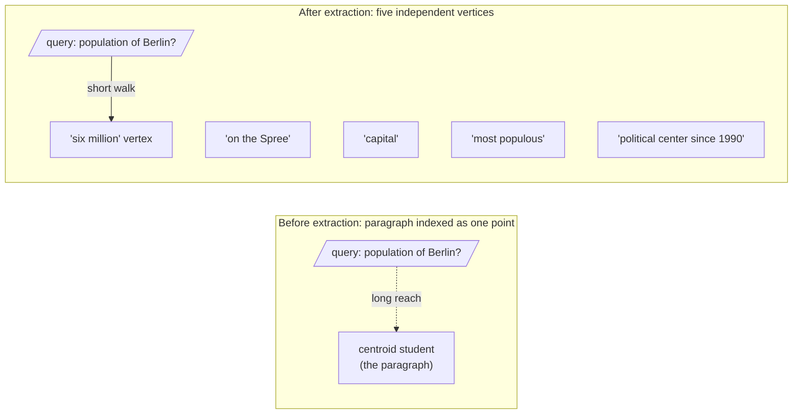

Why did the bake-off go the way it did? We could prove it on a whiteboard. Instead we prove it with our bodies, because the geometry becomes obvious the moment it is the geometry of a room.

## Core intuition

The difference between a paragraph and a fact is a difference in geometry: one sits at a centroid, the other sits at a node. The query is attracted to the node, not to the average.

## Why it matters

This is the physical intuition behind the dilution inequality. It is not a theorem that exists only in abstraction; it is a spatial phenomenon that can be felt and seen.

## Instructor framing

If you cannot run this as a physical classroom exercise, at minimum have students sketch it: five dots spread on paper, a sixth dot placed at their visual average, and a seventh "query" dot drawn walking toward its nearest neighbor before and after the average dot is removed. The kinesthetic version works because distance in a 2D room is something a body already has intuitions about — borrow those intuitions for a 384-dimensional space that no one can actually picture.

## Worked example

The body-based demonstration is the final bridge between algebra and intuition. Once the class sees the centroid drift, the definitions of retrieval quality become obvious.

## The demonstration

Tape out a patch of floor as embedding space. Five volunteers are fact-vertices — one each for "on the Spree," "capital," "most populous," "six million," "political center since 1990" — and they stand spread apart, because their meanings are distinct.

Now bring in the paragraph: a sixth student who, by the rule of the game, must stand at the average of the five positions. They end up marooned in the middle of the patch, an arm's length from everyone and close to no one.

Now a query walks in. "What is the population of Berlin?" — played by a seventh student — enters and reaches for its nearest neighbour. With only the paragraph indexed, the closest thing in the room is that lonely centroid student, stranded in the middle. The match is distant; you can see the reach.

Then we factoid-extract: the paragraph dissolves, its five vertices step forward as independent points, and the query walks straight up to the "six million" vertex. The distance collapses in front of the whole class.

That shrinking gap is $\cos(q, e_k) \ge \cos(q, e_{para})$ made kinesthetic — and it is the mechanism on which the entire week rests.

> The Centroid Tug-of-War was not a game bolted onto the mathematics — it was the mathematics, standing up and walking around. The equation and the student walking from the marooned centroid to the "six million" vertex are the same sentence, told twice.

## Math explained step by step

Map the classroom demonstration onto the inequality it's illustrating, one correspondence at a time.

**Step 1 — the five volunteers standing "spread apart" are the orthogonal claim vectors $e_1, \ldots, e_5$.** Their physical distance apart in the taped-out floor represents the geometric fact that the five Berlin claims (river, capital, population, size, political history) share little semantic overlap — the same "distinct claims land far apart" idea from the Central Provocation page.

**Step 2 — the sixth student "standing at the average of the five positions" is literally computing $e_{para} = \frac{1}{5}\sum_i e_i$ with their feet.** There is no approximation here — if the five volunteers stand at five marked points, the geometric centroid of those points *is* the average, computed by the same arithmetic as the vector formula, just in two dimensions instead of 384.

**Step 3 — the seventh student's "reach" for the nearest neighbour is measuring $\cos(q, e_{para})$ versus $\cos(q, e_k)$ physically.** Before extraction, the only point in the room representing the paragraph is the marooned centroid — so the query's best available match is $\cos(q, e_{para})$, a long, weak reach. After extraction, the five original vertices are available again, and the query can walk to $e_k$ directly — a short, strong reach.

**Step 4 — the "shrinking gap" is the inequality $\cos(q, e_k) \ge \cos(q, e_{para})$ made visible as a literal, walkable distance.** Nothing about the underlying mathematics changed between the before and after diagrams — what changed is which points were available in the room (indexed in the database) for the query to reach toward. This is the entire week's argument in one physical fact: retrieval quality is bounded by what units you chose to index, not by how clever the query-matching is.

## Practical pattern

Use this demonstration (physical, sketched, or purely verbal) as a diagnostic conversation with stakeholders or teammates who are skeptical that "just add more derived artifacts" is worth the engineering cost:

1. when a retrieval failure is reported, ask "was the answer-bearing content indexed as its own point, or was it standing at a centroid with other content?" — this reframes debugging from "is the model bad" to "is the indexing unit right";
2. use the demonstration's vocabulary ("centroid," "vertex," "the reach") as shared language on a team — it is faster to say "that chunk is a centroid problem" than to re-derive the dilution inequality in a meeting;
3. before adding a new derived-artifact pipeline, sanity-check with this mental model whether the target queries are actually centroid-diluted (many claims sharing a chunk) — if the corpus is already mostly single-claim chunks, this specific fix will not move the needle, and effort belongs elsewhere.

## Common traps

- treating the demonstration as a teaching gimmick disconnected from the real mathematics — every element of the room maps exactly onto a term in the dilution inequality, and losing that correspondence loses the point;
- assuming the fix is always "make chunks smaller" rather than "extract single claims as separate index entries" — a small chunk can still average several claims if it wasn't cut at claim boundaries;
- applying the centroid intuition only to text, when the same reasoning applies to any pooled representation (image regions, table rows, patch embeddings) that mixes multiple distinguishable "vertices" into one vector;
- forgetting that the demonstration assumes roughly orthogonal (unrelated) claims — for claims that are genuinely related, some averaging is appropriate and desirable, and over-extracting can lose meaningful connective context (Week 3's discourse-structure lesson).

## Takeaways

- A paragraph's embedding sits at a centroid; a single fact's embedding sits at a vertex — and a query aimed at one fact always reaches the vertex faster than the centroid.
- This is not a metaphor for the dilution inequality; it is the same arithmetic, performed with physical positions instead of vector coordinates.
- Concretely: when debugging a retrieval miss, ask first whether the missed content was indexed as its own vertex or buried inside a multi-claim centroid — that question alone often locates the fix.
