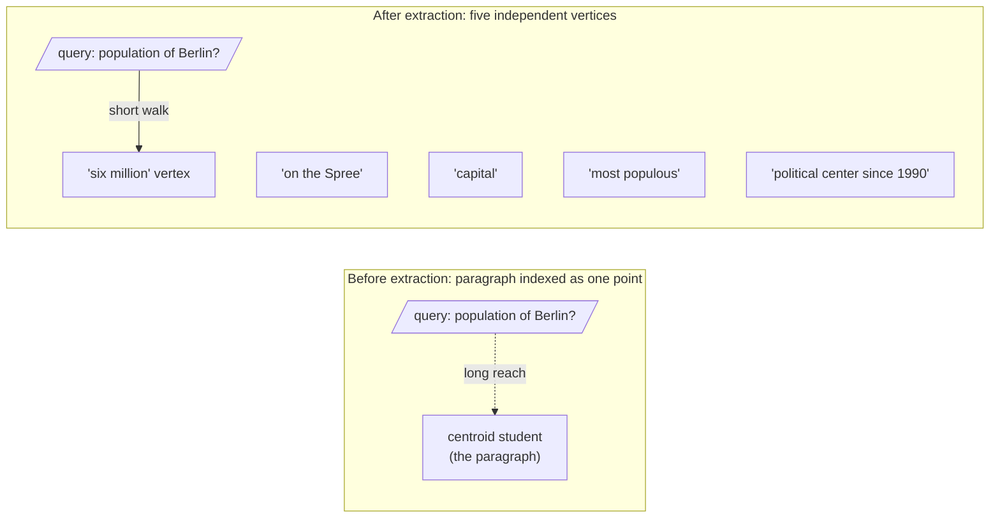

Why did the bake-off go the way it did? We could prove it on a whiteboard. Instead we prove it with our bodies, because the geometry becomes obvious the moment it is the geometry of a room.

## The demonstration

Tape out a patch of floor as embedding space. Five volunteers are fact-vertices — one each for "on the Spree," "capital," "most populous," "six million," "political center since 1990" — and they stand spread apart, because their meanings are distinct.

Now bring in the paragraph: a sixth student who, by the rule of the game, must stand at the average of the five positions. They end up marooned in the middle of the patch, an arm's length from everyone and close to no one.

Now a query walks in. "What is the population of Berlin?" — played by a seventh student — enters and reaches for its nearest neighbour. With only the paragraph indexed, the closest thing in the room is that lonely centroid student, stranded in the middle. The match is distant; you can see the reach.

Then we factoid-extract: the paragraph dissolves, its five vertices step forward as independent points, and the query walks straight up to the "six million" vertex. The distance collapses in front of the whole class.

That shrinking gap is $\cos(q, e_k) \ge \cos(q, e_{para})$ made kinesthetic — and it is the mechanism on which the entire week rests.

> The Centroid Tug-of-War was not a game bolted onto the mathematics — it was the mathematics, standing up and walking around. The equation and the student walking from the marooned centroid to the "six million" vertex are the same sentence, told twice.
