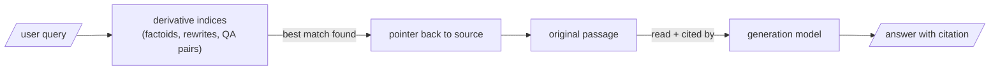

One pattern unifies everything in Act II, and you should learn it once and use it everywhere:

> Retrieve against the derivative. Generate from the source. Every derivative artifact carries a pointer home.

## Core intuition

The derivative artifact should be optimized for retrieval, while the original source should be optimized for truth and citation. The system's quality depends on keeping those two roles separate.

## Why it matters

This pattern bounds the damage of retrieval mistakes. A poor derivative can cause a miss, but it should not be allowed to produce a fabricated answer or a false citation.

## Instructor framing

This page is the moment to make explicit what every prior page in Act II assumed silently: retrieve-the-derivative-generate-from-source is not one technique among several, it is the safety contract that makes every other technique in this week defensible. A student who understands only the individual artifacts (factoids, rewrites, QA pairs) but not this unifying pattern will eventually build a system that quotes a synthetic artifact directly — exactly the failure mode this pattern exists to prevent.

## Worked example

This is the core architectural principle of the week, and it survives every later chapter: retrieval and generation are different jobs, and they must not share the same artifact.

The factoid, the rewrite, the QA pair — each is a better lure than the raw chunk for some class of query, and each is a worse thing to actually quote. So we never quote them. They win the retrieval; the original passage gives the testimony.

## Why this is also the safety mechanism

Because the source is always what the model reads and cites, a clumsy rewrite or an over-eager factoid can cost you a retrieval miss but never a fabricated citation. **The blast radius of a bad derivative is bounded.**

## The clean resolution of Meera and Ravi

This pattern is also the resolution of the tension from earlier in the week: we never threw the textbook away. Ravi's flashcards index the understanding; Meera's text still *is* the understanding. The exam-cram sheet did not replace learning — it pointed back to it.

## Why we add indices rather than replace one

Every representation in this pattern is paying rent for a specific class of query:

| Representation | What it wins |
|---|---|
| Raw chunk | "what does §4.2 actually say?" — queries that want the original passage |
| Factoid | pointed factual queries, where dilution would otherwise sink the raw chunk |
| Rewrite | queries phrased in plain language against adversarial or dense source prose |
| QA pair | any query that is itself shaped like a question |

None of these replaces the raw-chunk index. We add derivative indices because each representation earns its keep on a different slice of the query distribution — and the only way to know which is to measure, as the bake-off did.

## Math explained step by step

State the "bounded blast radius" claim precisely, as a property of the pipeline's error propagation, not just a reassurance.

**Step 1 — separate the two functions any RAG stage-1 result must serve.** Retrieval returns a set of candidate pointers $\{p_1, \ldots, p_k\}$; generation consumes the *content at those pointers* to produce an answer. The core pattern's rule is: the derivative artifact participates only in choosing the pointers, never in supplying the content.

**Step 2 — trace what happens when a derivative artifact is wrong, under this rule.** If a factoid, rewrite, or QA pair is inaccurate or misleading, the only thing it can corrupt is *which pointers get selected* — a bad artifact might cause the wrong chunk to rank highly (a retrieval miss) or fail to surface the right one (a false negative). It cannot corrupt the *content* handed to generation, because generation never reads the artifact — it reads the source at the pointer.

**Step 3 — trace what happens if this rule is violated (the artifact is quoted directly).** Now an inaccurate rewrite or an unsupported QA-pair answer becomes the actual text the generator conditions on — the error is no longer confined to "wrong document selected," it becomes "wrong fact stated to the user, with a citation trail that traces back to a synthetic artifact, not the source." This is a categorically worse failure: a retrieval miss is visible (no answer, or a clearly off-topic one); a fabricated-but-fluent citation is not.

**Step 4 — see why this makes the whole toolkit safe to deploy aggressively.** Because Step 2 holds as an invariant, teams can generate derivative artifacts liberally — multiple factoids, several rewrite variants, many QA pairs per chunk — without each new artifact adding new *citation* risk. Each new artifact can only ever add retrieval surface area (more ways to be found) while the citation risk stays pinned to the quality of the source documents alone, which was already being managed independently.

## Practical pattern

Enforce the core pattern as an architectural invariant, not a coding convention:

1. structure your index so retrieval always returns a pointer object (chunk ID, document ID, span offsets) alongside any derivative text, and make it structurally awkward — ideally impossible — for the generation prompt-builder to access the derivative's raw text instead of the pointer's target;
2. add an automated check in your ingestion pipeline that fails the build if any derivative artifact is stored without a source pointer;
3. periodically audit generation logs for citations that trace back to a derivative artifact rather than a source passage — if you find any, that is a pipeline bug, not a model quality issue, and it should be fixed at the architecture level;
4. when introducing any *new* derivative artifact type in the future, ask only one gating question before shipping it: "does this artifact ever reach the generator directly?" If the answer is anything but a hard no, redesign before deploying.

## Common traps

- letting a derivative artifact's text leak into the generation prompt "just this once" for convenience — this is exactly the boundary violation that turns a bounded retrieval miss into an unbounded fabrication risk;
- treating this pattern as obvious and therefore not worth enforcing in code — the risk is not that engineers disagree with the principle, it's that a fast-moving pipeline change accidentally routes the wrong text to the generator;
- auditing derivative artifacts for retrieval quality but never auditing the pipeline itself for whether the separation between retrieval-object and generation-object is actually maintained in code;
- assuming this pattern is specific to Week 4's artifacts — the same discipline applies to every future derivative this course builds (RAPTOR summaries, graph community summaries) and should be checked again each time.

## Takeaways

- The core pattern — retrieve the derivative, generate from the source — is what makes every artifact in this week's toolkit safe to deploy: a bad derivative can cost a retrieval miss, never a fabricated citation.
- This safety property depends on an architectural invariant (generation never reads derivative text directly), not on the derivative artifacts being individually accurate.
- Concretely: add an automated check that fails your ingestion build if any derivative artifact is indexed without a pointer back to its source, and audit generation logs periodically for citations that trace to a derivative instead of a source passage.
