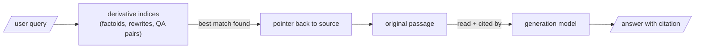

One pattern unifies everything in Act II, and you should learn it once and use it everywhere:

> Retrieve against the derivative. Generate from the source. Every derivative artifact carries a pointer home.

The factoid, the rewrite, the QA pair — each is a better lure than the raw chunk for some class of query, and each is a worse thing to actually quote. So we never quote them. They win the retrieval; the original passage gives the testimony.

## Why this is also the safety mechanism

Because the source is always what the model reads and cites, a clumsy rewrite or an over-eager factoid can cost you a retrieval miss but never a fabricated citation. **The blast radius of a bad derivative is bounded.**

## The clean resolution of Meera and Ravi

This pattern is also the resolution of the tension from earlier in the week: we never threw the textbook away. Ravi's flashcards index the understanding; Meera's text still *is* the understanding. The exam-cram sheet did not replace learning — it pointed back to it.

## Why we add indices rather than replace one

Every representation in this pattern is paying rent for a specific class of query:

| Representation | What it wins |
|---|---|
| Raw chunk | "what does §4.2 actually say?" — queries that want the original passage |
| Factoid | pointed factual queries, where dilution would otherwise sink the raw chunk |
| Rewrite | queries phrased in plain language against adversarial or dense source prose |
| QA pair | any query that is itself shaped like a question |

None of these replaces the raw-chunk index. We add derivative indices because each representation earns its keep on a different slice of the query distribution — and the only way to know which is to measure, as the bake-off did.
