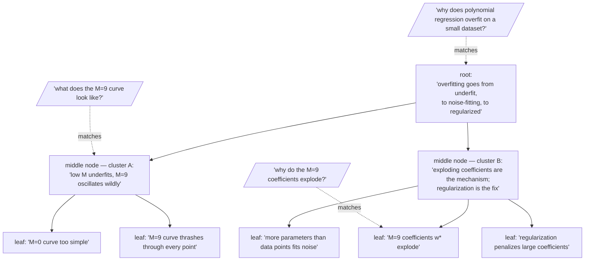

Think of it as summarizing a summary of a summary, on repeat, until a single document turns into a whole tree of magnifications you can search at any zoom level. That is RAPTOR — **Recursive Abstractive Processing for Tree-Organized Retrieval** — and it takes the abstractive summarization from the last page and gives it recursive structure. The algorithm is elegant enough to state in five lines:

1. Start with leaf-level chunks.
2. Cluster nearby chunks by embedding similarity.
3. Summarize each cluster into a new node.
4. Repeat: cluster the summaries, summarize the clusters.
5. Stop at a single root (or a few high-level nodes).

The result is a tree. The leaves are fine-grained chunks; the middle nodes are progressively more abstract summaries; the root is a synopsis of the whole.

## A small worked example: building the tree by hand

Let's build one, using five sentences straight out of the PRML bake-off (the "why does polynomial regression overfit?" corpus from a few pages back). Here are five leaf chunks:

1. "With $M=0$, the fitted curve is a constant — too simple to follow the data at all."
2. "With $M=9$, the fitted curve thrashes wildly through every single training point."
3. "The $M=9$ coefficient table shows the weights $w^\star$ exploding to enormous magnitudes."
4. "A high-degree polynomial has more free parameters than data points, so it fits the noise as if it were signal."
5. "Regularization is introduced right after, penalizing large coefficients to tame the wiggling curve."

Step 2 — cluster by embedding similarity. Chunks 1 and 2 are both describing *what the fitted curve looks like* at different $M$ — their embeddings sit close together. Chunks 3, 4, and 5 are all describing *why the curve behaves that way and how to fix it* — a different neighbourhood of embedding space entirely. So clustering groups them $\{1, 2\}$ and $\{3, 4, 5\}$, not by keyword overlap but because "looks like" and "is caused by" are different kinds of claims.

Step 3 — summarize each cluster into a new node:

- **Cluster A** (chunks 1, 2) → "Bishop shows curves at increasing polynomial degree: low $M$ underfits, and high $M$ (specifically $M=9$) fits the training points almost perfectly while oscillating wildly between them."
- **Cluster B** (chunks 3, 4, 5) → "The exploding coefficients at high $M$ are the mechanism of overfitting — with more parameters than data points the model fits noise — and regularization fixes this by penalizing large weights."

Step 4/5 — repeat and stop at the root. There is only one level of clustering left to do: summarize the two cluster summaries together into a single root node — "PRML's overfitting story: as polynomial degree grows, the fit goes from too simple, to noise-fitting with exploding coefficients, and regularization is the remedy." That root is precisely the self-contained causal claim the raw-chunk baseline in the bake-off could never return in one piece, because Bishop never wrote it as one sentence — it was scattered across a figure, a table, and three paragraphs. RAPTOR's root node is where that scattering gets reassembled.



## Retrieval at any altitude

At retrieval time you search **every level at once**. A factual query — "why do the $M=9$ coefficients explode?" — matches a leaf. A query about what the curves look like — "what does the $M=9$ curve look like?" — matches a middle node. And the original central question of the bake-off — "why does polynomial regression overfit on a small dataset?" — matches the root, because the root is exactly the self-contained answer that no single chunk held. The query chooses the magnification; the index is a zoom lens, not a fixed focal length.

Picture a galaxy. From inside, you see individual stars — the leaves. Pull back and the stars blur into spiral arms — the middle nodes. Pull back further and the whole galaxy is a single bright coin — the root. No magnification is the true one; each answers a different question about the same object.

Here is the five-sentence walkthrough above, generalized into the loop that builds a tree of any size:

```python
# the shape of the RAPTOR construction loop
def build_raptor_tree(chunks, embed_fn, cluster_fn, summarize_fn, max_levels=3):
    tree = {"leaves": chunks}
    level = chunks
    for depth in range(max_levels):
        if len(level) <= 1:
            break
        vectors = embed_fn(level)
        clusters = cluster_fn(vectors)          # soft clustering: a chunk may join >1 cluster
        level = [summarize_fn(cluster) for cluster in clusters]
        tree[f"level_{depth+1}"] = level
    tree["root"] = level[0] if len(level) == 1 else summarize_fn(level)
    return tree
```

> **Key reference.** Sarthi et al., "RAPTOR: Recursive Abstractive Processing for Tree-Organized Retrieval." The clustering uses soft, overlapping Gaussian-mixture assignment over UMAP-reduced embeddings — a chunk may belong to more than one cluster, because a paragraph can be about more than one thing. Soft clustering of a corpus is the doorway to next week's network analysis and community detection.

The **Matryoshka parallel** is exact. A Matryoshka embedding is one vector meaningful at many dimensionalities; RAPTOR is one corpus retrievable at many resolutions. Matryoshka gives multi-resolution *vectors*; RAPTOR gives multi-resolution *text*.
