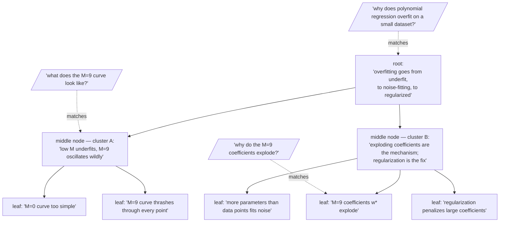

Think of it as summarizing a summary of a summary, on repeat, until a single document turns into a whole tree of magnifications you can search at any zoom level. That is RAPTOR — **Recursive Abstractive Processing for Tree-Organized Retrieval** — and it takes the abstractive summarization from the last page and gives it recursive structure. The algorithm is elegant enough to state in five lines:

## Core intuition

The document is not a single level of detail. It contains facts, clusters of facts, and themes that only appear when you step back and summarize the summaries.

## Why it matters

RAPTOR gives the retrieval system a zoom lens. It does not force one fixed granularity; it makes the right level of abstraction available for each query.

## Instructor framing

Walk through the five-sentence PRML tree slowly and have students predict, before you reveal it, which query would match which level. The "aha" this page is built around is that the tree doesn't need a router deciding which level to search — every level is searched simultaneously, and the query's own specificity naturally resonates with the right altitude. That is a different design philosophy from picking one summary granularity in advance, and it's worth naming as such.

## Worked example


This is the multi-resolution view of retrieval. A fact, a section summary, and a document synopsis are all legitimate retrieval targets for different user intents.

1. Start with leaf-level chunks.
2. Cluster nearby chunks by embedding similarity.
3. Summarize each cluster into a new node.
4. Repeat: cluster the summaries, summarize the clusters.
5. Stop at a single root (or a few high-level nodes).

The result is a tree. The leaves are fine-grained chunks; the middle nodes are progressively more abstract summaries; the root is a synopsis of the whole.

## A small worked example: building the tree by hand

Let's build one, using five sentences straight out of the PRML bake-off (the "why does polynomial regression overfit?" corpus from a few pages back). Here are five leaf chunks:

1. "With $M=0$, the fitted curve is a constant — too simple to follow the data at all."
2. "With $M=9$, the fitted curve thrashes wildly through every single training point."
3. "The $M=9$ coefficient table shows the weights $w^\star$ exploding to enormous magnitudes."
4. "A high-degree polynomial has more free parameters than data points, so it fits the noise as if it were signal."
5. "Regularization is introduced right after, penalizing large coefficients to tame the wiggling curve."

Step 2 — cluster by embedding similarity. Chunks 1 and 2 are both describing *what the fitted curve looks like* at different $M$ — their embeddings sit close together. Chunks 3, 4, and 5 are all describing *why the curve behaves that way and how to fix it* — a different neighbourhood of embedding space entirely. So clustering groups them $\{1, 2\}$ and $\{3, 4, 5\}$, not by keyword overlap but because "looks like" and "is caused by" are different kinds of claims.

Step 3 — summarize each cluster into a new node:

- **Cluster A** (chunks 1, 2) → "Bishop shows curves at increasing polynomial degree: low $M$ underfits, and high $M$ (specifically $M=9$) fits the training points almost perfectly while oscillating wildly between them."
- **Cluster B** (chunks 3, 4, 5) → "The exploding coefficients at high $M$ are the mechanism of overfitting — with more parameters than data points the model fits noise — and regularization fixes this by penalizing large weights."

Step 4/5 — repeat and stop at the root. There is only one level of clustering left to do: summarize the two cluster summaries together into a single root node — "PRML's overfitting story: as polynomial degree grows, the fit goes from too simple, to noise-fitting with exploding coefficients, and regularization is the remedy." That root is precisely the self-contained causal claim the raw-chunk baseline in the bake-off could never return in one piece, because Bishop never wrote it as one sentence — it was scattered across a figure, a table, and three paragraphs. RAPTOR's root node is where that scattering gets reassembled.



## Retrieval at any altitude

At retrieval time you search **every level at once**. A factual query — "why do the $M=9$ coefficients explode?" — matches a leaf. A query about what the curves look like — "what does the $M=9$ curve look like?" — matches a middle node. And the original central question of the bake-off — "why does polynomial regression overfit on a small dataset?" — matches the root, because the root is exactly the self-contained answer that no single chunk held. The query chooses the magnification; the index is a zoom lens, not a fixed focal length.

Picture a galaxy. From inside, you see individual stars — the leaves. Pull back and the stars blur into spiral arms — the middle nodes. Pull back further and the whole galaxy is a single bright coin — the root. No magnification is the true one; each answers a different question about the same object.

Here is the five-sentence walkthrough above, generalized into the loop that builds a tree of any size:

```python
# the shape of the RAPTOR construction loop
def build_raptor_tree(chunks, embed_fn, cluster_fn, summarize_fn, max_levels=3):
    tree = {"leaves": chunks}
    level = chunks
    for depth in range(max_levels):
        if len(level) <= 1:
            break
        vectors = embed_fn(level)
        clusters = cluster_fn(vectors)          # soft clustering: a chunk may join >1 cluster
        level = [summarize_fn(cluster) for cluster in clusters]
        tree[f"level_{depth+1}"] = level
    tree["root"] = level[0] if len(level) == 1 else summarize_fn(level)
    return tree
```

> **Key reference.** Sarthi et al., "RAPTOR: Recursive Abstractive Processing for Tree-Organized Retrieval." The clustering uses soft, overlapping Gaussian-mixture assignment over UMAP-reduced embeddings — a chunk may belong to more than one cluster, because a paragraph can be about more than one thing. Soft clustering of a corpus is the doorway to next week's network analysis and community detection.

The **Matryoshka parallel** is exact. A Matryoshka embedding is one vector meaningful at many dimensionalities; RAPTOR is one corpus retrievable at many resolutions. Matryoshka gives multi-resolution *vectors*; RAPTOR gives multi-resolution *text*.


## Math explained step by step

Walk `build_raptor_tree` against the PRML example, one loop iteration at a time.

**Step 1 — embed the current level.** `vectors = embed_fn(level)` starts with the five leaf sentences, giving five points in the space — this is ordinary embedding, nothing new yet.

**Step 2 — cluster by proximity, not by keyword.** `cluster_fn(vectors)` groups $\{1,2\}$ and $\{3,4,5\}$ because "what the curve looks like" sentences land near each other and "why it happens / how to fix it" sentences land in a different neighborhood — the clustering step is doing exactly the semantic-chunking similarity computation from Week 3, just applied one level up, to whole sentences instead of sub-sentence spans.

**Step 3 — summarize each cluster into one new node, and treat that summary as a new, first-class embeddable object.** `summarize_fn(cluster)` produces the Cluster A and Cluster B text above. Crucially, this new node is not a pointer or a label — it becomes an entry in `level` for the *next* iteration, indistinguishable in kind from a leaf chunk, which is exactly what allows the loop to recurse: cluster summaries can themselves be clustered and summarized again.

**Step 4 — repeat until one node remains, and that node is the root.** The loop condition `if len(level) <= 1: break` is the stopping rule — for five leaves clustering into two, then two clustering into one, `max_levels=3` is more than enough headroom, and the loop naturally halts once a single synthesizing node exists.

**Step 5 — retrieval treats every level as equally legitimate, scored the same way.** At query time, the score $\cos(q, v)$ is computed against leaves, middle nodes, and the root identically — there's no special-casing by level. A query embeds close to whichever node's abstraction level matches its own specificity, which is why "why do the coefficients explode" (leaf-shaped) and "why does regression overfit" (root-shaped) each naturally resonate with a different, appropriately-scoped node without any query classifier deciding which level to search.

## Practical pattern

Implementing RAPTOR in a real pipeline:

1. use soft (overlapping) clustering, not hard partitioning — a paragraph can genuinely belong to more than one theme (the paper references both "methodology" and "results" in one section), and forcing a hard assignment loses that;
2. cap `max_levels` deliberately based on corpus size — a small document (five chunks, as above) needs only 2-3 levels; a large corpus may benefit from more, but each added level multiplies summarization LLM calls, so treat depth as a cost/benefit knob, not a free parameter;
3. enforce the same faithfulness discipline as flat summarization (previous page) at every level — an unfaithful middle-node summary propagates its error into every summary built on top of it, so faithfulness checks matter more, not less, as you go up the tree;
4. index all levels together in one searchable collection, with metadata marking each node's level and children, so a downstream generator can optionally "drill down" from a matched summary node to its supporting leaves for citation.

## Common traps

- using hard clustering and being surprised when a chunk that genuinely belongs to two themes gets arbitrarily assigned to only one, silently degrading the summary of whichever cluster it was excluded from;
- letting summarization errors compound silently up the tree — an inaccurate middle-node summary poisons every higher-level summary built from it, so faithfulness checks applied only at the root miss where the error actually originated;
- setting `max_levels` too high for a small document, generating redundant near-identical summary levels that add LLM cost without adding retrieval value;
- assuming retrieval must choose which tree level to search — the actual design (searching all levels simultaneously and letting query specificity naturally match node altitude) is the whole point, and building a level-router is usually unnecessary added complexity.

## Takeaways

- RAPTOR turns summarization into a recursive tree: cluster, summarize, repeat, until a single root remains — leaves, middle nodes, and root are all embedded and searched identically.
- Soft (overlapping) clustering matters because real content often belongs to more than one theme — hard clustering silently drops that overlap.
- Concretely: search every tree level simultaneously rather than building a query router to pick a level — a query's own specificity naturally resonates with the matching altitude, which is the mechanism, not a coincidence.
