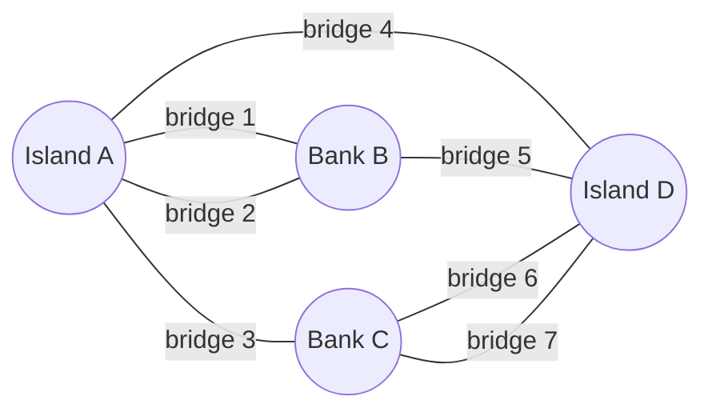

Last week we climbed from the book to the library, indexing derivative artifacts — factoids, rewrites, summaries — instead of an author's raw prose. This week we climb again. A library is still a place where each volume stands alone, spine by spine. Extract the entities in a corpus and the relationships between them — who regulates whom, what treats what, which theorem rests on which lemma — and the volumes dissolve into something new: a web, with boulevards and back alleys, dense neighborhoods and lonely outskirts. The library becomes a city.

## Core intuition

A document is a set of facts, but a corpus is a system of relationships. Once entities and edges are extracted, the important object is no longer the sentence but the graph that emerges from the connections among them.

This is the central move of the week: discard the prose and keep the topology. What remains is not a list of facts, but a structure that can reveal communities, hubs, and short paths.

## Why it matters

A graph is the right representation when the question is not "what sentence mentions this?" but "what is connected to what, and how do those connections shape the answer?" This is where retrieval begins to look like network reasoning rather than lexical matching.

## Instructor framing

Act I builds the mathematical toolkit behind GraphRAG. The lesson is that large networks develop structure for reasons no single edge can explain. The graph is not decoration; it is the object that matters.

A city can be studied because it has a mathematics. Hold this one line for the whole day: *large graphs develop emergent structure — communities, hubs, small worlds — that no individual edge contains, every variant of GraphRAG is an attempt to harvest that structure for retrieval, and every variant must pay for the harvest.* Act I builds the toolkit, and it mentions no retrieval at all — deliberately. Every idea here reappears this afternoon with its serial numbers barely filed off.

The central point is simple but profound: connectivity is often more informative than geometry. A graph tells us which things are related, how dense the relationship is, and which nodes are central. That is exactly the structure that makes retrieval richer than a bag of sentences.

## Worked example


A paragraph about a drug, a regulator, a patient group, and a side effect is not just a string of facts. It is a local network: entity to entity, claim to claim, risk to evidence. The graph makes those relations explicit, which is exactly the substrate a retrieval system must traverse for multi-hop reasoning.

## A Sunday puzzle in Königsberg

Eighteenth-century Königsberg straddled the river Pregel, its four land masses stitched together by seven bridges. The city's residents amused themselves with a puzzle: can you stroll the city, crossing every bridge exactly once? In 1736 Leonhard Euler proved the answer is no — and *how* he proved it mattered more than the answer.

Euler threw away everything a mapmaker would keep: distances, island shapes, river width. What remained were four dots and seven lines — vertices and edges. The puzzle lived entirely in the *pattern of connection*, not in geometry. That is a graph.

$$G = (V, E), \qquad E \subseteq V \times V$$

That is the entire formal definition — a set of vertices and a set of edges between them. From this skeletal beginning grows router maps, brain connectomes, friendship networks, citation webs, and — by this afternoon — the knowledge graph of an enterprise corpus.



## Checking Euler's answer in code

An Eulerian walk exists only if zero or two vertices have odd degree. Königsberg has four — no stroll works.

```python
# Konigsberg as an edge list -- count degree, check Euler's condition
edges = [("A","B"), ("A","B"), ("A","C"), ("A","D"), ("B","D"), ("C","D"), ("C","D")]

degree = {}
for u, v in edges:
    degree[u] = degree.get(u, 0) + 1
    degree[v] = degree.get(v, 0) + 1

odd_degree_nodes = [v for v, k in degree.items() if k % 2 == 1]
print(degree)              # {'A': 3, 'B': 3, 'C': 3, 'D': 3} -- all four are odd
print(len(odd_degree_nodes))  # 4 -- Euler's condition (0 or 2 odd) fails: no such walk
```

> **The one thing to remember.** Euler's move — discard geometry, keep connectivity — is the same move an embedding model *refuses* to make. Embeddings live in geometry; graphs live in topology. When we throw away the prose of a corpus and keep only its entities and relationships, we are making Euler's move: we lose things (geometry always mourns), and we see things no amount of prose-reading could show.


## Math explained step by step

Walk through Euler's actual argument, since "no such walk exists" is provable, not just observed by trial and error.

**Step 1 — notice what happens to degree every time a walk passes through a vertex (not counting the start/end).** Each visit to an intermediate vertex uses one edge to arrive and a different edge to leave — so every "pass-through" visit consumes exactly two of that vertex's edges. This means a vertex you only pass through (never start or end at) must have an *even* number of edges total, or you'd arrive once too often with no unused edge left to leave by.

**Step 2 — apply this to the start and end of the walk.** The start vertex uses one edge to leave (unpaired, since there's no "arriving" first) and then possibly returns and leaves again in pairs — so a start vertex has *odd* degree only if the walk doesn't return to it as an endpoint. The same logic applies to the end vertex. This means at most two vertices (the start and the end) are allowed to have odd degree; every other vertex must have even degree.

**Step 3 — count Königsberg's degrees and check the rule.** The code above computes `{'A': 3, 'B': 3, 'C': 3, 'D': 3}` — all four land masses have odd degree. Step 2 permits at most two odd-degree vertices in total (the walk's start and end); Königsberg has four. The walk is not merely undiscovered — it is mathematically impossible, for any starting point, any route.

**Step 4 — see why this is the paradigm for the whole day.** Euler answered a question about a specific map using a property (`degree parity`) that has nothing to do with distances, bridge widths, or island shapes — purely a count derived from the connection pattern. Every technique this week (degree distributions, community detection, shortest paths) is the same move: answer a question about the corpus using a countable property of the graph's connection pattern, not by re-reading the prose.

## Practical pattern

Before building any graph-based retrieval system, use Euler's move as a design checklist:

1. explicitly decide what counts as a vertex (entities? claims? documents?) and what counts as an edge (co-occurrence? explicit relation? citation?) — this decision, made once at extraction time, determines everything the graph can subsequently reveal, the same way "four land masses, seven bridges" was a modeling choice before it was a proof;
2. resist the urge to encode geometry or narrative order into the graph "just in case" — Euler's insight came specifically from throwing away everything except connectivity; a knowledge graph cluttered with positional or sequential metadata it doesn't need is harder to reason about, not more informative;
3. validate your graph extraction the way you'd validate any measurement: compute basic statistics (degree distribution, connected components) before building anything on top of it, the same way this page checks Euler's condition with eight lines of code rather than trusting intuition.

## Common traps

- treating "extract a knowledge graph" as self-evidently useful without first deciding, deliberately, what should count as a vertex and an edge — an ill-defined extraction schema produces a graph that answers no question well;
- assuming graph structure and embedding-space structure capture the same information — they are different mathematical objects (topology vs. geometry) built from different decisions, and conflating them leads to using graph algorithms on embeddings or vice versa without translating between the two;
- skipping basic graph diagnostics (degree distribution, connectivity) before building retrieval on top of an extracted graph — a graph with a bug in its extraction step (missing edges, duplicated entities) will silently produce bad answers with no error message;
- assuming graph-based reasoning replaces embedding-based reasoning, when the rest of the week builds the case that GraphRAG is a complement to dense retrieval, not a replacement for it.

## Takeaways

- A graph is defined purely by connectivity (vertices and edges), deliberately discarding geometry — the same move Euler made to solve the Königsberg bridges problem, and the same move a knowledge graph makes when it discards prose and keeps only entities and relations.
- Structural properties (like degree parity) can prove facts about a network that no amount of local inspection of individual edges would reveal — this is the entire promise of GraphRAG.
- Concretely: before building any graph-based retrieval system, decide explicitly what counts as a vertex and an edge, then validate the resulting graph's basic statistics before trusting any algorithm built on top of it.
