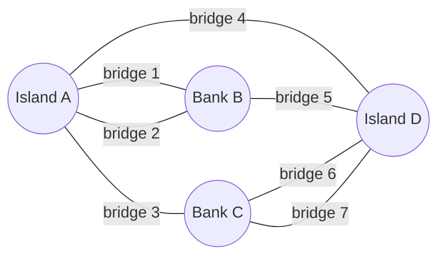

Last week we climbed from the book to the library, indexing derivative artifacts — factoids, rewrites, summaries — instead of an author's raw prose. This week we climb again. A library is still a place where each volume stands alone, spine by spine. Extract the entities in a corpus and the relationships between them — who regulates whom, what treats what, which theorem rests on which lemma — and the volumes dissolve into something new: a web, with boulevards and back alleys, dense neighborhoods and lonely outskirts. The library becomes a city.

A city can be studied, because it has a mathematics. Hold this one line for the whole day: *large graphs develop emergent structure — communities, hubs, small worlds — that no individual edge contains, every variant of GraphRAG is an attempt to harvest that structure for retrieval, and every variant must pay for the harvest.* Act I builds the toolkit, and it mentions no retrieval at all — deliberately. Every idea here reappears this afternoon with its serial numbers barely filed off.

## A Sunday puzzle in Königsberg

Eighteenth-century Königsberg straddled the river Pregel, its four land masses stitched together by seven bridges. The city's residents amused themselves with a puzzle: can you stroll the city, crossing every bridge exactly once? In 1736 Leonhard Euler proved the answer is no — and *how* he proved it mattered more than the answer.

Euler threw away everything a mapmaker would keep: distances, island shapes, river width. What remained were four dots and seven lines — vertices and edges. The puzzle lived entirely in the *pattern of connection*, not in geometry. That is a graph.

$$G = (V, E), \qquad E \subseteq V \times V$$

That is the entire formal definition — a set of vertices and a set of edges between them. From this skeletal beginning grows router maps, brain connectomes, friendship networks, citation webs, and — by this afternoon — the knowledge graph of an enterprise corpus.



## Checking Euler's answer in code

An Eulerian walk exists only if zero or two vertices have odd degree. Königsberg has four — no stroll works.

```python
# Konigsberg as an edge list -- count degree, check Euler's condition
edges = [("A","B"), ("A","B"), ("A","C"), ("A","D"), ("B","D"), ("C","D"), ("C","D")]

degree = {}
for u, v in edges:
    degree[u] = degree.get(u, 0) + 1
    degree[v] = degree.get(v, 0) + 1

odd_degree_nodes = [v for v, k in degree.items() if k % 2 == 1]
print(degree)              # {'A': 3, 'B': 3, 'C': 3, 'D': 3} -- all four are odd
print(len(odd_degree_nodes))  # 4 -- Euler's condition (0 or 2 odd) fails: no such walk
```

> **The one thing to remember.** Euler's move — discard geometry, keep connectivity — is the same move an embedding model *refuses* to make. Embeddings live in geometry; graphs live in topology. When we throw away the prose of a corpus and keep only its entities and relationships, we are making Euler's move: we lose things (geometry always mourns), and we see things no amount of prose-reading could show.
