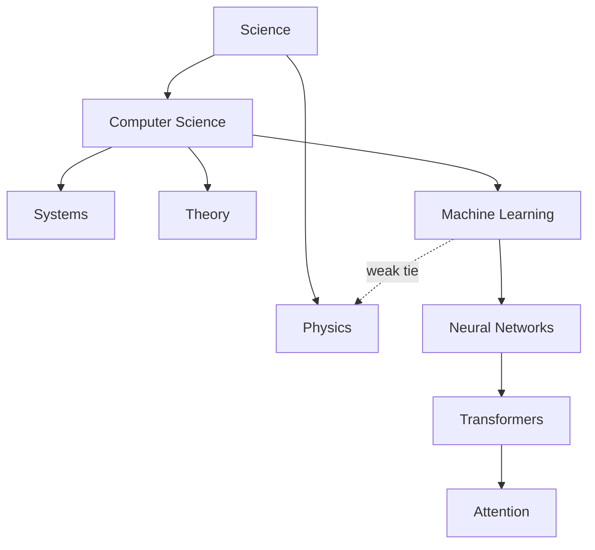

In 1967, Stanley Milgram mailed packets to strangers in Nebraska with an odd instruction: get this letter to a particular stockbroker near Boston, but only by forwarding it to someone you know on a first-name basis. The letters that arrived took, on average, about six forwardings. In a country of two hundred million people, the social graph's diameter — measured in handshakes — was a single-digit number. "Six degrees of separation" entered the language: how can a network be so clustered (your friends know each other) and yet so short (any two villages a few hops apart)?

Watts and Strogatz supplied the answer: take a highly clustered lattice — everyone connected to their near neighbors — and rewire just a few edges at random, creating long-range shortcuts. Clustering barely drops; path lengths collapse. A handful of bridges is enough to make a world small. Add Barabási's hubs — Grand Central stations where shortcuts concentrate — and you have the architecture of essentially every real network: dense local neighborhoods, stitched together by rare long-range bridges and busy hubs.

Granovetter saw the sociological half of this decades earlier: it is your **weak ties** — the acquaintance in another city, not your closest friend — through which new information reaches you. In a knowledge graph, the weak tie is the rare cross-domain edge — "softmax is the gradient of a cumulant generating function" — the bridge between provinces that a frequency filter is most tempted to cut. (Remember this; it becomes Critique C this evening.)

## Knowledge is a small world too

Subjects contain topics contain subtopics: STEM contains physics and computer science; machine learning contains neural networks; within them, transformers, and within those, attention — dense neighborhoods at every level. And the strands cross: logistic regression lives simultaneously in machine learning, medicine, econometrics, and psychology. Those cross-listings are the weak ties, the long-range shortcuts of the knowledge city. A corpus, faithfully converted to a graph of entities and relationships, inherits this architecture — and that inheritance is the entire reason GraphRAG can exist.

## Fractal, but in the real world

Zoom into the knowledge city. Coarsest altitude: continents (the sciences, the law, the humanities). Descend: provinces (physics, biology, computer science). Descend again: districts (systems, theory, machine learning). Again: neighborhoods (vision, language, reinforcement learning). At every altitude, the same statistical texture greets you: dense communities, sparse bridges, a few local hubs. The structure is self-similar under zoom.

Both halves of the phrase are load-bearing. **Fractal**: the communities-within-communities pattern recurs, and the same detection machinery finds it at every level — this is what lets a community-detection algorithm hand back a *hierarchy* rather than a flat partition. **In the real world**: you cannot keep zooming forever. A mathematical fractal is self-similar at infinitely many scales; a real network gives you perhaps two, three, four meaningful levels before "community" stops meaning anything — a neighborhood of three houses is just three houses. Real self-similarity is statistical and finite, like the coastline of Britain.

> **The one thing to remember.** Scale-invariance is the mathematical name for something you already believe pedagogically: subtopics sit within topics within subjects, and the shape of "a subject organizing itself" does not depend on the altitude at which you look — for a finite, real number of levels, not infinitely many.
