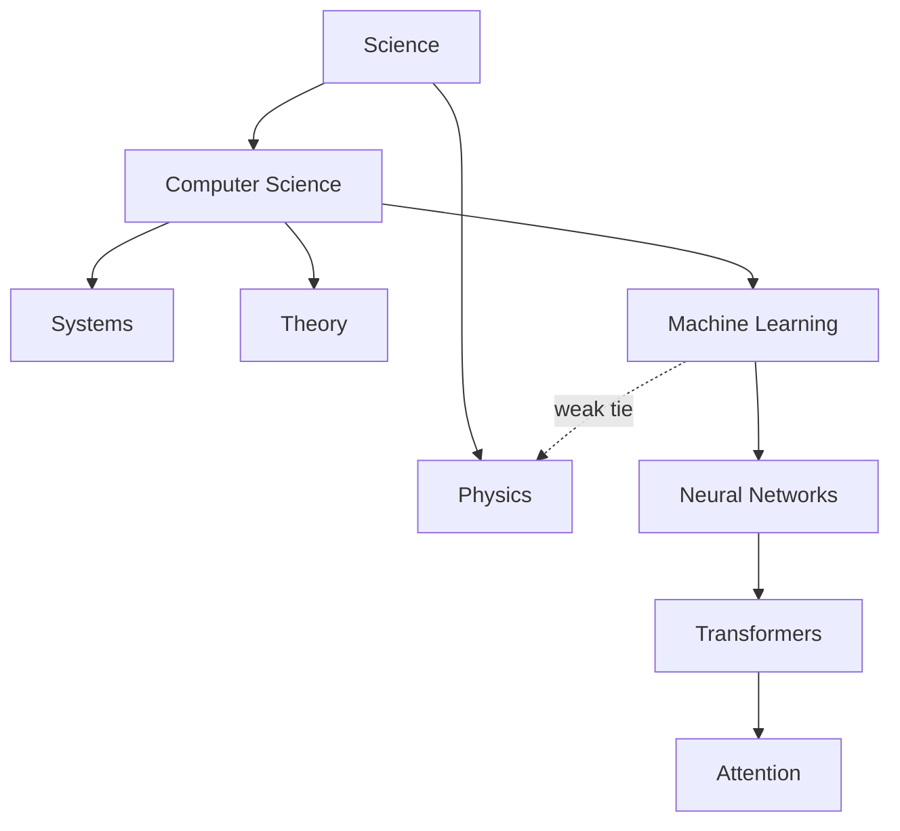

In 1967, Stanley Milgram mailed packets to strangers in Nebraska with an odd instruction: get this letter to a particular stockbroker near Boston, but only by forwarding it to someone you know on a first-name basis. The letters that arrived took, on average, about six forwardings. In a country of two hundred million people, the social graph's diameter — measured in handshakes — was a single-digit number. "Six degrees of separation" entered the language: how can a network be so clustered (your friends know each other) and yet so short (any two villages a few hops apart)?

## Core intuition

Real networks are simultaneously local and long-range. They are dense inside communities, yet surprisingly short across the entire graph.

That combination — cluster locally, connect globally — is the small-world effect, and it is exactly the shape that knowledge graphs inherit.

## Why it matters

This explains why an entity graph can be useful for multi-hop reasoning while still being highly local inside communities. Short paths emerge from just a few cross-cutting bridges, and those bridges are often the nodes that matter most in retrieval.

## Instructor framing

The Milgram experiment is famous enough that students may nod along without absorbing the actual puzzle it poses: dense local clustering and short global paths sound contradictory until you see the Watts-Strogatz mechanism (a few rewired long-range edges) resolve them simultaneously. Push past the "six degrees" trivia to the mechanism — the rest of GraphRAG depends on this same trick (a few strategic bridges) making retrieval both locally coherent and globally reachable.

## Worked example

Consider a corpus of medical literature: papers on cardiology cluster tightly together (dense internal citation), papers on nephrology cluster tightly together, and the two clusters share almost no direct citations — except for a handful of papers on "cardiorenal syndrome" that cite both fields. Those few cross-cutting papers are the weak ties: remove them, and a query connecting "heart failure medication" to "kidney function decline" would require traversing the *entire* graph to find a path between the two clusters. Keep them, and the same query is two hops away. This is exactly why a knowledge graph's few rare cross-domain edges — not its many dense in-cluster edges — often carry the retrieval value that matters most for genuinely novel, cross-cutting questions.

The graph is not a random cloud. It has local neighborhoods and long-range shortcuts. A corpus organized this way is a network with structure, not just a bag of facts.

The graph is not a random cloud. It has local neighborhoods and long-range shortcuts. A corpus organized this way is a network with structure, not just a bag of facts.

Watts and Strogatz supplied the answer: take a highly clustered lattice — everyone connected to their near neighbors — and rewire just a few edges at random, creating long-range shortcuts. Clustering barely drops; path lengths collapse. A handful of bridges is enough to make a world small. Add Barabási's hubs — Grand Central stations where shortcuts concentrate — and you have the architecture of essentially every real network: dense local neighborhoods, stitched together by rare long-range bridges and busy hubs.

Granovetter saw the sociological half of this decades earlier: it is your **weak ties** — the acquaintance in another city, not your closest friend — through which new information reaches you. In a knowledge graph, the weak tie is the rare cross-domain edge — "softmax is the gradient of a cumulant generating function" — the bridge between provinces that a frequency filter is most tempted to cut. (Remember this; it becomes Critique C this evening.)

## Knowledge is a small world too

Subjects contain topics contain subtopics: STEM contains physics and computer science; machine learning contains neural networks; within them, transformers, and within those, attention — dense neighborhoods at every level. And the strands cross: logistic regression lives simultaneously in machine learning, medicine, econometrics, and psychology. Those cross-listings are the weak ties, the long-range shortcuts of the knowledge city. A corpus, faithfully converted to a graph of entities and relationships, inherits this architecture — and that inheritance is the entire reason GraphRAG can exist.

## Fractal, but in the real world

Zoom into the knowledge city. Coarsest altitude: continents (the sciences, the law, the humanities). Descend: provinces (physics, biology, computer science). Descend again: districts (systems, theory, machine learning). Again: neighborhoods (vision, language, reinforcement learning). At every altitude, the same statistical texture greets you: dense communities, sparse bridges, a few local hubs. The structure is self-similar under zoom.

Both halves of the phrase are load-bearing. **Fractal**: the communities-within-communities pattern recurs, and the same detection machinery finds it at every level — this is what lets a community-detection algorithm hand back a *hierarchy* rather than a flat partition. **In the real world**: you cannot keep zooming forever. A mathematical fractal is self-similar at infinitely many scales; a real network gives you perhaps two, three, four meaningful levels before "community" stops meaning anything — a neighborhood of three houses is just three houses. Real self-similarity is statistical and finite, like the coastline of Britain.

> **The one thing to remember.** Scale-invariance is the mathematical name for something you already believe pedagogically: subtopics sit within topics within subjects, and the shape of "a subject organizing itself" does not depend on the altitude at which you look — for a finite, real number of levels, not infinitely many.

## Math explained step by step

Work through the Watts-Strogatz mechanism to see why rewiring "just a few edges" has such an outsized effect on path length while barely touching clustering.

**Step 1 — start from a ring lattice, where every vertex connects only to its near neighbors.** In this world, clustering is high (your neighbors' neighbors are also your neighbors) but path length is long — reaching a vertex on the "far side" of the ring requires traversing every vertex in between, since there's no way to skip ahead.

**Step 2 — rewire one edge at random, turning a short local connection into a long-range one.** This single new edge creates a shortcut: two previously-distant regions of the ring are now one hop apart *through that edge*. Crucially, removing one local edge barely dents the local clustering (each vertex still has nearly all its other near-neighbor connections intact), but it can cut the path length between two distant regions roughly in half.

**Step 3 — see why a *few* random rewirings compound rather than merely add up.** Once one shortcut exists, paths that used to require the full ring traversal can now route through that shortcut. A second random rewiring creates a second shortcut, and paths can chain through *both* — the number of usable long-range routes grows combinatorially with the number of shortcuts, while local clustering degrades only linearly (each rewiring removes just one local edge). This asymmetry — path length collapsing fast, clustering dropping slow — is the mathematical content of "clustering barely drops; path lengths collapse."

**Step 4 — map this onto a knowledge graph's weak ties.** The "cardiorenal syndrome" papers in the worked example are exactly these rewired shortcut edges: rare, individually unremarkable-looking connections whose removal would barely change the density of either the cardiology or nephrology cluster, but whose presence is the entire reason a cross-domain query can be answered in a small number of hops instead of requiring an exhaustive graph traversal.

## Practical pattern

When designing or auditing a knowledge-graph retrieval system with this structure in mind:

1. do not judge an edge's importance by how "impressive" or dense its neighborhood looks — a rare cross-cluster edge with low apparent traffic can be doing more retrieval work than a hundred dense in-cluster edges, precisely because it is the only path between two otherwise-disconnected regions;
2. when pruning or filtering a knowledge graph for noise (a common Week 5 later concern), explicitly protect low-frequency, cross-domain edges from frequency-based filtering — a naive "keep only edges seen $N$ times" rule will disproportionately delete exactly the weak ties that make multi-hop, cross-topic queries answerable;
3. for multi-hop or cross-domain queries, consider explicitly searching for and traversing bridge edges rather than only expanding within a query's initial cluster — the shortest path to an answer in another domain often exists specifically because of a small number of these bridges.

## Common traps

- pruning "low-signal" or infrequent edges from a knowledge graph without checking whether they are cross-domain bridges — a frequency-based cleanup step can silently destroy the very edges that make cross-cutting retrieval possible;
- assuming that because a corpus has dense internal clustering, any two entities are easy to connect — dense clustering describes *within*-community reachability, not *across*-community reachability, which depends entirely on the much rarer bridge edges;
- treating the small-world property as automatic for any graph, when it specifically requires both high clustering AND a small number of long-range shortcuts — a graph with only one of the two properties does not behave the same way;
- forgetting that real knowledge hierarchies are fractal only across a handful of levels — treating "keep zooming in for finer communities" as always meaningful, when at some depth a "community" becomes too small to represent a real thematic grouping.

## Takeaways

- A small-world network combines dense local clustering with short global path lengths, and the mechanism is a small number of long-range "weak tie" edges bridging otherwise-distant clusters.
- Knowledge graphs inherit this structure naturally — subjects cluster densely, and rare cross-domain edges (the "weak ties") are what make multi-hop, cross-topic questions answerable in a few steps rather than requiring exhaustive search.
- Concretely: when cleaning or pruning a knowledge graph, protect rare cross-domain edges from frequency-based filtering — they carry disproportionate retrieval value relative to their apparent frequency.
