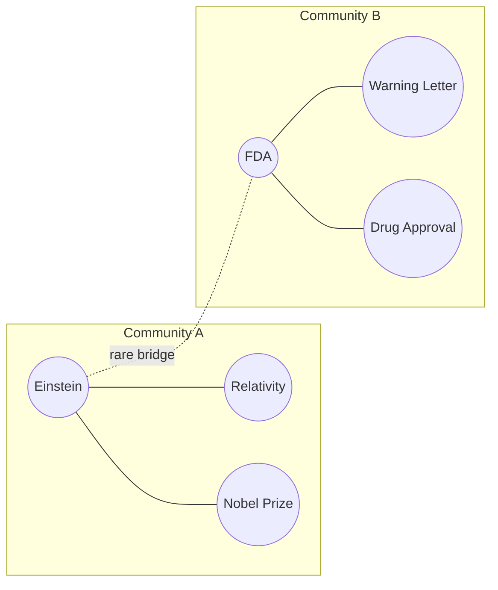

We keep saying "community"; the mathematics must now pay for the word. A community is a set of vertices more densely connected internally than externally — a neighborhood whose streets mostly stay inside it. But "more densely than what?" Than chance. The standard objective, due to Newman, is **modularity**:

## Core intuition

A community is not merely a visible cluster in a picture. It is a group with more connections among its members than you would expect from a random graph with the same degrees.

This is the formal notion that makes community detection a proper optimization problem instead of a hand-wavy visual judgment.

## Why it matters

In a real corpus graph, communities correspond to thematic neighborhoods: law, chemistry, finance, and so on. If the graph is to support global sensemaking, community detection is how those neighborhoods are exposed to the system.

## Instructor framing

Make sure "Leiden" lands as a name to remember, not a footnote — it is genuinely the algorithm running inside a specific, widely-used production system (Microsoft GraphRAG), which is a rare instance in this course of a single named algorithm mapping directly onto a single named product. Students who can say "GraphRAG's community summaries come from Leiden running on modularity-optimized entity clusters" have understood the whole page in one sentence.

## Worked example


This chapter makes the graph city legible. A community is the place where meaning clusters, and modularity tells us how to find it automatically.

$$Q = \frac{1}{2m} \sum_{ij} \left( A_{ij} - \frac{k_i k_j}{2m} \right) \delta(c_i, c_j)$$

where $m$ is the number of edges, $k_i$ the degrees, $c_i$ the community assignment of vertex $i$, and $\delta$ is one when its arguments match. Read the bracket aloud: $A_{ij}$ is the edge that is there; $k_i k_j / 2m$ is the edge you would *expect by chance* if the graph were randomly rewired while preserving everyone's degree. Modularity sums, over pairs inside the same community, the surplus of actual connection over expected connection. High $Q$ means the neighborhoods are real — not an artifact of a few vertices being popular. Community detection is then an optimization: find the assignment $\{c_i\}$ that maximizes $Q$.

Note the family resemblance to last week: RAPTOR clustered chunks by embedding proximity; modularity clusters vertices by *relational surplus*. Same instinct — find the latent groups — different geometry. RAPTOR asks "who sounds alike?"; modularity asks "who is wired together?"

## Louvain and its repair, Leiden

Exact maximization is NP-hard, so the field runs on good greedy algorithms. The **Louvain algorithm** (2008) alternates two moves: shuffle individual vertices between communities whenever the shuffle increases $Q$; then collapse each community into a super-vertex and repeat on the smaller graph. It is fast and usually good — and it harbors a genuine pathology: it can output "communities" that are internally *disconnected*, islands filed under one name with no street between them. The **Leiden algorithm** repairs exactly this with a refinement phase that guarantees every community it reports is well-connected, at every level of the hierarchy it builds.

**Mark this algorithm's name and circle it.** Leiden is not algorithmic trivia. It is, precisely and literally, the engine at the heart of Microsoft GraphRAG: when we say "GraphRAG detects the communities of the entity graph and summarizes each one," the detector is Leiden, running on exactly this modularity mathematics, exploiting exactly the communities-within-communities structure from the previous page.



```python
# modularity, computed by hand for a two-community toy graph
edges = [("Einstein","Relativity"), ("Einstein","NobelPrize"),
         ("FDA","WarningLetter"), ("FDA","DrugApproval"),
         ("Einstein","FDA")]                       # one rare cross-community bridge

degree = {}
for u, v in edges:
    degree[u] = degree.get(u, 0) + 1
    degree[v] = degree.get(v, 0) + 1

community = {"Einstein":"A","Relativity":"A","NobelPrize":"A",
             "FDA":"B","WarningLetter":"B","DrugApproval":"B"}

m = len(edges)
A = {(u,v) for u, v in edges} | {(v,u) for u, v in edges}

Q = 0.0
nodes = degree.keys()
for i in nodes:
    for j in nodes:
        expected = degree[i] * degree[j] / (2*m)
        actual = 1 if (i, j) in A else 0
        if community[i] == community[j]:
            Q += (actual - expected)
Q /= (2*m)
print(f"Q = {Q:.3f}")  # Q = 0.300 -- positive: the two hand-drawn communities are real, not chance
```

Walk that number through by hand for one pair. Einstein and Relativity are both in Community A and share an edge, so $A_{ij}=1$; each has degree $k_i=3$ and $k_j=1$ (five edges total, $m=5$, so $2m=10$), giving an expected value of $k_i k_j / 2m = 3 \times 1 / 10 = 0.3$ — the surplus for that one pair is $1 - 0.3 = 0.7$. Do that for every same-community pair, sum, divide by $2m$, and the five real edges beat chance enough to leave $Q = 0.300$ — comfortably above zero, so the two communities are not an artifact of Einstein and FDA both happening to be popular.

> **The one thing to remember.** Louvain is fast but can hand you disconnected "communities"; Leiden repairs it with a guarantee of connectedness at every level. Circle the name — it is the community detector inside Microsoft GraphRAG, not a footnote.


## Math explained step by step

Rebuild the modularity computation above, narrating why each piece exists.

**Step 1 — establish the "expected by chance" baseline.** $k_i k_j / 2m$ is the probability that vertices $i$ and $j$ would be connected if you randomly rewired the graph while preserving every vertex's degree — high-degree vertices are more likely to connect to anything by pure chance, so the baseline is higher for them. This baseline exists specifically to answer "is this edge surprising, or is it just what you'd expect from two well-connected vertices bumping into each other?"

**Step 2 — compute the surplus for each pair, not just whether an edge exists.** $A_{ij} - k_i k_j/2m$ is "actual minus expected" — a positive number means this pair is connected *more* than chance would predict, a hallmark of real community structure rather than incidental hub traffic.

**Step 3 — restrict the sum to same-community pairs, and see why this restriction is the whole trick.** The $\delta(c_i, c_j)$ term zeroes out every cross-community pair, so $Q$ only accumulates surplus connection *within* proposed communities. This means $Q$ is high precisely when a proposed partition groups together vertices that are surprisingly well-connected to each other — exactly the informal definition of "community" made computable.

**Step 4 — verify the arithmetic on the worked pair.** Einstein-Relativity: $A_{ij}=1$ (an edge exists), expected $= 3 \times 1 / 10 = 0.3$ (Einstein has degree 3, Relativity has degree 1, $2m=10$), surplus $= 0.7$. Repeating this for every same-community pair and summing gives $Q = 0.300$ — comfortably positive, meaning the two hand-drawn communities (Einstein's physics cluster, FDA's regulatory cluster) are denser internally than chance predicts, not merely a partition drawn around two popular vertices.

**Step 5 — see why maximizing $Q$ is a search problem, and why Louvain/Leiden are needed at all.** There is no formula that directly outputs the best community assignment $\{c_i\}$ — you would need to try every possible partition of the vertices and compute $Q$ for each, which is combinatorially infeasible for any real graph. Louvain and Leiden are greedy search strategies that climb toward a high-$Q$ partition without exhaustively checking every possibility, trading a guarantee of the global optimum for tractability.

## Practical pattern

When applying community detection to a knowledge graph for GraphRAG-style summarization:

1. use Leiden, not Louvain, for anything you plan to build summaries on top of — a disconnected "community" from Louvain will produce an incoherent summary, since an LLM asked to summarize a set of entities that don't actually form one connected story will either fail or silently paper over the disconnect;
2. run community detection at multiple resolution levels (Leiden supports hierarchical output) to get communities at different granularities — mirror last week's RAPTOR lesson: different queries want different altitudes, and community detection should offer the same range;
3. inspect $Q$ itself, not just the partition, as a health check — a very low modularity score on your extracted graph suggests either the graph lacks real community structure or the extraction process introduced too much noise (spurious edges) to reveal it;
4. treat the rare cross-community bridge edges (previous page's weak ties) as deliberately excluded from every community by construction — that's not a bug, it's what makes them bridges, and your retrieval design should account for querying across communities separately from querying within one.

## Common traps

- running Louvain in production and not checking for disconnected communities — a "community" that is actually two unrelated islands sharing a label will produce a summary that either silently ignores half the content or incoherently merges two unrelated topics;
- treating community detection as objective ground truth rather than an optimization heuristic — Louvain and Leiden find a *high*-modularity partition, not provably *the* highest, and different runs or parameter settings can produce different valid partitions;
- forgetting that modularity's "expected by chance" baseline already accounts for degree, so simply noticing that two hub vertices are connected is not evidence of a community — the connection has to exceed what their combined popularity alone would predict;
- applying community detection once and treating the resulting partition as permanent, when a corpus that grows or changes should have its communities periodically recomputed — new documents can blur old community boundaries or create new ones.

## Takeaways

- Modularity formalizes "community" as connection-surplus-over-chance, which is what makes community detection a computable optimization problem rather than a visual judgment call.
- Louvain is fast but can produce internally disconnected communities; Leiden repairs this with a connectedness guarantee and is the actual algorithm inside Microsoft GraphRAG.
- Concretely: if you are building any summarization or retrieval on top of detected communities, use Leiden and verify connectedness — a disconnected community silently corrupts every summary built from it.
