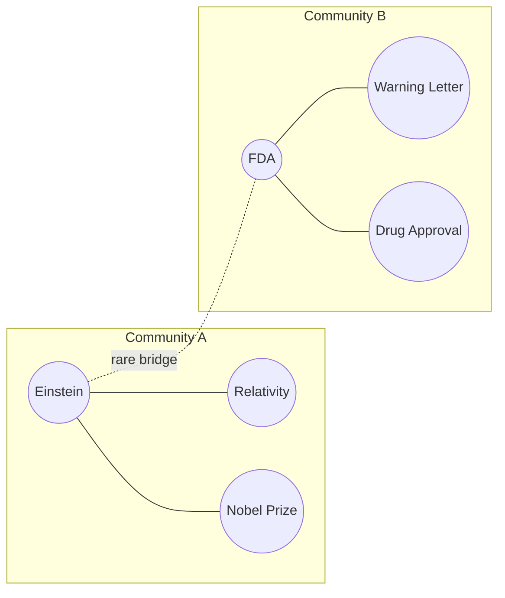

We keep saying "community"; the mathematics must now pay for the word. A community is a set of vertices more densely connected internally than externally — a neighborhood whose streets mostly stay inside it. But "more densely than what?" Than chance. The standard objective, due to Newman, is **modularity**:

$$Q = \frac{1}{2m} \sum_{ij} \left( A_{ij} - \frac{k_i k_j}{2m} \right) \delta(c_i, c_j)$$

where $m$ is the number of edges, $k_i$ the degrees, $c_i$ the community assignment of vertex $i$, and $\delta$ is one when its arguments match. Read the bracket aloud: $A_{ij}$ is the edge that is there; $k_i k_j / 2m$ is the edge you would *expect by chance* if the graph were randomly rewired while preserving everyone's degree. Modularity sums, over pairs inside the same community, the surplus of actual connection over expected connection. High $Q$ means the neighborhoods are real — not an artifact of a few vertices being popular. Community detection is then an optimization: find the assignment $\{c_i\}$ that maximizes $Q$.

Note the family resemblance to last week: RAPTOR clustered chunks by embedding proximity; modularity clusters vertices by *relational surplus*. Same instinct — find the latent groups — different geometry. RAPTOR asks "who sounds alike?"; modularity asks "who is wired together?"

## Louvain and its repair, Leiden

Exact maximization is NP-hard, so the field runs on good greedy algorithms. The **Louvain algorithm** (2008) alternates two moves: shuffle individual vertices between communities whenever the shuffle increases $Q$; then collapse each community into a super-vertex and repeat on the smaller graph. It is fast and usually good — and it harbors a genuine pathology: it can output "communities" that are internally *disconnected*, islands filed under one name with no street between them. The **Leiden algorithm** repairs exactly this with a refinement phase that guarantees every community it reports is well-connected, at every level of the hierarchy it builds.

**Mark this algorithm's name and circle it.** Leiden is not algorithmic trivia. It is, precisely and literally, the engine at the heart of Microsoft GraphRAG: when we say "GraphRAG detects the communities of the entity graph and summarizes each one," the detector is Leiden, running on exactly this modularity mathematics, exploiting exactly the communities-within-communities structure from the previous page.



```python
# modularity, computed by hand for a two-community toy graph
edges = [("Einstein","Relativity"), ("Einstein","NobelPrize"),
         ("FDA","WarningLetter"), ("FDA","DrugApproval"),
         ("Einstein","FDA")]                       # one rare cross-community bridge

degree = {}
for u, v in edges:
    degree[u] = degree.get(u, 0) + 1
    degree[v] = degree.get(v, 0) + 1

community = {"Einstein":"A","Relativity":"A","NobelPrize":"A",
             "FDA":"B","WarningLetter":"B","DrugApproval":"B"}

m = len(edges)
A = {(u,v) for u, v in edges} | {(v,u) for u, v in edges}

Q = 0.0
nodes = degree.keys()
for i in nodes:
    for j in nodes:
        expected = degree[i] * degree[j] / (2*m)
        actual = 1 if (i, j) in A else 0
        if community[i] == community[j]:
            Q += (actual - expected)
Q /= (2*m)
print(f"Q = {Q:.3f}")  # Q = 0.300 -- positive: the two hand-drawn communities are real, not chance
```

Walk that number through by hand for one pair. Einstein and Relativity are both in Community A and share an edge, so $A_{ij}=1$; each has degree $k_i=3$ and $k_j=1$ (five edges total, $m=5$, so $2m=10$), giving an expected value of $k_i k_j / 2m = 3 \times 1 / 10 = 0.3$ — the surplus for that one pair is $1 - 0.3 = 0.7$. Do that for every same-community pair, sum, divide by $2m$, and the five real edges beat chance enough to leave $Q = 0.300$ — comfortably above zero, so the two communities are not an artifact of Einstein and FDA both happening to be popular.

> **The one thing to remember.** Louvain is fast but can hand you disconnected "communities"; Leiden repairs it with a guarantee of connectedness at every level. Circle the name — it is the community detector inside Microsoft GraphRAG, not a footnote.
